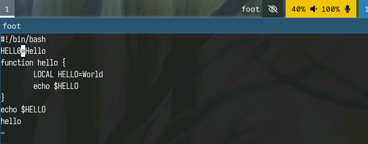

---
## Front matter
lang: ru-RU
title: Лабораторная работа №10
subtitle: Операционные системы
  - Бекауов А.Т
institute:
  - Российский университет дружбы народов, Москва, Россия

## i18n babel
babel-lang: russian
babel-otherlangs: english

## Formatting pdf
toc: false
toc-title: Содержание
slide_level: 2
aspectratio: 169
section-titles: true
theme: metropolis
header-includes:
 - \metroset{progressbar=frametitle,sectionpage=progressbar,numbering=fraction}
 - '\makeatletter'
 - '\beamer@ignorenonframefalse'
 - '\makeatother'

##Fonts
mainfont: PT Serif
romanfont: PT Serif
sansfont: PT Sans
monofont: PT Mono
mainfontoptions: Ligatures=TeX
romanfontoptions: Ligatures=TeX
sansfontoptions: Ligatures=TeX,Scale=MatchLowercase
monofontoptions: Scale=MatchLowercase,Scale=0.9
---

# Введение

## Цель работы

Цель данной лабораторной работы -познакомиться с операционной системой Linux. Получить практические навыки работы с редактором vi, установленным по умолчанию практически во всех дистрибутивах.

# Выполнение лабораторной работы

## Задание 1: Подготовка к выполнению

Сначала с помощью команды mkdir с ключом p создаю каталог с именем м ~/work/os/lab06, затем перехожу в этот каталог, создаю в нём файл hello.sh и открываю его в текстовом редакторе vi.

{#fig:001 width=70%}

## Задание 1: Ввод текста

Далее перехожу в режим вставки нажав клавишу i и набираю там предложенный в методичке текст. По завершение перехожу в командный режим нажав кнопку ESC

{#fig:002 width=70%}

## Задание 1: Сохранение и выход

Затем перехожу в режим последней строки нажав ":", и набираю внизу wq, чтобы записть (сохранить) файл и выйти из vi.

{#fig:003 width=70%}

## Задание 1: редактирование прав доступа

С помощью команды chmod делаем файл исполняемым.

{#fig:004 width=70%}

## Задание 2: Редактирование в режиме вставки

Вызываю  vi на редактирование файла hello.sh, устанавливаю курсор на конец слова HELL и ,перейдя в режим вставки (i), дописываю его до HELLO. По завершение возвращаюсь в командный режим (ESC)

{#fig:005 width=70%}

## Задание 2: Удаление слова в командном режиме

Устанавливаю курсор на четвертую строку в начало слова LOCAL и прожимаю комбинацию клавиш d+w, чтобы удалить это слово 

{#fig:006 width=70%}

## Задание 2: Редактирование в режиме вставки

В режиме вставки дописываю на месте LOCAL слово local, возвращаюсь в командный режим и перевожу курсор на последнюю строчку.

{#fig:007 width=70%}

## Задание 2: Редактирование в режиме вставки

Перехожу в режим вставки (i) и перейдя на строчку после последней, набираю текст "echo $HELLO", затем нажимаю ESC, чтобы перейти обратно в командный режим.

{#fig:008 width=70%}

## Задание 2: Удаление строки

Курсор находится на последней строчке. Нажимаю комбинацию "d+d", и удаляю строчку на которой располагался курсор. 

{#fig:009 width=70%}

## Задание 2 : Отмена действия

Затем нажимаю клавишу "u", чтобы отменить последнее действие и вернуть обратно последнюю строку. Затем перехожу в режим последней строки (:) и набираю wq, чтобы сохранить файл и покинуть vi.

{#fig:010 width=70%}

# Заключение

## Выводы

В ходе данной лаботраторной работы я познакомился с операционной системой Linux. Получил практические навыки работы с редактором vi, установленным по умолчанию практически во всех дистрибутивах.

