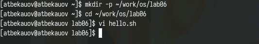
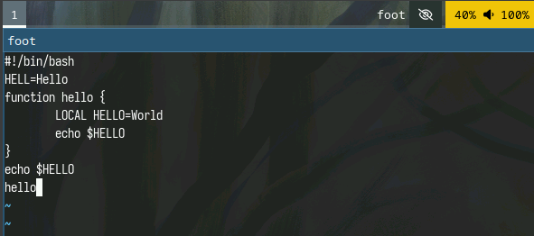
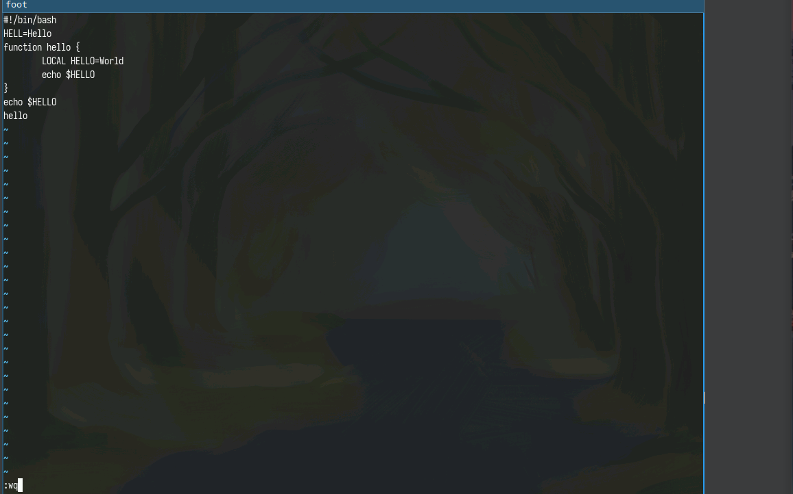
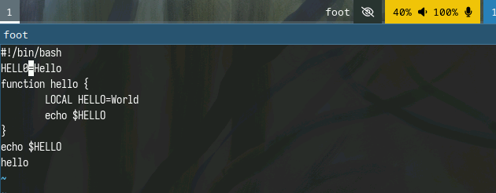
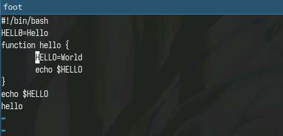
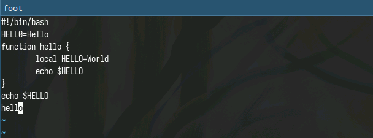
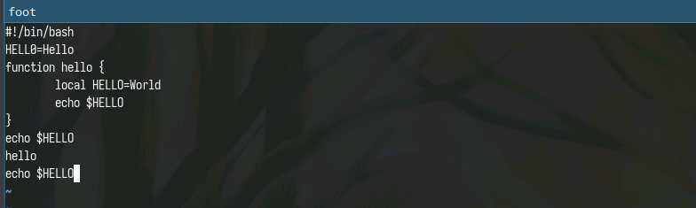
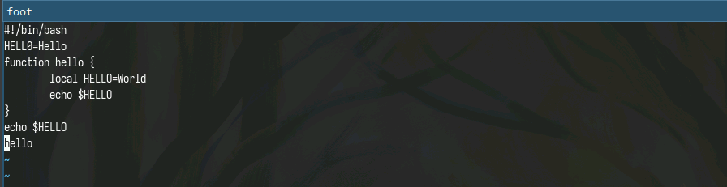
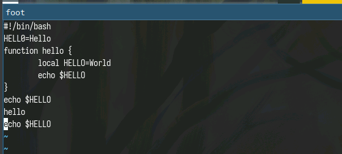
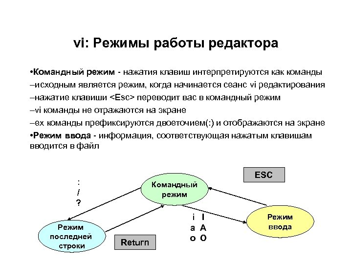

---
## Front matter
title: "Отчёт по лабораторной работе №10"
subtitle: "Операционные системы"
author: "Бекауов Артур Тимурович"

## Generic otions
lang: ru-RU
toc-title: "Содержание"

## Bibliography
bibliography: bib/cite.bib
csl: pandoc/csl/gost-r-7-0-5-2008-numeric.csl

## Pdf output format
toc: true # Table of contents
toc-depth: 2
lof: true # List of figures
lot: true # List of tables
fontsize: 12pt
linestretch: 1.5
papersize: a4
documentclass: scrreprt
## I18n polyglossia
polyglossia-lang:
  name: russian
  options:
	- spelling=modern
	- babelshorthands=true
polyglossia-otherlangs:
  name: english
## I18n babel
babel-lang: russian
babel-otherlangs: english
## Fonts
mainfont: PT Serif
romanfont: PT Serif
sansfont: PT Sans
monofont: PT Mono
mainfontoptions: Ligatures=TeX
romanfontoptions: Ligatures=TeX
sansfontoptions: Ligatures=TeX,Scale=MatchLowercase
monofontoptions: Scale=MatchLowercase,Scale=0.9
## Biblatex
biblatex: true
biblio-style: "gost-numeric"
biblatexoptions:
  - parentracker=true
  - backend=biber
  - hyperref=auto
  - language=auto
  - autolang=other*
  - citestyle=gost-numeric
## Pandoc-crossref LaTeX customization
figureTitle: "Рис."
tableTitle: "Таблица"
listingTitle: "Листинг"
lofTitle: "Список иллюстраций"
lotTitle: "Список таблиц"
lolTitle: "Листинги"
## Misc options
indent: true
header-includes:
  - \usepackage{indentfirst}
  - \usepackage{float} # keep figures where there are in the text
  - \floatplacement{figure}{H} # keep figures where there are in the text
---

# Цель работы

Цель данной лабораторной работы -познакомиться с операционной системой Linux. Получить практические навыки работы с редактором vi, установленным по умолчанию практически во всех дистрибутивах.

# Задание

1. Ознакомиться с теоретическим материалом.

2. Ознакомиться с редактором vi.

3. Выполнить упражнения, используя команды vi.

- Задание 1. Создание нового файла с использованием vi

- Задание 2. Редактирование существующего файла

# Выполнение лабораторной работы

Сначала с помощью команды mkdir с ключом p создаю каталог с именем м ~/work/os/lab06, затем перехожу в этот каталог, создаю в нём файл hello.sh и открываю его в текстовом редакторе vi.  (рис. [-@fig:001]).

{#fig:001 width=70%}

Далее перехожу в режим вставки нажав клавишу i и набираю там предложенный в методичке текст. По завершение перехожу в командный режим нажав кнопку ESC (рис. [-@fig:002]).

{#fig:002 width=70%}

Затем перехожу в режим последней строки нажав ":", и набираю внизу wq, чтобы записть (сохранить) файл и выйти из vi.(рис. [-@fig:003]).

{#fig:003 width=70%}

С помощью команды chmod делаем файл исполняемым. (рис. [-@fig:004]).

{#fig:004 width=70%}

Вызываю  vi на редактирование файла hello.sh, устанавливаю курсор на конец слова HELL и ,перейдя в режим вставки (i), дописываю его до HELLO. По завершение возвращаюсь в командный режим (ESC) (рис. [-@fig:005]).

{#fig:005 width=70%}

Устанавливаю курсор на четвертую строку в начало слова LOCAL и прожимаю комбинацию клавиш d+w, чтобы удалить это слово (рис. [-@fig:006]).

{#fig:006 width=70%}

В режиме вставки дописываю на месте LOCAL слово local, возвращаюсь в командный режим и перевожу курсор на последнюю строчку.(рис. [-@fig:007]).

{#fig:007 width=70%}

Перехожу в режим вставки (i) и перейдя на строчку после последней, набираю текст "echo $HELLO", затем нажимаю ESC, чтобы перейти обратно в командный режим.  (рис. [-@fig:008]).

{#fig:008 width=70%}

Курсор находится на последней строчке. Нажимаю комбинацию "d+d", и удаляю строчку на которой располагался курсор. (рис. [-@fig:009]).

{#fig:009 width=70%}

Затем нажимаю клавишу "u", чтобы отменить последнее действие и вернуть обратно последнюю строку. Затем перехожу в режим последней строки (:) и набираю wq, чтобы сохранить файл и покинуть vi.  (рис. [-@fig:010]). 

{#fig:010 width=70%}

# Выводы

В ходе данной лаботраторной работы я познакомился с операционной системой Linux. Получил практические навыки работы с редактором vi, установленным по умолчанию практически во всех дистрибутивах.

# Ответы на онтрольные вопросы

1. Дайте краткую характеристику режимам работы редактора vi.

- командный режим — предназначен для ввода команд редактирования и навигации по редактируемому файлу;
- режим вставки — предназначен для ввода содержания редактируемого файла;
- режим последней (или командной) строки — используется для записи изменений в файл и выхода из редактора.

2. Как выйти из редактора, не сохраняя произведённые изменения?

Можно нажимать символ q (или q!), если требуется выйти из редактора без сохранения.

3. Назовите и дайте краткую характеристику командам позиционирования.
- 0 (ноль) — переход в начало строки;
- $ — переход в конец строки;
- G — переход в конец файла;
- n G — переход на строку с номером n.

4. Что для редактора vi является словом?

Редактор vi предполагает, что слово - это строка символов, которая может включать в себя буквы, цифры и символы подчеркивания.

5. Каким образом из любого места редактируемого файла перейти в начало (конец) файла?

С помощью G — переход в конец файла

6. Назовите и дайте краткую характеристику основным группам команд редактирования.

- Вставка текста – а — вставить текст после курсора; – А — вставить текст в конец строки; – i — вставить текст перед курсором; – n i — вставить текст n раз; – I — вставить текст в начало строки.
- Вставка строки – о — вставить строку под курсором; – О — вставить строку над курсором.
- Удаление текста – x — удалить один символ в буфер; – d w — удалить одно слово в буфер; – d $ — удалить в буфер текст от курсора до конца строки; – d 0 — удалить в буфер текст от начала строки до позиции курсора; – d d — удалить в буфер одну строку; – n d d — удалить в буфер n строк.
- Отмена и повтор произведённых изменений – u — отменить последнее изменение; – . — повторить последнее изменение.
- Копирование текста в буфер – Y — скопировать строку в буфер; – n Y — скопировать n строк в буфер; – y w — скопировать слово в буфер.
- Вставка текста из буфера – p — вставить текст из буфера после курсора; – P — вставить текст из буфера перед курсором.
- Замена текста – c w — заменить слово; – n c w — заменить n слов; – c $ — заменить текст от курсора до конца строки; – r — заменить слово; – R — заменить текст.
- Поиск текста – / текст — произвести поиск вперёд по тексту указанной строки символов текст; – ? текст — произвести поиск назад по тексту указанной строки символов текст.

7. Необходимо заполнить строку символами $. Каковы ваши действия?

Перейти в режим вставки.

8. Как отменить некорректное действие, связанное с процессом редактирования?

С помощью u — отменить последнее изменение

9. Назовите и дайте характеристику основным группам команд режима последней строки.

Режим последней строки — используется для записи изменений в файл и выхода из редактора.

10. Как определить, не перемещая курсора, позицию, в которой заканчивается строка?

$ — переход в конец строки

11. Выполните анализ опций редактора vi (сколько их, как узнать их назначение и т.д.).

Опции редактора vi позволяют настроить рабочую среду. Для задания опций используется команда set (в режиме последней строки): – : set all — вывести полный список опций; – : set nu — вывести номера строк; – : set list — вывести невидимые символы; – : set ic — не учитывать при поиске, является ли символ прописным или строчным.

12. Как определить режим работы редактора vi?

В редакторе vi есть два основных режима: командный режим и режим вставки. По умолчанию работа начинается в командном режиме. В режиме вставки клавиатура используется для набора текста. Для выхода в командный режим используется клавиша Esc или комбинация Ctrl + c.

13. Постройте граф взаимосвязи режимов работы редактора vi.(рис. @fig:011).

{#fig:011 width=70%}

