---
## Front matter
title: "Отчёт по лабораторной работе №11"
subtitle: "Операционные системы"
author: "Бекауов Артур Тимурович"

## Generic otions
lang: ru-RU
toc-title: "Содержание"

## Bibliography
bibliography: bib/cite.bib
csl: pandoc/csl/gost-r-7-0-5-2008-numeric.csl

## Pdf output format
toc: true # Table of contents
toc-depth: 2
lof: true # List of figures
lot: true # List of tables
fontsize: 12pt
linestretch: 1.5
papersize: a4
documentclass: scrreprt
## I18n polyglossia
polyglossia-lang:
  name: russian
  options:
	- spelling=modern
	- babelshorthands=true
polyglossia-otherlangs:
  name: english
## I18n babel
babel-lang: russian
babel-otherlangs: english
## Fonts
mainfont: PT Serif
romanfont: PT Serif
sansfont: PT Sans
monofont: PT Mono
mainfontoptions: Ligatures=TeX
romanfontoptions: Ligatures=TeX
sansfontoptions: Ligatures=TeX,Scale=MatchLowercase
monofontoptions: Scale=MatchLowercase,Scale=0.9
## Biblatex
biblatex: true
biblio-style: "gost-numeric"
biblatexoptions:
  - parentracker=true
  - backend=biber
  - hyperref=auto
  - language=auto
  - autolang=other*
  - citestyle=gost-numeric
## Pandoc-crossref LaTeX customization
figureTitle: "Рис."
tableTitle: "Таблица"
listingTitle: "Листинг"
lofTitle: "Список иллюстраций"
lotTitle: "Список таблиц"
lolTitle: "Листинги"
## Misc options
indent: true
header-includes:
  - \usepackage{indentfirst}
  - \usepackage{float} # keep figures where there are in the text
  - \floatplacement{figure}{H} # keep figures where there are in the text
---

# Цель работы

Цель данной лабораторной работы - получить практические навыки работы с редактором Emacs.

# Задание

1. Ознакомиться с теоретическим материалом.
2. Ознакомиться с редактором emacs.
3. Выполнить упражнения.
4. Ответить на контрольные вопросы.

# Выполнение лабораторной работы

Введя в терминале команду emacs, открываю текстовый редактор Emacs. (рис. [-@fig:001]).

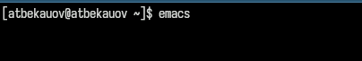{#fig:001 width=70%}

Далее нажав комбинации клавиши Ctrl-x и Ctrl-f, создаю и открываю файл lab07.sh. (рис. [-@fig:002]).

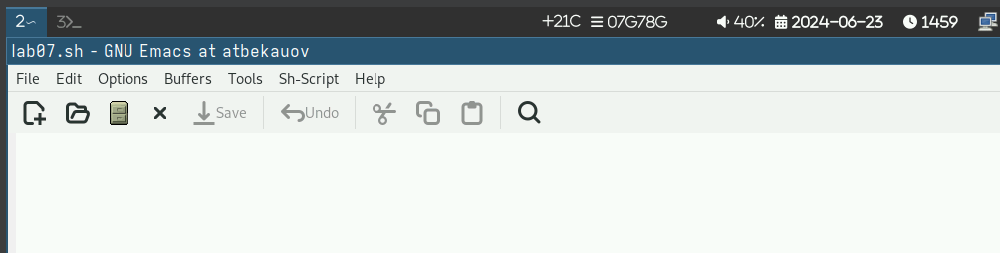{#fig:002 width=70%}

Затем ввожу в файл текст, приложенный в методичке к лабораторной работе. (рис. [-@fig:003]).

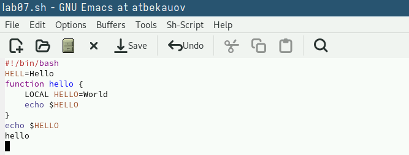{#fig:003 width=70%}

После этого прожимаю комбинации клавиш Ctrl-x и Ctrl-s и сохраняю изменения в файле. (рис. [-@fig:004]).

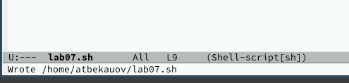{#fig:004 width=70%}

С помощью комбинации Ctrl-k вырезаю (коопирую и удаляю) 5-ую строку и ,переведя курсор в конец файла, прожимаю комбинацию Ctrl-y, которая вставляет скопированную строку.    (рис. [-@fig:005]).

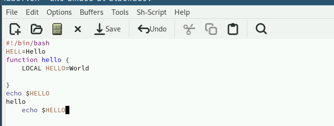{#fig:005 width=70%}

Далее устанавливаю курсор в начале второй строки и прожимаю комбинацю Ctrl-space, которая позволяет мне выделять текст перемещая курсор. Выделяю строки со 2-ой по 4-ую и копирую их, нажав Alt-w (рис. [-@fig:006]).

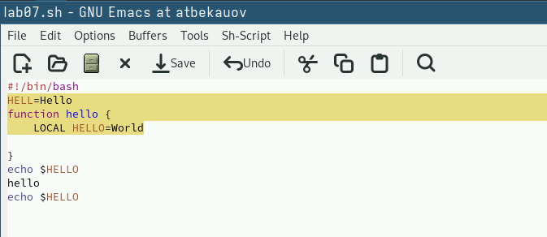{#fig:006 width=70%}

Далее с помощью комбинации Ctrl-y, вставляю скопированный текст в конец.(рис. [-@fig:007]).

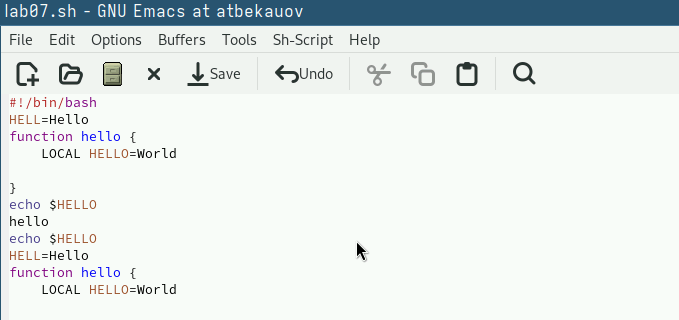{#fig:007 width=70%}

Вновь выделяю (Ctrl-space) ,только что вставленный, текст и нажав комбинацию Ctrl-w, вырезаю выделенный текст. (рис. [-@fig:008]).

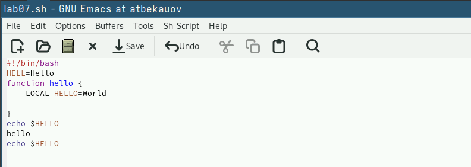{#fig:008 width=70%}

Затем с помощью комбинации Ctrl-/ отменяю последнее действие, возвращая обратно выделенный текст. (рис. [-@fig:009]).

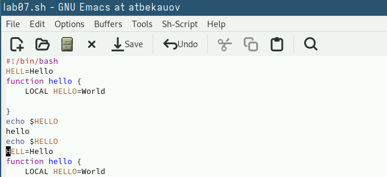{#fig:009 width=70%}

Перемещение по файлу происходит с помощью стрелок, которые перемещаю курсор по символом. Также с помощью комбинаций Ctrl-a (курсор в начало строки), Ctrl-e (курсор в конец строки), Alt-< (курсор в начало буфера), Alt-> (курсор в конец буфера).

Нажав комбинации клавиш Ctrl-x и Ctrl-b, вывожу список активных буферов на экран (рис. [-@fig:010]).

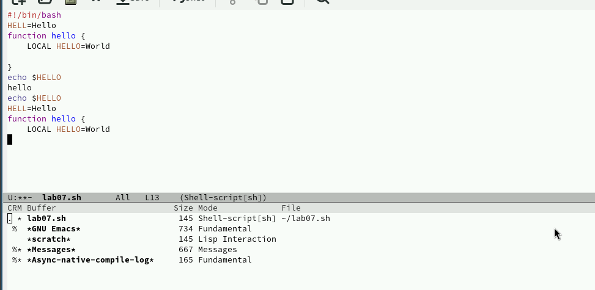{#fig:010 width=70%}

Затем перехожу к списку, нажав Ctrl-x и o,  перехожу к списку и нажав enter напротив  scratch перехожу в этот буфер. (рис. [-@fig:011]).

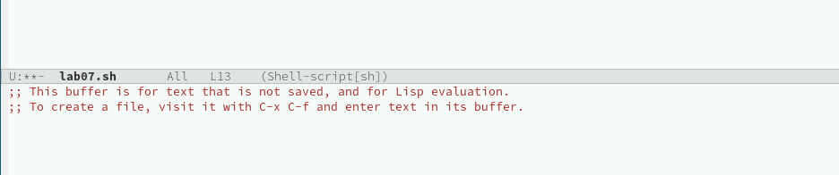{#fig:011 width=70%}

После комбинацией Ctrl-x и 0, закрываю окно. (рис. [-@fig:012])

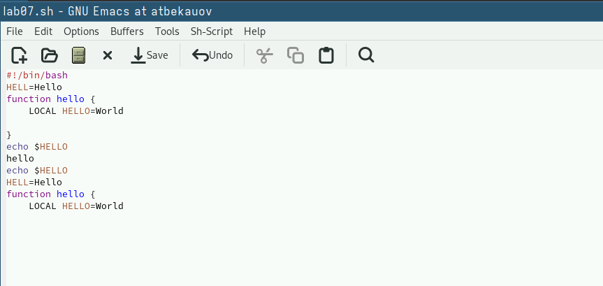{#fig:012 width=70%}

Далее с помощью комбинации Ctrl-o и b, переключаюсь в другой буфер без вывода списка.(рис. [-@fig:013]).

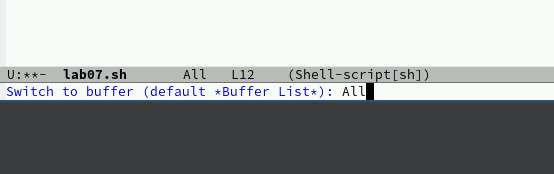{#fig:013 width=70%}

Затем разделяю фрейм на 4 части, комбинациями Ctrl-x и 3 (делит фрем на два окна по вертикали), Ctrl-x и 2(делит каждое из этих окон на две части по горизонтали) (рис. [-@fig:014]).

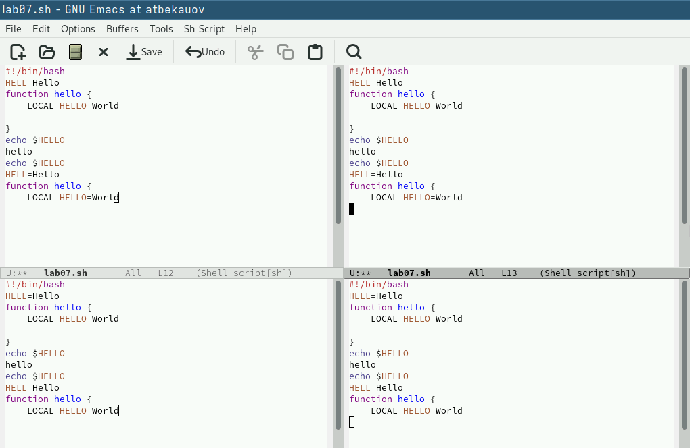{#fig:014 width=70%}

В каждом из окон создаю (Ctrl-x и Ctrl-f) новый файл и набираю в нём немного текста (рис. [-@fig:015]). 

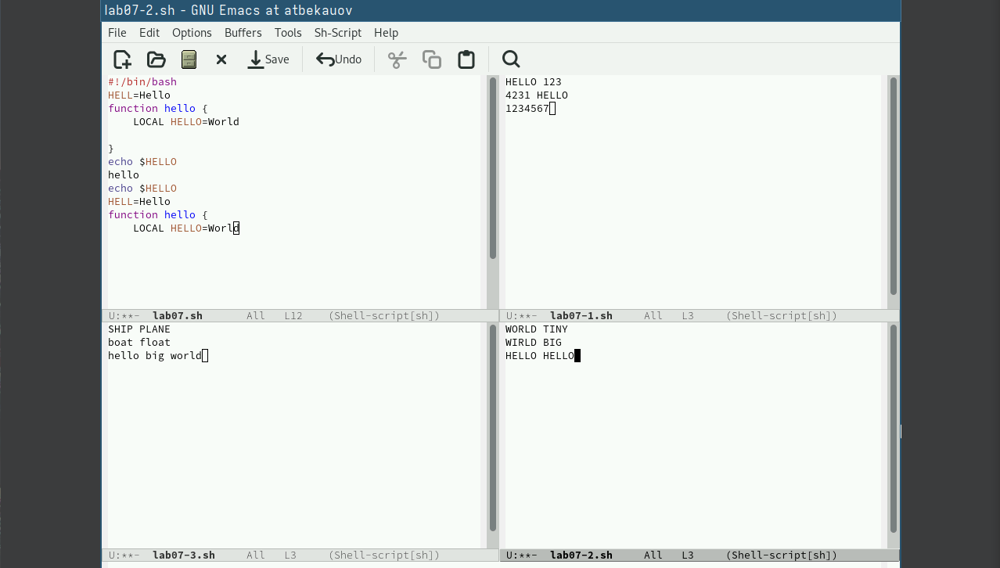{#fig:015 width=70%}

Закрываю все окна кроме изначального. Ввожу комбинацию Ctrl-s - перехожу в режим поиска, и ввожу слово HELLO, в тексте подсвечиваются все варианты этого слова. Могу перемещаться между ними в тексте, нажимая Ctrl-s. (рис. [-@fig:016]).
 

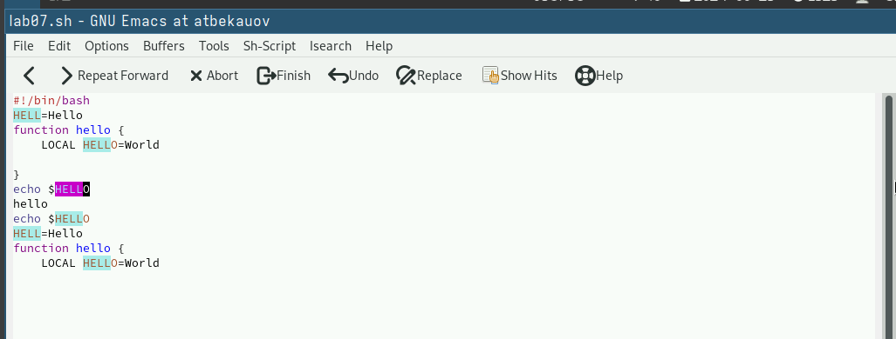{#fig:016 width=70%}

Выхожу из режима поиска с помощью комбинации Ctrl-g (Отмена текущего действия). Перехожу в режим поиска и замены, нажав Alt-%. Ввожу слово HELLO, и нажимаю ENTER, в тексте стали подсвечены все варианты этого слова и мне предлагается ввести слово на замену. (рис. [-@fig:017]).
 

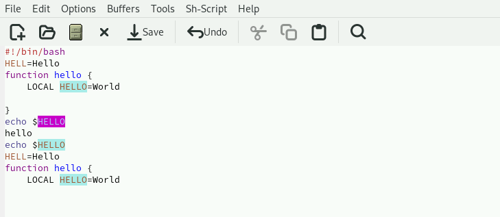{#fig:017 width=70%}

Ввожу слово BIG и нажимаю !, чтобы начать замену. (рис. [-@fig:018]).

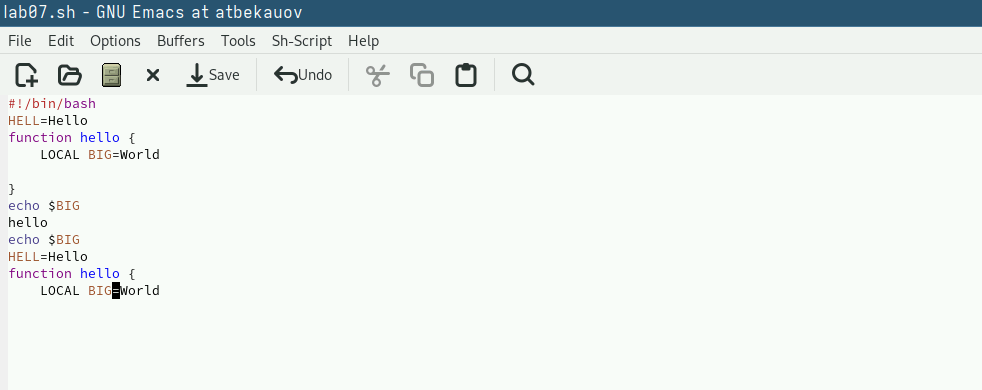{#fig:018 width=70%}

Рассмотрим режим поиска, вызываемый комбинацией Alt+s и o. Он отличается от обычного тем, что совпадения выводятся в отдельном окне в виде списка нумерованных строк из текста, в котором они появляются. (рис. [-@fig:019]).

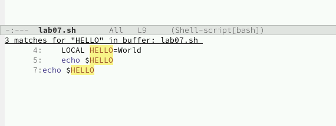{#fig:019 width=70%}

# Выводы

В ходе данной лаботраторной работы я получил практические навыки работы с редактором Emacs.

# Ответы на онтрольные вопросы

1. Кратко охарактеризуйте редактор emacs.

Emacs — один из наиболее мощных и широко распространённых редакторов, используемых в мире UNIX. Написан на языке высокого уровня Lisp.

2. Какие особенности данного редактора могут сделать его сложным для освоения новичком?

Большое разнообразие сложных комбинаций клавиш, которые необходимы для редактирования файла и в принципе для работа с Emacs.

3. Своими словами опишите, что такое буфер и окно в терминологии emacs’а.

Буфер - это объект в виде текста. Окно - это прямоугольная область, в которой отображен буфер.

4. Можно ли открыть больше 10 буферов в одном окне?

Да, можно.

5. Какие буферы создаются по умолчанию при запуске emacs?

Emacs использует буферы с именами, начинающимися с пробела, для внутренних целей. Отчасти он обращается с буферами с такими именами особенным образом — например, по умолчанию в них не записывается информация для отмены изменений.

6. Какие клавиши вы нажмёте, чтобы ввести следующую комбинацию C-c | и C-c C-|?

Ctrl + c, а потом | и Ctrl + c Ctrl + |

7. Как поделить текущее окно на две части?

С помощью команды Ctrl + x 3 (по вертикали) и Ctrl + x 2 (по горизонтали).

8. В каком файле хранятся настройки редактора emacs?

Настройки emacs хранятся в файле . emacs, который хранится в домашней дирректории пользователя. Кроме этого файла есть ещё папка . emacs.

9. Какую функцию выполняет клавиша и можно ли её переназначить?

Выполняет функцию стереть, думаю можно переназначить.

10. Какой редактор вам показался удобнее в работе vi или emacs? Поясните почему.

Для меня удобнее был редактор Emacs, так как у него есть командая оболочка. А vi открывается в терминале, и выглядит своеобразно.
