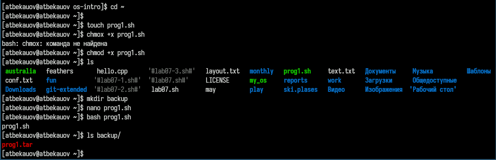
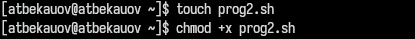
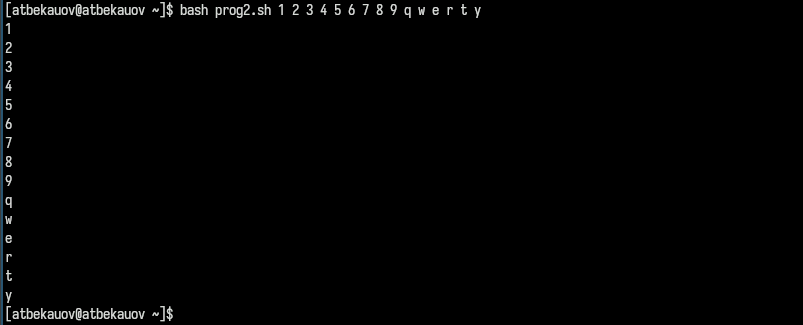
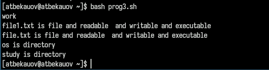
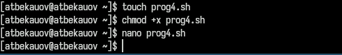
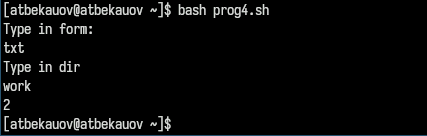

---
## Front matter
lang: ru-RU
title: Лабораторная работа №11
subtitle: Операционные системы
  - Бекауов А.Т
institute:
  - Российский университет дружбы народов, Москва, Россия

## i18n babel
babel-lang: russian
babel-otherlangs: english

## Formatting pdf
toc: false
toc-title: Содержание
slide_level: 2
aspectratio: 169
section-titles: true
theme: metropolis
header-includes:
 - \metroset{progressbar=frametitle,sectionpage=progressbar,numbering=fraction}
 - '\makeatletter'
 - '\beamer@ignorenonframefalse'
 - '\makeatother'

##Fonts
mainfont: PT Serif
romanfont: PT Serif
sansfont: PT Sans
monofont: PT Mono
mainfontoptions: Ligatures=TeX
romanfontoptions: Ligatures=TeX
sansfontoptions: Ligatures=TeX,Scale=MatchLowercase
monofontoptions: Scale=MatchLowercase,Scale=0.9
---

# Введение

## Цель работы

Цель данной лабораторной работы - получить практические навыки работы с редактором Emacs.

# Выполнение лабораторной работы

## Запуск Emacs

Введя в терминале команду emacs, открываю текстовый редактор Emacs.

{#fig:001 width=70%}

## Создание и открытие файла

Далее нажав комбинации клавиши Ctrl-x и Ctrl-f, создаю и открываю файл lab07.sh.

{#fig:002 width=70%}

## Ввод текста

Затем ввожу в файл текст, приложенный в методичке к лабораторной работе.

{#fig:003 width=70%}

## Сохранение файла

После этого прожимаю комбинации клавиш Ctrl-x и Ctrl-s и сохраняю изменения в файле.

{#fig:004 width=70%}

## Вырезание и вставка строки

С помощью комбинации Ctrl-k вырезаю (коопирую и удаляю) 5-ую строку и ,переведя курсор в конец файла, прожимаю комбинацию Ctrl-y, которая вставляет скопированную строку.

{#fig:005 width=70%}

## Выделение и копирование текста

Далее устанавливаю курсор в начале второй строки и прожимаю комбинацю Ctrl-space, которая позволяет мне выделять текст перемещая курсор. Выделяю строки со 2-ой по 4-ую и копирую их, нажав Alt-w 

{#fig:006 width=70%}

## Вставка текста

Далее с помощью комбинации Ctrl-y, вставляю скопированный текст в конец.

{#fig:007 width=70%}

## Вырезание текста

Вновь выделяю (Ctrl-space) ,только что вставленный, текст и нажав комбинацию Ctrl-w, вырезаю выделенный текст.

{#fig:008 width=70%}

## Отмена последнего действия

Затем с помощью комбинации Ctrl-/ отменяю последнее действие, возвращая обратно выделенный текст.

{#fig:009 width=70%}

## Перемещение по файлу

Перемещение по файлу происходит с помощью стрелок, которые перемещаю курсор по символом. Также с помощью комбинаций Ctrl-a (курсор в начало строки), Ctrl-e (курсор в конец строки), Alt-< (курсор в начало буфера), Alt-> (курсор в конец буфера).

## Список активных буферов

Нажав комбинации клавиш Ctrl-x и Ctrl-b, вывожу список активных буферов на экран

{#fig:010 width=70%}

## Перемещение в активный буфер

Затем перехожу к списку, нажав Ctrl-x и o,  перехожу к списку и нажав enter напротив  scratch перехожу в этот буфер.

{#fig:011 width=70%}

## Закрытие окна

После комбинацией Ctrl-x и 0, закрываю окно.

{#fig:012 width=70%}

## Перемещение в буфер без списка

Далее с помощью комбинации Ctrl-o и b, переключаюсь в другой буфер без вывода списка

{#fig:013 width=70%}

## Деление фрейма на 4 окна

Затем разделяю фрейм на 4 части, комбинациями Ctrl-x и 3 (делит фрем на два окна по вертикали), Ctrl-x и 2(делит каждое из этих окон на две части по горизонтали) 

{#fig:014 width=70%}

## Открытие 4 файлов в 4 окнах

В каждом из окон создаю (Ctrl-x и Ctrl-f) новый файл и набираю в нём немного текста

{#fig:015 width=70%}

## Режим поиска Ctrl-s

Закрываю все окна кроме изначального. Ввожу комбинацию Ctrl-s - перехожу в режим поиска, и ввожу слово HELLO, в тексте подсвечиваются все варианты этого слова. Могу перемещаться между ними в тексте, нажимая Ctrl-s.

{#fig:016 width=70%}

## Режим поиска и замены

Выхожу из режима поиска с помощью комбинации Ctrl-g (Отмена текущего действия). Перехожу в режим поиска и замены, нажав Alt-%. Ввожу слово HELLO, и нажимаю ENTER, в тексте стали подсвечены все варианты этого слова и мне предлагается ввести слово на замену.

{#fig:017 width=70%}

## Замена

Ввожу слово BIG и нажимаю !, чтобы начать замену.

{#fig:018 width=70%}

## Второй режим поиска

Рассмотрим режим поиска, вызываемый комбинацией Alt+s и o. Он отличается от обычного тем, что совпадения выводятся в отдельном окне в виде списка нумерованных строк из текста, в котором они появляются.

{#fig:019 width=70%}

# Заключение

## Выводы

В ходе данной лаботраторной работы я получил практические навыки работы с редактором Emacs.

