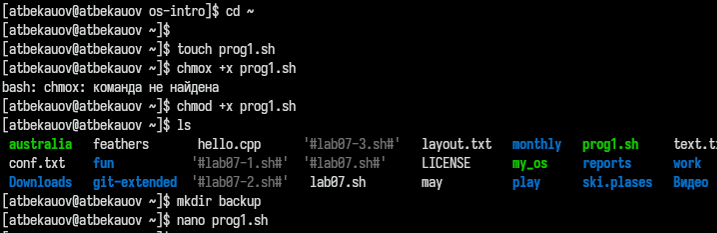
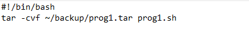
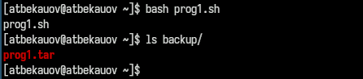
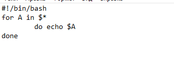
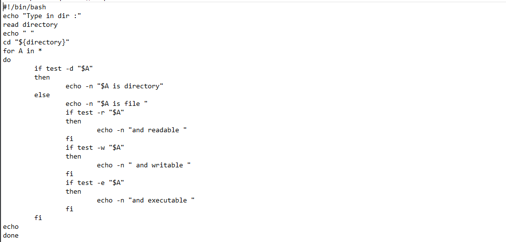
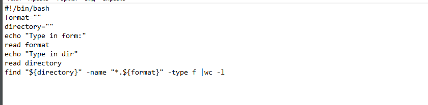

---
## Front matter
lang: ru-RU
title: Лабораторная работа №12
subtitle: Операционные системы
  - Бекауов А.Т
institute:
  - Российский университет дружбы народов, Москва, Россия

## i18n babel
babel-lang: russian
babel-otherlangs: english

## Formatting pdf
toc: false
toc-title: Содержание
slide_level: 2
aspectratio: 169
section-titles: true
theme: metropolis
header-includes:
 - \metroset{progressbar=frametitle,sectionpage=progressbar,numbering=fraction}
 - '\makeatletter'
 - '\beamer@ignorenonframefalse'
 - '\makeatother'

##Fonts
mainfont: PT Serif
romanfont: PT Serif
sansfont: PT Sans
monofont: PT Mono
mainfontoptions: Ligatures=TeX
romanfontoptions: Ligatures=TeX
sansfontoptions: Ligatures=TeX,Scale=MatchLowercase
monofontoptions: Scale=MatchLowercase,Scale=0.9
---

# Введение

## Цель работы

Цель данной лабораторной работы - изучить основы программирования в оболочке ОС UNIX/Linux. Научиться писать небольшие командные файлы.

# Выполнение лабораторной работы

## Программа №1 - Создание файла

Создаю файл prog1.sh  для новой программы меняю права доступа, разрешая его выполнение, таким образом файл становится исполняемым. Открываю файл в nano.

{#fig:001 width=70%}

## Программа №1 - Листинг

Далее ввожу следующий текст программы:

{#fig:002 width=70%}

## Программа №1 - Выполнение

Сохраняю файл и закрываю редактор nano, далее запускаю исполняемый файл с помощью команды bash. Затем проверяю, что файл создал резервную копию самого себя (в виде архива) и поместил её в директорию backup.

{#fig:003 width=70%}

## Программа №2 - Создание файла

Создаю файл prog2.sh  для новой программы меняю права доступа, разрешая его выполнение, таким образом файл становится исполняемым. Открываю файл в nano.

{#fig:001 width=70%}

## Программа №2 - Листинг

Далее ввожу следующий текст программы:

{#fig:002 width=70%}

## Программа №2 - Выполнение

Сохраняю файл, выхожу из nano  и запускую файл через bash,  введя в качестве аргумента разные символы. Как видим символы были продублированны скриптом.

{#fig:003 width=70%}

## Программа №3 - Создание файла

Создаю файл prog1.sh  для новой программы меняю права доступа, разрешая его выполнение, таким образом файл становится исполняемым. Открываю файл в nano.

{#fig:001 width=70%}

## Программа №3 - Листинг

Далее ввожу следующий текст программы:

{#fig:002 width=70%}

## Программа №3 - Выполнение

Сохраняю файл, выхожу из nano  и запускую файл через bash, скрип просит ввести директорию - ввожу имя директории work. Скрипт выводит информацию о всех объектах этой директории.

{#fig:003 width=70%}

## Программа №4 - Создание файла

Создаю файл prog1.sh  для новой программы меняю права доступа, разрешая его выполнение, таким образом файл становится исполняемым. Открываю файл в nano.

{#fig:001 width=70%}

## Программа №4 - Листинг

Далее ввожу следующий текст программы:

{#fig:002 width=70%}

## Программа №4 - Выполнение

Сохраняю файл, выхожу из nano  и запускую файл через bash, скрипт просит ввести формат - ввожу txt, скрип просит ввести директорию - ввожу имя директории work. Кол-во txt файлов в директории work - 2.

{#fig:003 width=70%}

# Заключение

## Выводы

В ходе данной лаботраторной работы я изучил основы программирования в оболочке ОС UNIX/Linux. Научился писать небольшие командные файлы.

