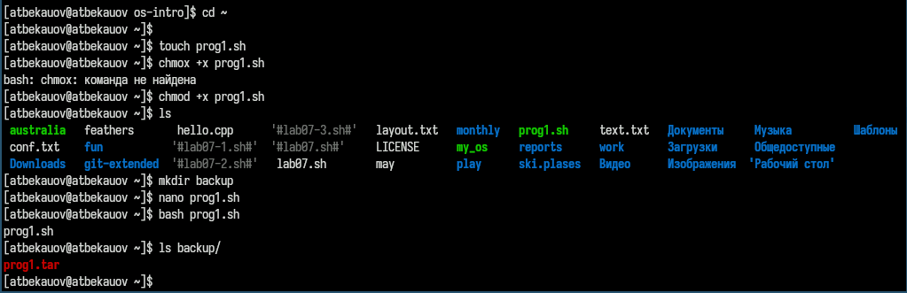
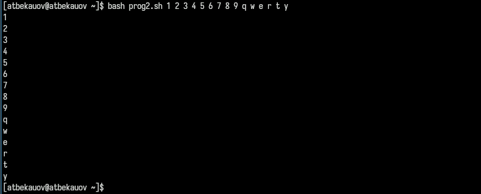
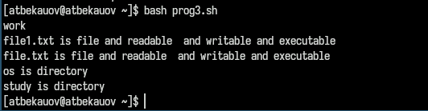
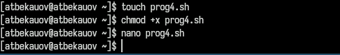
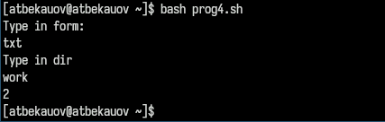

---
## Front matter
title: "Отчёт по лабораторной работе №12"
subtitle: "Операционные системы"
author: "Бекауов Артур Тимурович"

## Generic otions
lang: ru-RU
toc-title: "Содержание"

## Bibliography
bibliography: bib/cite.bib
csl: pandoc/csl/gost-r-7-0-5-2008-numeric.csl

## Pdf output format
toc: true # Table of contents
toc-depth: 2
lof: true # List of figures
lot: true # List of tables
fontsize: 12pt
linestretch: 1.5
papersize: a4
documentclass: scrreprt
## I18n polyglossia
polyglossia-lang:
  name: russian
  options:
	- spelling=modern
	- babelshorthands=true
polyglossia-otherlangs:
  name: english
## I18n babel
babel-lang: russian
babel-otherlangs: english
## Fonts
mainfont: PT Serif
romanfont: PT Serif
sansfont: PT Sans
monofont: PT Mono
mainfontoptions: Ligatures=TeX
romanfontoptions: Ligatures=TeX
sansfontoptions: Ligatures=TeX,Scale=MatchLowercase
monofontoptions: Scale=MatchLowercase,Scale=0.9
## Biblatex
biblatex: true
biblio-style: "gost-numeric"
biblatexoptions:
  - parentracker=true
  - backend=biber
  - hyperref=auto
  - language=auto
  - autolang=other*
  - citestyle=gost-numeric
## Pandoc-crossref LaTeX customization
figureTitle: "Рис."
tableTitle: "Таблица"
listingTitle: "Листинг"
lofTitle: "Список иллюстраций"
lotTitle: "Список таблиц"
lolTitle: "Листинги"
## Misc options
indent: true
header-includes:
  - \usepackage{indentfirst}
  - \usepackage{float} # keep figures where there are in the text
  - \floatplacement{figure}{H} # keep figures where there are in the text
---

# Цель работы

Цель данной лабораторной работы - изучить основы программирования в оболочке ОС UNIX/Linux. Научиться писать небольшие командные файлы.

# Задание

1. Написать скрипт, который при запуске будет делать резервную копию самого себя (то есть файла, в котором содержится его исходный код) в другую директорию backup в вашем домашнем каталоге. При этом файл должен архивироваться одним из архиваторов на выбор zip, bzip2 или tar. Способ использования команд архивации необходимо узнать, изучив справку.

2. Написать пример командного файла, обрабатывающего любое произвольное число аргументов командной строки, в том числе превышающее десять. Например, скрипт может последовательно распечатывать значения всех переданных аргументов.

3. Написать командный файл — аналог команды ls (без использования самой этой команды и команды dir). Требуется, чтобы он выдавал информацию о нужном каталоге и выводил информацию о возможностях доступа к файлам этого каталога.

4. Написать командный файл, который получает в качестве аргумента командной строки формат файла (.txt, .doc, .jpg, .pdf и т.д.) и вычисляет количество таких файлов в указанной директории. Путь к директории также передаётся в виде аргумента командной строки.

# Выполнение лабораторной работы

Создаю файл prog1.sh  для новой программы меняю права доступа, разрешая его выполнение, таким образом файл становится исполняемым. Открываю файл в редакторе nano и записываю следующий код программы:

```shell
#!/bin/bash
tar -cvf ~/backup/prog1.tar prog1.sh
```

Сохраняю файл и закрываю редактор nano, далее запускаю исполняемый файл с помощью команды bash. Затем проверяю, что файл создал резервную копию самого себя (в виде архива) и поместил её в директорию backup.(рис. [-@fig:001]).

{#fig:001 width=70%}

Создаю файл prog2.sh, меняю права доступа, разрешая его выполнение. Открываю файл в nano (рис. [-@fig:002]).

{#fig:002 width=70%}

Затем ввожу в файл текст программы:

```shell
#!/bin/bash
for A in $*
	do echo $A
done
```

Сохраняю файл, выхожу из nano  и запускую файл через bash,  введя в качестве аргумента разные символы. Как видим символы были продублированны скриптом. (рис. [-@fig:003]).

{#fig:003 width=70%}

Создаю файл prog3.sh, меняю права доступа, разрешая его выполнение. Открываю файл в nano (рис. [-@fig:004]).

{#fig:004 width=70%}

Затем ввожу в файл текст программы:

```shell
#!/bin/bash
echo "Type in dir :"
read directory
echo " "
cd "${directory}"
for A in *
do
	if test -d "$A"
	then
		echo -n "$A is directory"
	else
		echo -n "$A is file "
		if test -r "$A"
		then
			echo -n "and readable "
		fi
		if test -w "$A"
		then
			echo -n " and writable "
		fi
		if test -e "$A"
		then
			echo -n "and executable "
		fi
	fi
echo
done
```

Сохраняю файл, выхожу из nano  и запускую файл через bash, скрип просит ввести директорию - ввожу имя директории work. Скрипт выводит информацию о всех объектах этой директории.   (рис. [-@fig:005]).

{#fig:005 width=70%}

Создаю файл prog4.sh, меняю права доступа, разрешая его выполнение. Открываю файл в nano (рис. [-@fig:006]).

{#fig:006 width=70%}

Затем ввожу в файл текст программы:

```shell
#!/bin/bash
format=""
directory=""
echo "Type in form:"
read format
echo "Type in dir"
read directory
find "${directory}" -name "*.${format}" -type f |wc -l
```

Сохраняю файл, выхожу из nano  и запускую файл через bash, скрипт просит ввести формат - ввожу txt, скрип просит ввести директорию - ввожу имя директории work. Кол-во txt файлов в директории work - 2.

{#fig:007 width=70%}


# Выводы

В ходе данной лаботраторной работы я изучил основы программирования в оболочке ОС UNIX/Linux. Научился писать небольшие командные файлы.

# Ответы на онтрольные вопросы

1. Кратко охарактеризуйте редактор emacs.

Emacs — один из наиболее мощных и широко распространённых редакторов, используемых в мире UNIX. Написан на языке высокого уровня Lisp.

2. Какие особенности данного редактора могут сделать его сложным для освоения новичком?

Большое разнообразие сложных комбинаций клавиш, которые необходимы для редактирования файла и в принципе для работа с Emacs.

3. Своими словами опишите, что такое буфер и окно в терминологии emacs’а.

Буфер - это объект в виде текста. Окно - это прямоугольная область, в которой отображен буфер.

4. Можно ли открыть больше 10 буферов в одном окне?

Да, можно.

5. Какие буферы создаются по умолчанию при запуске emacs?

Emacs использует буферы с именами, начинающимися с пробела, для внутренних целей. Отчасти он обращается с буферами с такими именами особенным образом — например, по умолчанию в них не записывается информация для отмены изменений.

6. Какие клавиши вы нажмёте, чтобы ввести следующую комбинацию C-c | и C-c C-|?

Ctrl + c, а потом | и Ctrl + c Ctrl + |

7. Как поделить текущее окно на две части?

С помощью команды Ctrl + x 3 (по вертикали) и Ctrl + x 2 (по горизонтали).

8. В каком файле хранятся настройки редактора emacs?

Настройки emacs хранятся в файле . emacs, который хранится в домашней дирректории пользователя. Кроме этого файла есть ещё папка . emacs.

9. Какую функцию выполняет клавиша и можно ли её переназначить?

Выполняет функцию стереть, думаю можно переназначить.

10. Какой редактор вам показался удобнее в работе vi или emacs? Поясните почему.

Для меня удобнее был редактор Emacs, так как у него есть командая оболочка. А vi открывается в терминале, и выглядит своеобразно.
