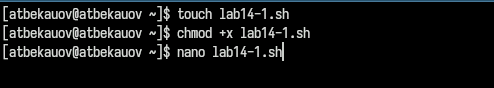
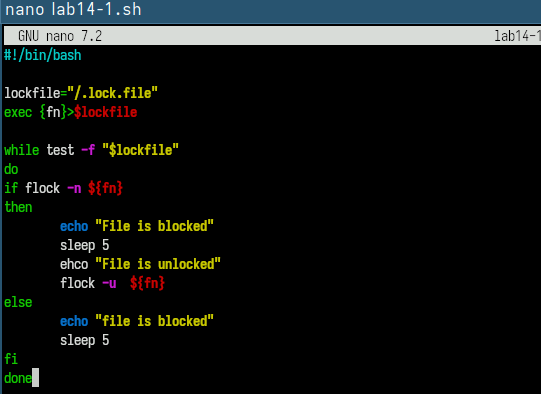
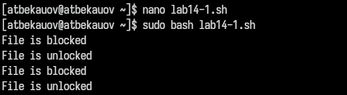
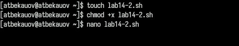
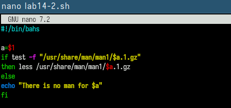
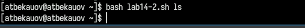
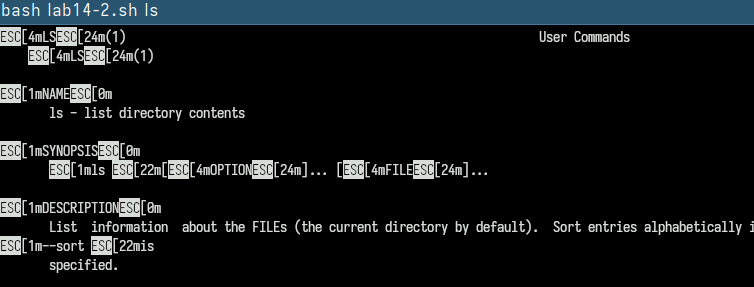
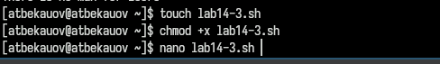
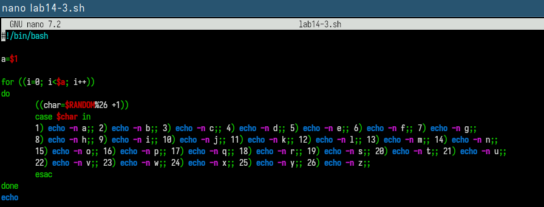
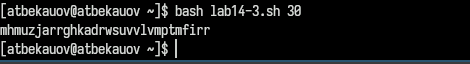

---
## Front matter
lang: ru-RU
title: Лабораторная работа №14
subtitle: Операционные системы
  - Бекауов А.Т
institute:
  - Российский университет дружбы народов, Москва, Россия

## i18n babel
babel-lang: russian
babel-otherlangs: english

## Formatting pdf
toc: false
toc-title: Содержание
slide_level: 2
aspectratio: 169
section-titles: true
theme: metropolis
header-includes:
 - \metroset{progressbar=frametitle,sectionpage=progressbar,numbering=fraction}
 - '\makeatletter'
 - '\beamer@ignorenonframefalse'
 - '\makeatother'

##Fonts
mainfont: PT Serif
romanfont: PT Serif
sansfont: PT Sans
monofont: PT Mono
mainfontoptions: Ligatures=TeX
romanfontoptions: Ligatures=TeX
sansfontoptions: Ligatures=TeX,Scale=MatchLowercase
monofontoptions: Scale=MatchLowercase,Scale=0.9
---

# Введение

## Цель работы

Изучить основы программирования в оболочке ОС UNIX. Научиться писать более сложные командные файлы с использованием логических управляющих конструкций и циклов.

# Выполнение лабораторной работы

## Программа №1 - Создание файла

Создаю файл lab14-1.sh  для новой программы меняю права доступа, разрешая его выполнение, таким образом файл становится исполняемым.

{#fig:001 width=70%}

## Программа №1 - Листинг

Открываю файл в редакторе nano и записываю следующий код программы:

{#fig:002 width=70%}

## Программа №1 - Выполнение

Сохраняю файл и закрываю редактор nano, далее запускаю исполняемый файл с помощью команды bash. Затем проверяю, что выполняет поставленную задачу.

{#fig:003 width=70%}

## Программа №2 - Создание файлов

Создаю файл lab14-2.sh, меняю права доступа, разрешая его выполнение.

{#fig:004 width=70%}

## Программа №2 - Листинг lab14-2.sh

Затем открываю в nano файл lab14-2.sh  и ввожу следующую программу:

{#fig:005 width=70%}

## Программа №2 - Выполнение 1

Сохраняю файл, выхожу из nano  и запускую файл через bash.  Ввожу в качестве аргумента ls

{#fig:006 width=70%}

## Программа №2 - Выполнение 2

Вижу, что командный файл открыл мне справку по команде ls.

{#fig:007 width=70%}

## Программа №3 - Создание файла

Создаю файл lab13-4.sh, меняю права доступа, разрешая его выполнение. Открываю файл в nano

{#fig:008 width=70%}

## Программа №3 - Листинг

Далее ввожу следующий текст программы:

{#fig:009 width=70%}

## Программа №3 - Выполнение

Сохраняю файл, выхожу из nano  и запускую файл через bash с аргументом 30, программа выводит 30 случайных английских букв.

{#fig:010 width=70%}

# Заключение

## Выводы

В ходе данной лаботраторной работы я научился писать более сложные командные файлы с использованием логических управляющих конструкций и циклов.

