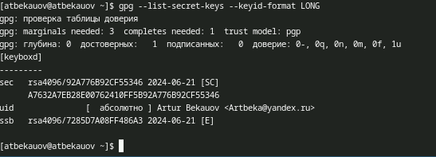
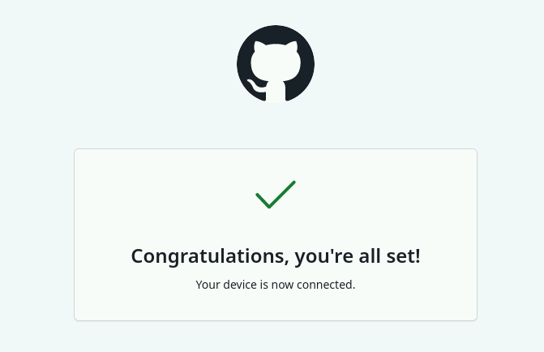
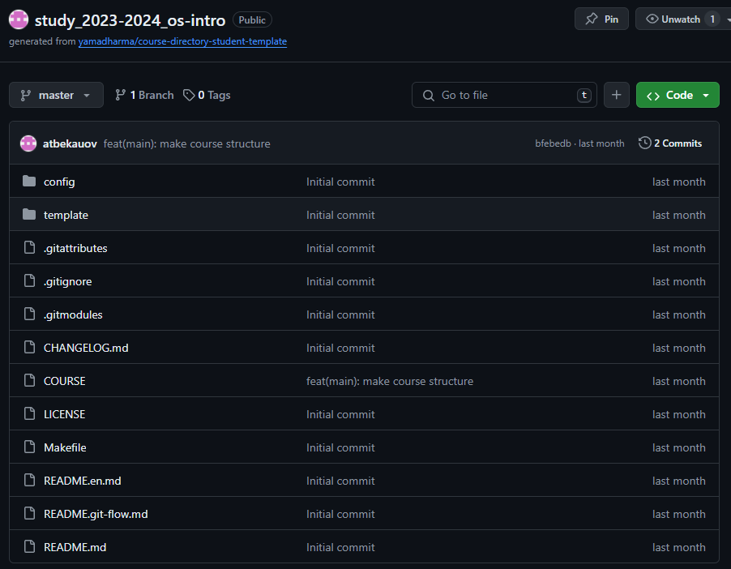

---
## Front matter
lang: ru-RU
title: Лабораторная работа №2
subtitle: Операционные системы
author:
  - Бекауов А.Т
institute:
  - Российский университет дружбы народов, Москва, Россия

## i18n babel
babel-lang: russian
babel-otherlangs: english

## Formatting pdf
toc: false
toc-title: Содержание
slide_level: 2
aspectratio: 169
section-titles: true
theme: metropolis
header-includes:
 - \metroset{progressbar=frametitle,sectionpage=progressbar,numbering=fraction}
 - '\makeatletter'
 - '\beamer@ignorenonframefalse'
 - '\makeatother'
---

# Введение

## Цель работы

Цель данной лабораторной работы -- изучение идеологии и применения средств контроля версий, освоение умения по работе с git.

## Задачи

1.Создать базовую конфигурацию для работы с git

2.Создать ключ SSH

3.Создать ключ GPG

4.Настроить подписи Git

5.Заргеистрироваться на GitHub

6.Создать локальный каталог для выполнения заданий по предмету.

# Выполнение лабораторной работы

## Установка пакетов git

Первым делом в начале лабораторной работы я проверил, что у меня установлены пакеты системы контроля версий git.

{#fig:001 width=70%}

## Базовая настройка git

Далее задаю имя и email владельца репозитория, Настраиваю utf-8 в выводе сообщений git, задаю имя начальной ветки и указываю параметры autocrlf и safecrlf 

{#fig:002 width=70%}

## Создание pgp ключа

Затем создаю pgp ключ, по указанным в методчке параметрам.

{#fig:003 width=70%}

## Вывод списка ключей

После этого вывожу список ключей и копирую отпечаток приватного ключа.

{#fig:004 width=70%}

## Копирование ключа

У меня не корректно работал xclip, поэтому вывожу ключ в терминале, и копирую его вручную в буфер обмена.

{#fig:005 width=70%}

## Добавление GPG ключа в GitHub

Перейдя в GitHub в браузере, авторизуюсь и добавляю новый GPG ключ под названием Sway, куда вставляю из буфера созданный ключ. 

{#fig:006 width=70%}

## Автоматические подписи коммитов

Далее настраиваю автоматическую подпись коммитов

{#fig:007 width=70%}

## Авторизация устройства в GH

Затем провожу авторизацию в github, выбираю авторизоваться через браузер и  вхожу там в свой аккаунт github.

{#fig:008 width=70%}

## Создание репозитория по шаблону

После создаю репозиторий в GH по шаблону приложенному в методичке.

{#fig:009 width=70%}

## Создание каталога для репозитория

Далее создаю каталог ~/work/study/2022-2023/"Операционные системы"

{#fig:010 width=70%}

## Создание ssh ключей

Далее я создаю ssh ключи

{#fig:011 width=70%}

## Добавление ssh ключа

Скопировал ключ в буфер обмена и добавил на GH c названием sway. 

{#fig:012 width=70%}

## Копирование репозитория курса

После этого клонирую созданный репозиторий в приготовленную ранее папку (локальный репозиторий называю os-intro)

{#fig:013 width=70%}

## Отправка изменений на сервер

Произвожу описанные в методичке действия с файлами реопзитория и отправляю изменения на сервер

{#fig:014 width=70%}

# Заключение

## Выводы

В ходе данной лаботраторной работы я изучил идеологии и применения средств контроля версий, освоил умения по работе с git.

