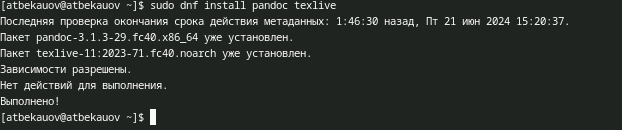
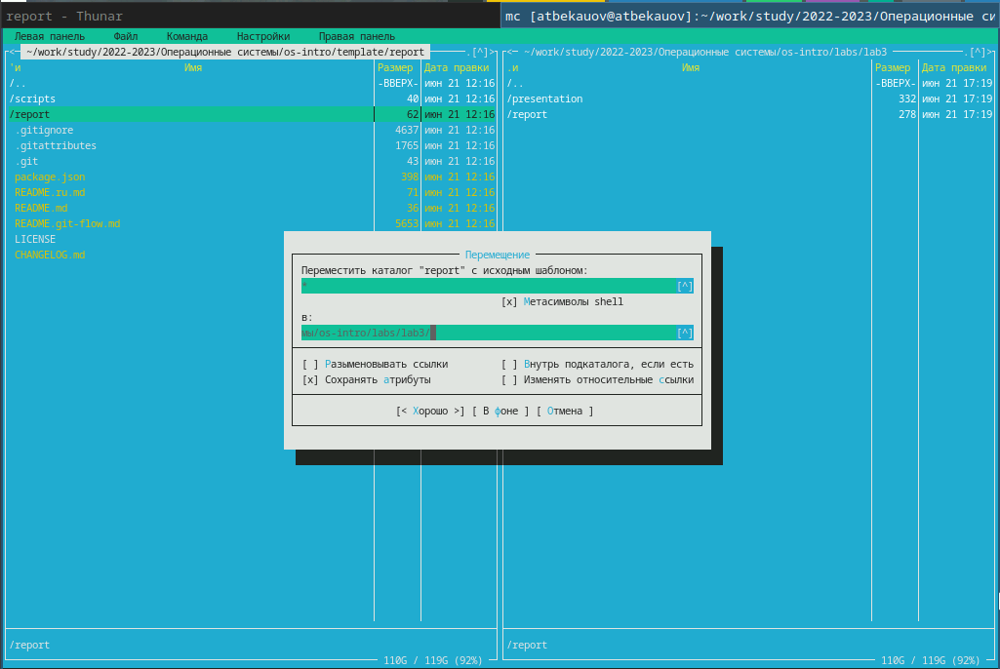
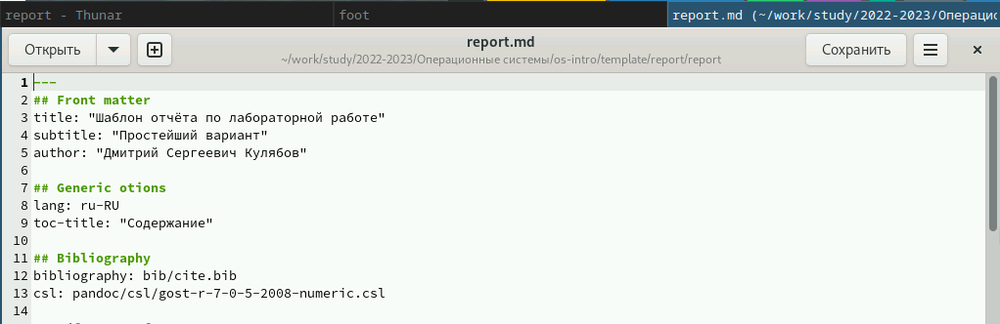
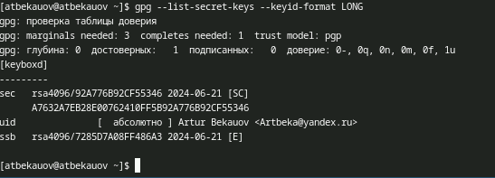
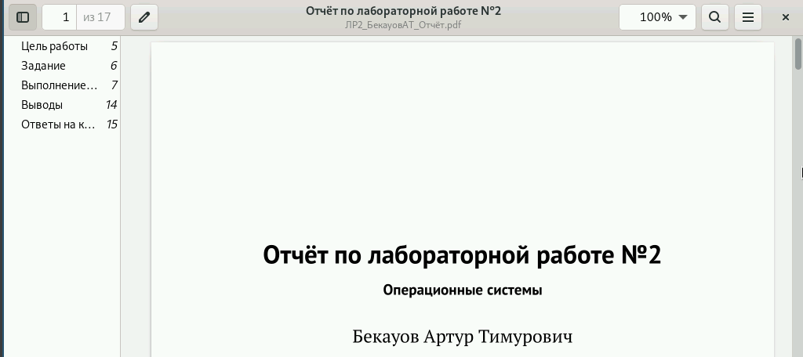

---
## Front matter
lang: ru-RU
title: Лабораторная работа №3
subtitle: Операционные системы
author:
  - Бекауов А.Т
institute:
  - Российский университет дружбы народов, Москва, Россия

## i18n babel
babel-lang: russian
babel-otherlangs: english

## Formatting pdf
toc: false
toc-title: Содержание
slide_level: 2
aspectratio: 169
section-titles: true
theme: metropolis
header-includes:
 - \metroset{progressbar=frametitle,sectionpage=progressbar,numbering=fraction}
 - '\makeatletter'
 - '\beamer@ignorenonframefalse'
 - '\makeatother'

##Fonts
mainfont: PT Serif
romanfont: PT Serif
sansfont: PT Sans
monofont: PT Mono
mainfontoptions: Ligatures=TeX
romanfontoptions: Ligatures=TeX
sansfontoptions: Ligatures=TeX,Scale=MatchLowercase
monofontoptions: Scale=MatchLowercase,Scale=0.9
---

# Введение

## Цель работы

Научиться оформлять отчёты с помощью легковесного языка разметки Markdown

## Задачи

– Сделайте отчёт по предыдущей лабораторной работе в формате Markdown

# Выполнение лабораторной работы

## Установка пакетов pandoc и texlive

Первым делом в начале лабораторной работы я проверил, что у меня установлены пакеты системы контроля версий git.

{#fig:001 width=70%}

## Перемещение образца отчёта

Далее задаю имя и email владельца репозитория, Настраиваю utf-8 в выводе сообщений git, задаю имя начальной ветки и указываю параметры autocrlf и safecrlf 

{#fig:002 width=70%}

## Редактирование report.md

Затем создаю pgp ключ, по указанным в методчке параметрам.

{#fig:003 width=70%}

## Компиляция отчётов

После этого вывожу список ключей и копирую отпечаток приватного ключа.

{#fig:004 width=70%}

## Проверка отчёта

У меня не корректно работал xclip, поэтому вывожу ключ в терминале, и копирую его вручную в буфер обмена.

{#fig:005 width=70%}

# Заключение

## Выводы

В ходе данной лаботраторной работы я научился оформлять отчёты с помощью легковесного языка разметки Markdown

