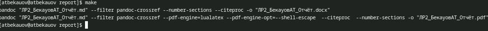

---
## Front matter
lang: ru-RU
title: Лабораторная работа №3
subtitle: Операционные системы
author:
  - Бекауов А.Т
institute:
  - Российский университет дружбы народов, Москва, Россия

## i18n babel
babel-lang: russian
babel-otherlangs: english

## Formatting pdf
toc: false
toc-title: Содержание
slide_level: 2
aspectratio: 169
section-titles: true
theme: metropolis
header-includes:
 - \metroset{progressbar=frametitle,sectionpage=progressbar,numbering=fraction}
 - '\makeatletter'
 - '\beamer@ignorenonframefalse'
 - '\makeatother'

##Fonts
mainfont: PT Serif
romanfont: PT Serif
sansfont: PT Sans
monofont: PT Mono
mainfontoptions: Ligatures=TeX
romanfontoptions: Ligatures=TeX
sansfontoptions: Ligatures=TeX,Scale=MatchLowercase
monofontoptions: Scale=MatchLowercase,Scale=0.9
---

# Введение

## Цель работы

Научиться оформлять отчёты с помощью легковесного языка разметки Markdown

## Задачи

– Сделайте отчёт по предыдущей лабораторной работе в формате Markdown

# Выполнение лабораторной работы

## Установка пакетов pandoc и texlive

Первым делом в начале лабораторной работы я проверил, что у меня установлены пакеты pandoc и texlive.

{#fig:001 width=70%}

## Перемещение образца отчёта

Далее я переместил папку с примером отчёта из каталога template в директорию соответствующую второй лабораторной

{#fig:002 width=70%}

## Редактирование report.md

Затем я открываю файл report в текстовом редакторе gedit и переписываю его в соответствии с изначальным отчётом по второй лабораторной.

{#fig:003 width=70%}

## Компиляция отчётов

Далее я переименовываю файл report.md и применяю в папке команду make, которая создаёт из md файла (С помощью makefile файла) отчёт в формате docx и pdf.

{#fig:004 width=70%}

## Проверка отчёта

После этого открою отчёт в формате pdf, чтобы в корректности компиляции.

{#fig:005 width=70%}

# Заключение

## Выводы

В ходе данной лаботраторной работы я научился оформлять отчёты с помощью легковесного языка разметки Markdown

