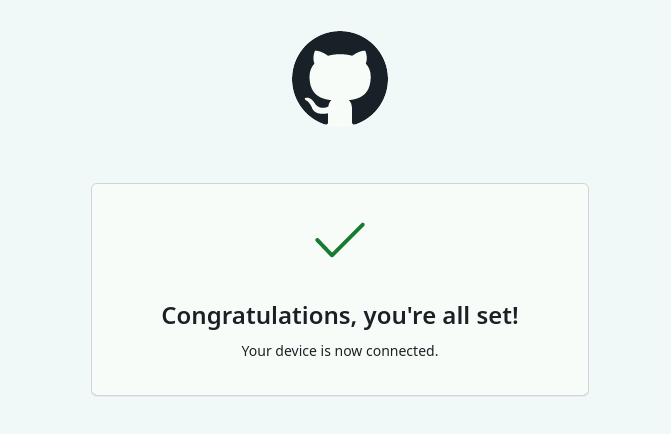
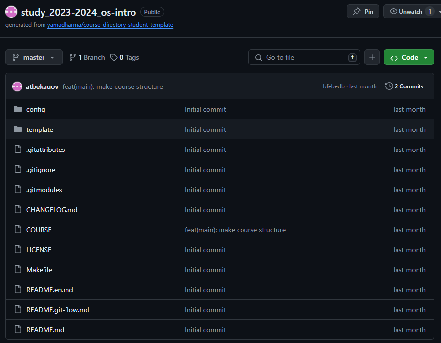
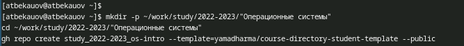
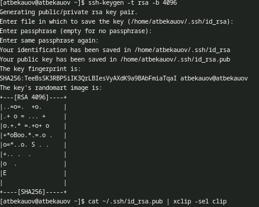
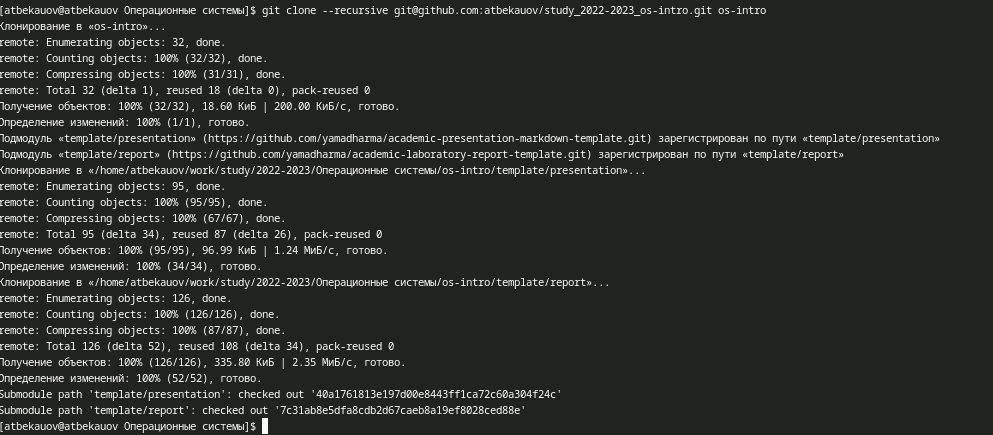
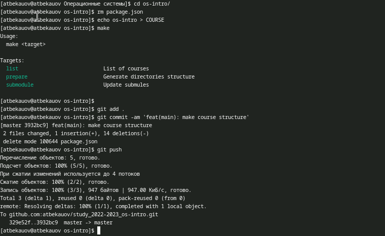

---
## Front matter
title: "Отчёт по лабораторной работе №2"
subtitle: "Операционные системы"
author: "Бекауов Артур Тимурович"

## Generic otions
lang: ru-RU
toc-title: "Содержание"

## Bibliography
bibliography: bib/cite.bib
csl: pandoc/csl/gost-r-7-0-5-2008-numeric.csl

## Pdf output format
toc: true # Table of contents
toc-depth: 2
lof: true # List of figures
lot: true # List of tables
fontsize: 12pt
linestretch: 1.5
papersize: a4
documentclass: scrreprt
## I18n polyglossia
polyglossia-lang:
  name: russian
  options:
	- spelling=modern
	- babelshorthands=true
polyglossia-otherlangs:
  name: english
## I18n babel
babel-lang: russian
babel-otherlangs: english
## Fonts
mainfont: PT Serif
romanfont: PT Serif
sansfont: PT Sans
monofont: PT Mono
mainfontoptions: Ligatures=TeX
romanfontoptions: Ligatures=TeX
sansfontoptions: Ligatures=TeX,Scale=MatchLowercase
monofontoptions: Scale=MatchLowercase,Scale=0.9
## Biblatex
biblatex: true
biblio-style: "gost-numeric"
biblatexoptions:
  - parentracker=true
  - backend=biber
  - hyperref=auto
  - language=auto
  - autolang=other*
  - citestyle=gost-numeric
## Pandoc-crossref LaTeX customization
figureTitle: "Рис."
tableTitle: "Таблица"
listingTitle: "Листинг"
lofTitle: "Список иллюстраций"
lotTitle: "Список таблиц"
lolTitle: "Листинги"
## Misc options
indent: true
header-includes:
  - \usepackage{indentfirst}
  - \usepackage{float} # keep figures where there are in the text
  - \floatplacement{figure}{H} # keep figures where there are in the text
---

# Цель работы

Цель данной лабораторной работы -- изучение идеологии и применения средств контроля версий, освоение умения по работе с git.

# Задание

1.Создать базовую конфигурацию для работы с git

2.Создать ключ SSH

3.Создать ключ GPG

4.Настроить подписи Git

5.Заргеистрироваться на GitHub

6.Создать локальный каталог для выполнения заданий по предмету.

# Выполнение лабораторной работы

Первым делом в начале лабораторной работы я проверил, что у меня установлены пакеты системы контроля версий git. (рис. [-@fig:001]).

{#fig:001 width=70%}

Далее задаю имя и email владельца репозитория, Настраиваю utf-8 в выводе сообщений git, задаю имя начальной ветки и указываю параметры autocrlf и safecrlf (рис. [-@fig:002]).

{#fig:002 width=70%}

Затем создаю pgp ключ, по указанным в методчке параметрам. (рис. [-@fig:003]).

{#fig:003 width=70%}

После этого вывожу список ключей и копирую отпечаток приватного ключа. (рис. [-@fig:004]).

{#fig:004 width=70%}

У меня не корректно работал xclip, поэтому вывожу ключ в терминале, и копирую его вручную в буфер обмена.  (рис. [-@fig:005]).

{#fig:005 width=70%}

Перейдя в GitHub в браузере, авторизуюсь и добавляю новый GPG ключ под названием Sway, куда вставляю из буфера созданный ключ. (рис. [-@fig:006]).

{#fig:006 width=70%}

Далее настраиваю автоматическую подпись коммитов. (рис. [-@fig:007]).

{#fig:007 width=70%}

Затем провожу авторизацию в github, выбираю авторизоваться через браузер и  вхожу там в свой аккаунт github. (рис. [-@fig:008]).

{#fig:008 width=70%}

После создаю репозиторий в GH по шаблону приложенному в методичке. (рис. [-@fig:009]).

{#fig:009 width=70%}

Далее создаю каталог ~/work/study/2022-2023/"Операционные системы"  (рис. [-@fig:010]).

{#fig:010 width=70%}

Далее я создаю ssh ключи. (рис. [-@fig:011]).

{#fig:011 width=70%}

Скопировал ключ в буфер обмена и добавил на GH c названием sway. (рис. [-@fig:012]).

{#fig:012 width=70%}

После этого клонирую созданный репозиторий в приготовленную ранее папку (локальный репозиторий называю os-intro) (рис. [-@fig:013]).

{#fig:013 width=70%}

Произвожу описанные в методичке действия с файлами реопзитория и отправляю изменения на сервер (рис. [-@fig:014]).

{#fig:014 width=70%}

# Выводы

В ходе данной лаботраторной работы я изучил идеологии и применения средств контроля версий, освоил умения по работе с git.

# Ответы на контрольные вопросы

1. Системы контроля версий (VCS) - программное обеспечение для облегчения работы с изменяющейся информацией. Они позволяют хранить несколько версий изменяющейся информации, одного и того же документа, может предоставить доступ к более ранним версиям документа. Используется для работы нескольких человек над проектом, позволяет посмотреть, кто и когда внес какое-либо изменение и т. д. VCS ррименяются для: Хранения понлой истории изменений, сохранения причин всех изменений, поиска причин изменений и совершивших изменение, совместной работы над проектами.

2. Хранилище -- репозиторий, хранилище версий, в нем хранятся все документы, включая историю их изменения и прочей служебной информацией. commit -- отслеживание изменений, сохраняет разницу в изменениях. История -- хранит все изменения в проекте и позволяет при необходимости вернуться/обратиться к нужным данным. Рабочая копия -- копия проекта, основанная на версии из хранилища, чаще всего последней версии.

3. Централизованные VCS (например: CVS, TFS, AccuRev) -- одно основное хранилище всего проекта. Каждый пользователь копирует себе необходимые ему файлы из этого репозитория, изменяет, затем добавляет изменения обратно в хранилище. Децентрализованные VCS (например: Git, Bazaar) -- у каждого пользователя свой вариант репозитория (возможно несколько вариантов), есть возможность добавлять и забирать изменения из любого репозитория. В отличие от классических, в распределенных (децентралиованных) системах контроля версий центральный репозиторий не является обязательным.

4. Сначала создается и подключается удаленный репозиторий, затем по мере изменения проекта эти изменения отправляются на сервер.

5. Участник проекта перед началом работы получает нужную ему версию проекта в хранилище, с помощью определенных команд, после внесения изменений пользователь размещает новую версию в хранилище. При этом предыдущие версии не удаляются. К ним можно вернуться в любой момент.

6. Хранение информации о всех изменениях в вашем коде, обеспечение удобства командной работы над кодом.

7. Создание основного дерева репозитория: git init

Получение обновлений (изменений) текущего дерева из центрального репозитория: git pull

Отправка всех произведённых изменений локального дерева в центральный репозиторий: git push

Просмотр списка изменённых файлов в текущей директории: git status

Просмотр текущих изменений: git diff

Сохранение текущих изменений: добавить все изменённые и/или созданные файлы и/или каталоги: git add .

добавить конкретные изменённые и/или созданные файлы и/или каталоги: git add имена_файлов

удалить файл и/или каталог из индекса репозитория (при этом файл и/или каталог остаётся в локальной директории): git rm имена_файлов

Сохранение добавленных изменений:

сохранить все добавленные изменения и все изменённые файлы: git commit -am 'Описание коммита'

сохранить добавленные изменения с внесением комментария через встроенный редактор: git commit

создание новой ветки, базирующейся на текущей: git checkout -b имя_ветки

переключение на некоторую ветку: git checkout имя_ветки (при переключении на ветку, которой ещё нет в локальном репозитории, она будет создана и связана с удалённой)

отправка изменений конкретной ветки в центральный репозиторий: git push origin имя_ветки

слияние ветки с текущим деревом: git merge --no-ff имя_ветки

Удаление ветки:

удаление локальной уже слитой с основным деревом ветки: git branch -d имя_ветки

принудительное удаление локальной ветки: git branch -D имя_ветки

удаление ветки с центрального репозитория: git push origin :имя_ветки

8. git push -all отправляем из локального репозитория все сохраненные изменения в центральный репозиторий, предварительно создав локальный репозиторий и сделав предварительную конфигурацию.

9. Ветвление - один из параллельных участков в одном хранилище, исходящих из одной версии, обычно есть главная ветка. Между ветками, т. е. их концами возможно их слияние. Используются для разработки новых функций.

10. Во время работы над проектом могут создаваться файлы, которые не следуют добавлять в репозиторий. Например, временные файлы. Можно прописать шаблоны игнорируемых при добавлении в репозиторий типов файлов в файл .gitignore с помощью сервисов.
