---
## Front matter
title: "Отчёт по лабораторной работе №5"
subtitle: "Операционные системы"
author: "Бекауов Артур Тимурович"

## Generic otions
lang: ru-RU
toc-title: "Содержание"

## Bibliography
bibliography: bib/cite.bib
csl: pandoc/csl/gost-r-7-0-5-2008-numeric.csl

## Pdf output format
toc: true # Table of contents
toc-depth: 2
lof: true # List of figures
lot: true # List of tables
fontsize: 12pt
linestretch: 1.5
papersize: a4
documentclass: scrreprt
## I18n polyglossia
polyglossia-lang:
  name: russian
  options:
	- spelling=modern
	- babelshorthands=true
polyglossia-otherlangs:
  name: english
## I18n babel
babel-lang: russian
babel-otherlangs: english
## Fonts
mainfont: PT Serif
romanfont: PT Serif
sansfont: PT Sans
monofont: PT Mono
mainfontoptions: Ligatures=TeX
romanfontoptions: Ligatures=TeX
sansfontoptions: Ligatures=TeX,Scale=MatchLowercase
monofontoptions: Scale=MatchLowercase,Scale=0.9
## Biblatex
biblatex: true
biblio-style: "gost-numeric"
biblatexoptions:
  - parentracker=true
  - backend=biber
  - hyperref=auto
  - language=auto
  - autolang=other*
  - citestyle=gost-numeric
## Pandoc-crossref LaTeX customization
figureTitle: "Рис."
tableTitle: "Таблица"
listingTitle: "Листинг"
lofTitle: "Список иллюстраций"
lotTitle: "Список таблиц"
lolTitle: "Листинги"
## Misc options
indent: true
header-includes:
  - \usepackage{indentfirst}
  - \usepackage{float} # keep figures where there are in the text
  - \floatplacement{figure}{H} # keep figures where there are in the text
---

# Цель работы

Цель данной лабораторной работы - ознакомится с менеджером паролей pass и дополнительным программным обеспечением и научится работать с менеджерами файлов конфигураций

# Задание

1.Ознакомится с менеджером паролей pass

2.Ознакомится с дополнительным программным обеспечением

3.Научится работать с менеджером файлов конфигураций

# Выполнение лабораторной работы

Установил пакеты pass и pass-otp. (рис. [-@fig:001]).

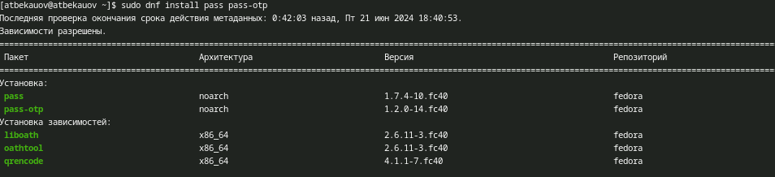{#fig:001 width=70%}

Далее устанавливаю пакеты gopass (рис. [-@fig:002]).

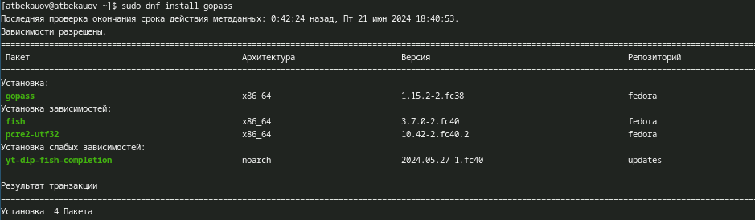{#fig:002 width=70%}

Затем просматриваю список ключей GPG (один ключ есть, он использовался в ЛР2) и инициализирую хранилище и создаю структуру git. (рис. [-@fig:003]).

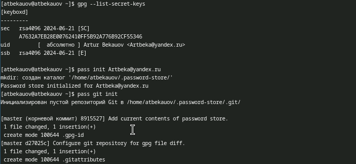{#fig:003 width=70%}

Создаю на GH репозиторий gitpass. (рис. [-@fig:004]).

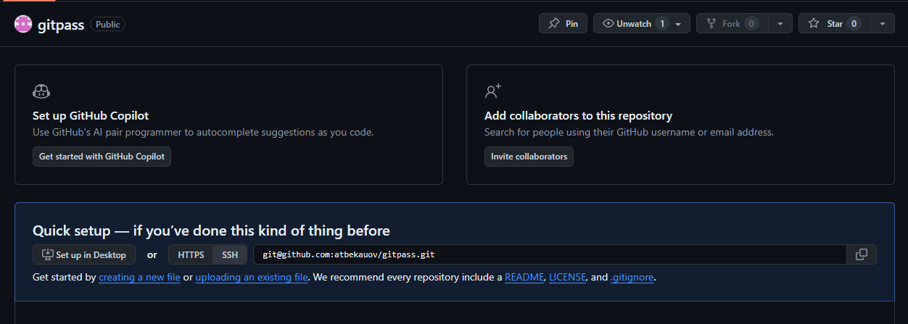{#fig:004 width=70%}

Задаю адрес созданного репозитория хранилищу и синхранизую локальное хранилище и то, что на GH.  (рис. [-@fig:005]).

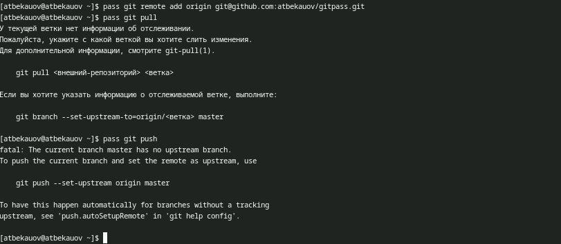{#fig:005 width=70%}

Далее проверяю возможность ручного коммита и проверяю статус синхронизации. (рис. [-@fig:006]).

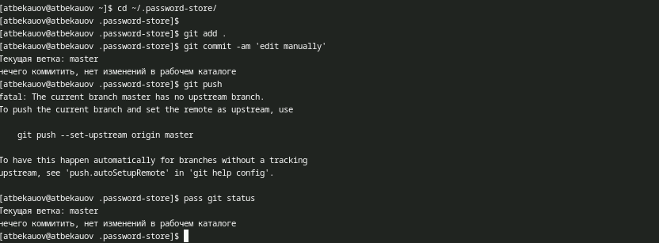{#fig:006 width=70%}

Для работы pass с браузером устанавливаю плагин для Firefox. (рис. [-@fig:007]).

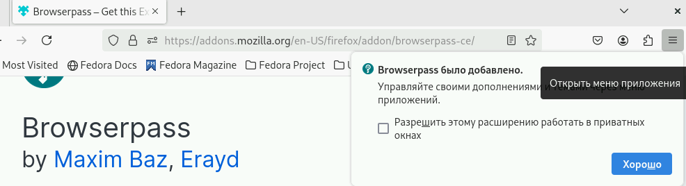{#fig:007 width=70%}

А для настройки интерфейса взаимодействия с браузером, включаю репозитории Copr и скачиваю пакет browserpass (browserpass-native). (рис. [-@fig:008]).

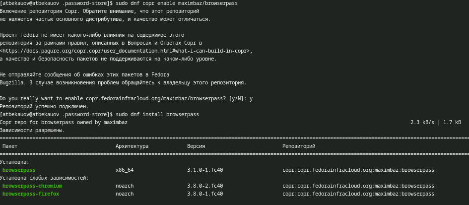{#fig:008 width=70%}

Далее добавляю новый пароль и отображаю его же. (рис. [-@fig:009]).

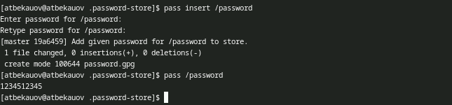{#fig:009 width=70%}

Затем заменяю этот пароль на сгенерированный (новый пароль обозначен жёлтым цветом)   (рис. [-@fig:010]).

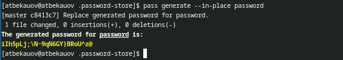{#fig:010 width=70%}

Далее устанавливаю дополнительное ПО. (рис. [-@fig:011]).

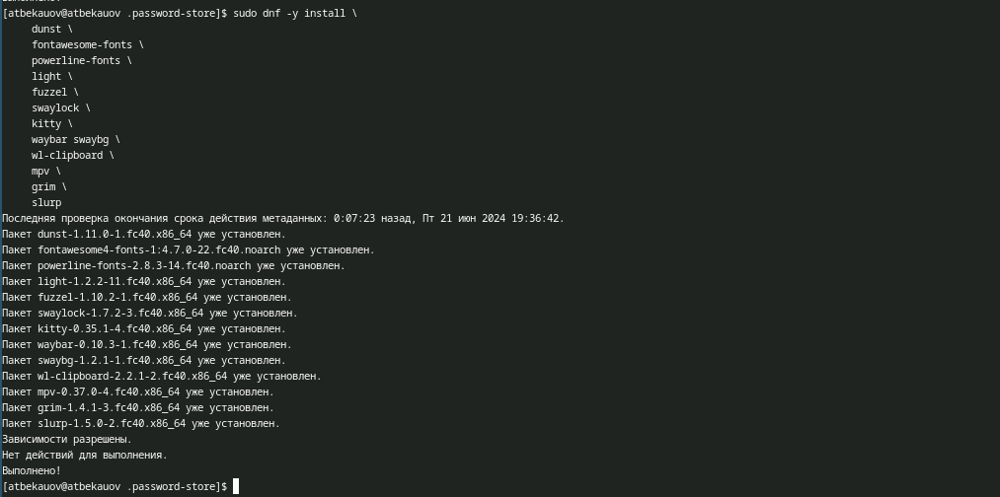{#fig:011 width=70%}

Также устанавливаю шрифты (подключая репозитории copr). (рис. [-@fig:012]).

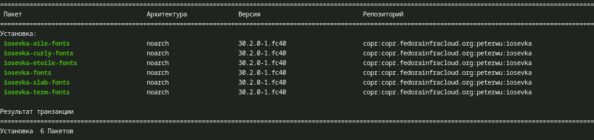{#fig:012 width=70%}

Затем устанавливаю бинарный файл chezmoi - он помагает управлять файлами конфигурации.  (рис. [-@fig:013]).

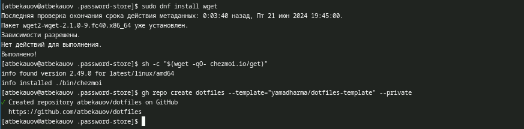{#fig:013 width=70%}

Далее создаю репозиторий для конфигурационных файлов на основе представленного шаблона (рис. [-@fig:017]).

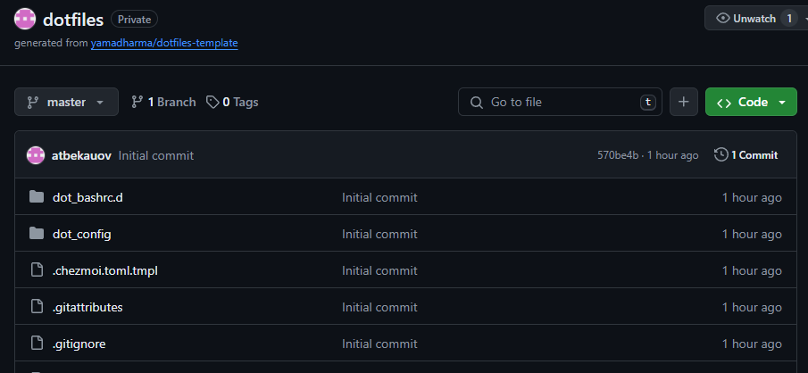{#fig:017 width=70%}

Инициализирую chezmoi с созданным репозиторием через ssh. (рис. [-@fig:014]).

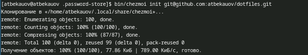{#fig:014 width=70%}

Попробуем извлечь последние изменения из репозитория и применить их. Результат - Уже актуально. Далее попробуем установить свои dotfiles на этот компьютер - очевидно ничего не изменилось. (рис. [-@fig:015]).

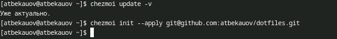{#fig:015 width=70%}

Настрою автоматическую фиксацию и отправку изменений в репозиторий. (рис. [-@fig:016]).

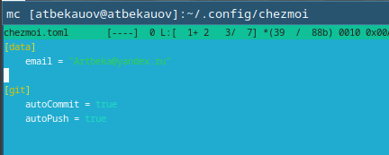{#fig:016 width=70%}

# Выводы

В ходе данной лаботраторной работы я ознакомится с менеджером паролей pass и дополнительным программным обеспечением и научится работать с менеджером файлов конфигураций

