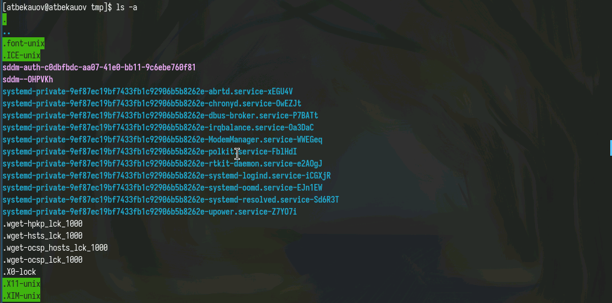
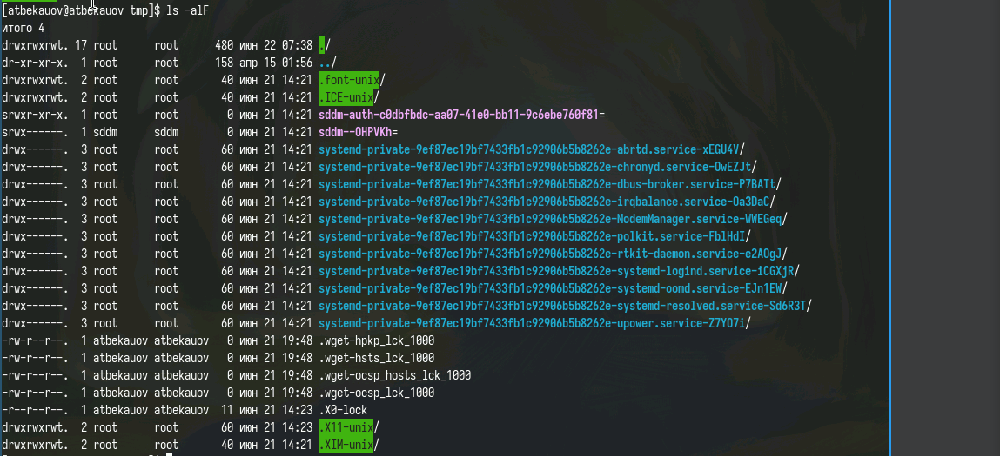
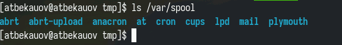
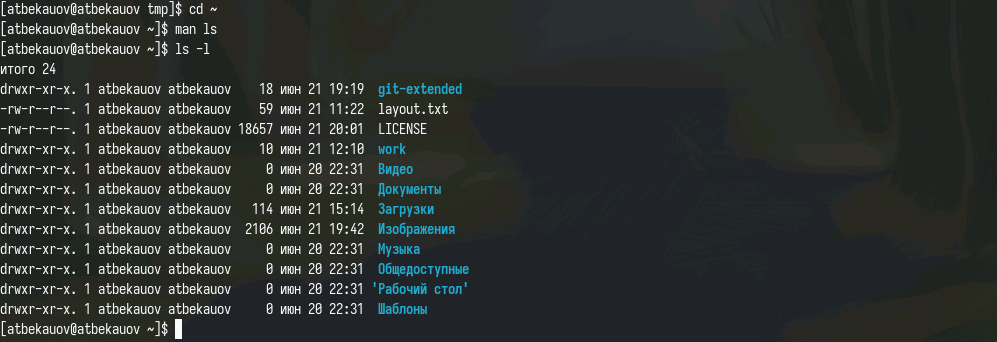

---
## Front matter
lang: ru-RU
title: Лабораторная работа №5
subtitle: Операционные системы
  - Бекауов А.Т
institute:
  - Российский университет дружбы народов, Москва, Россия

## i18n babel
babel-lang: russian
babel-otherlangs: english

## Formatting pdf
toc: false
toc-title: Содержание
slide_level: 2
aspectratio: 169
section-titles: true
theme: metropolis
header-includes:
 - \metroset{progressbar=frametitle,sectionpage=progressbar,numbering=fraction}
 - '\makeatletter'
 - '\beamer@ignorenonframefalse'
 - '\makeatother'

##Fonts
mainfont: PT Serif
romanfont: PT Serif
sansfont: PT Sans
monofont: PT Mono
mainfontoptions: Ligatures=TeX
romanfontoptions: Ligatures=TeX
sansfontoptions: Ligatures=TeX,Scale=MatchLowercase
monofontoptions: Scale=MatchLowercase,Scale=0.9
---

# Введение

## Цель работы

Цель данной лабораторной работы - ознакомится с менеджером паролей pass и дополнительным программным обеспечением и научится работать с менеджерами файлов конфигураций

## Задачи

1.Ознакомится с менеджером паролей pass

2.Ознакомится с дополнительным программным обеспечением

3.Научится работать с менеджером файлов конфигураций

# Выполнение лабораторной работы

## Установка пакетов pass, pass-otp

Установил пакеты pass и pass-otp.

{#fig:001 width=70%}

## Установка пакета gopass

Далее устанавливаю пакеты gopass

{#fig:002 width=70%}

## Инициализация хранилища

Затем просматриваю список ключей GPG (один ключ есть, он использовался в ЛР2) и инициализирую хранилище и создаю структуру git.

{#fig:003 width=70%}

## Репозиторий gitpass

Создаю на GH репозиторий gitpass.

{#fig:004 width=70%}

## Задание адреса и синхронизация

Задаю адрес созданного репозитория хранилищу и синхранизую локальное хранилище и то, что на GH.

{#fig:005 width=70%}

## Ручной коммит

Далее проверяю возможность ручного коммита и проверяю статус синхронизации. 

{#fig:006 width=70%}

## Установка плагина для браузера

Для работы pass с браузером устанавливаю плагин для Firefox.

{#fig:007 width=70%}

## Установка пакета browserpass

А для настройки интерфейса взаимодействия с браузером, включаю репозитории Copr и скачиваю пакет browserpass (browserpass-native).

{#fig:008 width=70%}

## Создание пароля

Далее добавляю новый пароль и отображаю его же.

{#fig:009 width=70%}

## Генерация и замена пароля

Затем заменяю этот пароль на сгенерированный (новый пароль обозначен жёлтым цветом)

{#fig:010 width=70%}

## Установка пакетов доп. ПО

Далее устанавливаю дополнительное ПО.

{#fig:011 width=70%}

## Установка шрифтов

Также устанавливаю шрифты (подключая репозитории copr). 

{#fig:012 width=70%}

## Установка chezmoi

Затем устанавливаю бинарный файл chezmoi - он помагает управлять файлами конфигурации.

{#fig:013 width=70%}

## Создание репозитория для конф. файлов

Далее создаю репозиторий для конфигурационных файлов на основе представленного шаблона

{#fig:017 width=70%}

## Инициализация chezmoi

Инициализирую chezmoi с созданным репозиторием через ssh.

{#fig:014 width=70%}

## Взаимодействие chezmoi с репозиторием

Попробуем извлечь последние изменения из репозитория и применить их. Результат - Уже актуально. Далее попробуем установить свои dotfiles на этот компьютер - очевидно ничего не изменилось.

{#fig:015 width=70%}

## Автоматизация chezmoi

Настрою автоматическую фиксацию и отправку изменений в репозиторий.

{#fig:016 width=70%}

# Заключение

## Выводы

В ходе данной лаботраторной работы я ознакомится с менеджером паролей pass и дополнительным программным обеспечением и научится работать с менеджером файлов конфигураций

