---
## Front matter
lang: ru-RU
title: Лабораторная работа №5
subtitle: Операционные системы
  - Бекауов А.Т
institute:
  - Российский университет дружбы народов, Москва, Россия

## i18n babel
babel-lang: russian
babel-otherlangs: english

## Formatting pdf
toc: false
toc-title: Содержание
slide_level: 2
aspectratio: 169
section-titles: true
theme: metropolis
header-includes:
 - \metroset{progressbar=frametitle,sectionpage=progressbar,numbering=fraction}
 - '\makeatletter'
 - '\beamer@ignorenonframefalse'
 - '\makeatother'

##Fonts
mainfont: PT Serif
romanfont: PT Serif
sansfont: PT Sans
monofont: PT Mono
mainfontoptions: Ligatures=TeX
romanfontoptions: Ligatures=TeX
sansfontoptions: Ligatures=TeX,Scale=MatchLowercase
monofontoptions: Scale=MatchLowercase,Scale=0.9
---

# Введение

## Цель работы

Цель данной лабораторной работы - приобретение практических навыков взаимодействия пользователя с системой посредством командной строки.

# Выполнение лабораторной работы

## Узнать полное имя домашнего каталога

С помощью pwd узнаю полное имя домашнего каталога

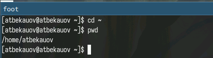{#fig:001 width=70%}

## Переход в каталог /tmp

Далее с помощью cd перехожу в каталог /tmp

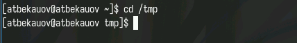{#fig:002 width=70%}

## Команда ls без ключей

Затем просматриваю содержимое каталога /tmp с помощью команды ls без ключей.

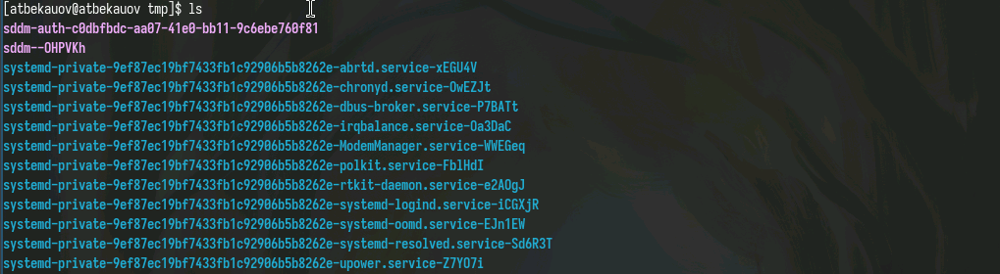{#fig:003 width=70%}

## ls с ключом a

После этого использую команду ls с ключом a - он позволяет просматривать скрытые файлы и подкаталоги..

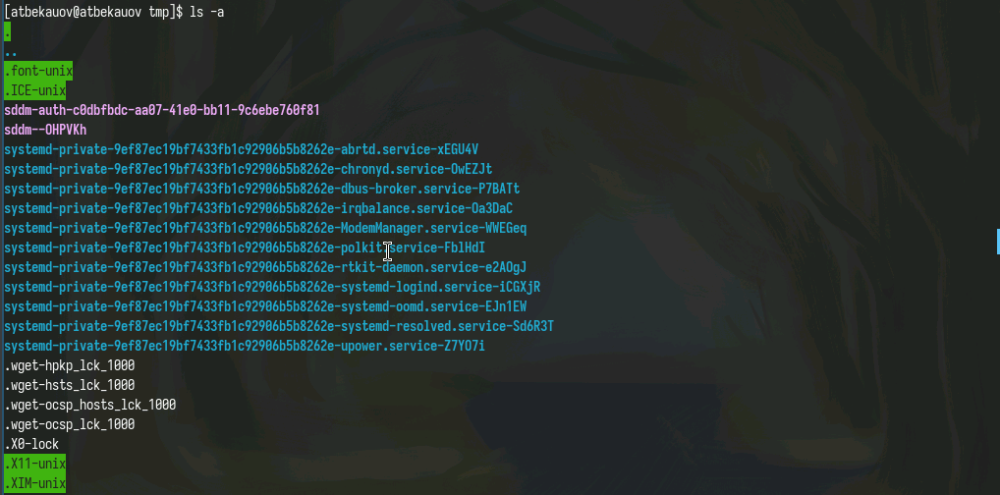{#fig:004 width=70%}

## ls с ключами a,l,F

Далее использую команду ls c в сочетании с ключами a,l,F. Таким образом будут выведены также скрытые объекты, у них будет развернутое описание и у каждого из них в конце стоит суффикс указывающий на вид объекта

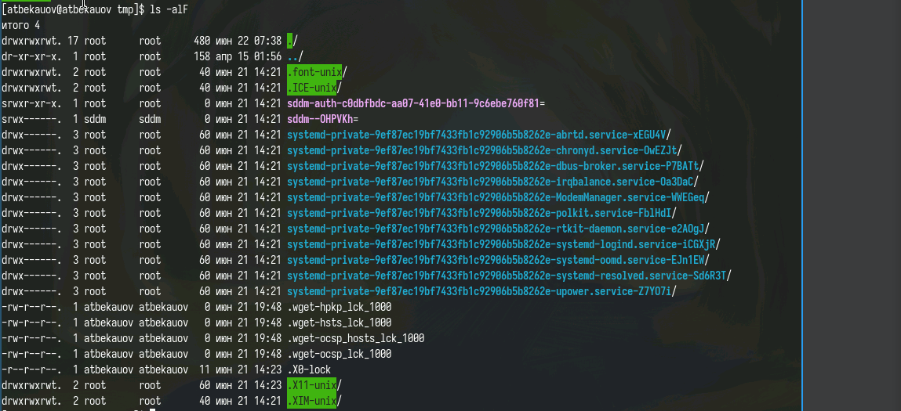{#fig:005 width=70%}

## Поиск подкаталога cron в /var/spool

С помощью команды ls определяю, что в каталоге /var/spool существует подкаталог cron. 

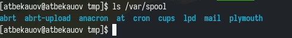{#fig:006 width=70%}

## Вывод владельца фалов каталога ~

Затем с целью узнать владельца каталогов в домашней директории перехожу туда и использую ls -l - стало видно, что владельцем файлов является atbekauov

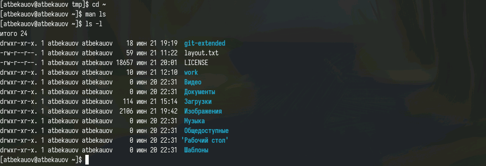{#fig:007 width=70%}

## mkdir и rmdir

После этого в домашнем каталоге создаю новый каталог с именем newdir (с помощью mkdir). Далее создаю в newdir подкаталог morefun. Затем одной командой mkdir с тремя аргументами создаю каталоги letters, memos, misk и одной же командой rmdir удаляю их .

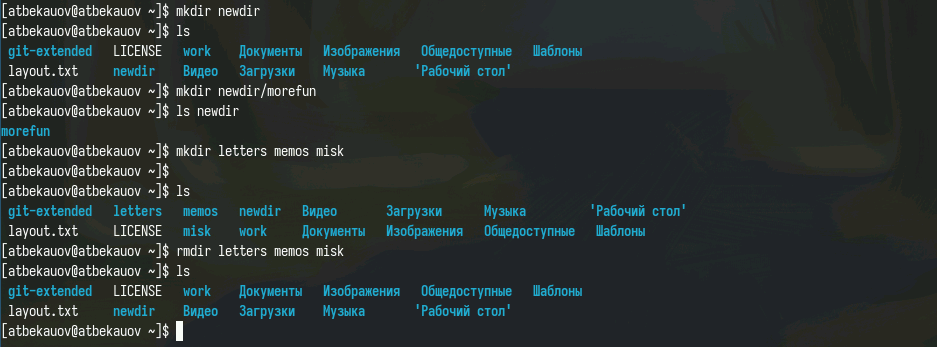{#fig:008 width=70%}

## Попытка удалить каталог командой rm

Попробую удалить каталог newdir с помощью команды rm. Как видим не получилось, т.к newdir это каталог.

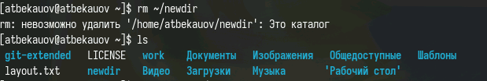{#fig:009 width=70%}

## Удаление каталога командой rmdir

Далее удаляю каталог ~/newdir/morefun с помощью команды rmdir. Как видим каталог удалён.

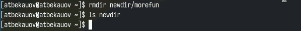{#fig:010 width=70%}

## man:Опция -R команды ls

Затем с помощью команды man нахожу, какую опцию команды ls нужно использовать для просмотра содержимое не только указанного каталога, но и подкаталогов,
входящих в него. Это опция -R или --recursive.

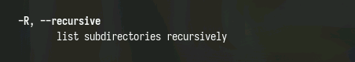{#fig:011 width=70%}

## man:Опции -l и -t команды ls

После командой man нахожу, набор опций команды ls, позволяющий отсортировать по времени последнего изменения выводимый список содержимого каталога
с развёрнутым описанием файлов. Это набор опций -t и -l

{#fig:012 width=70%}

{#fig:013 width=70%}

## man: cd

1. -P - позволяет следовать по символическим ссылкам перед тем, как обработаны все переходы ..
2. -L - переходит по символическим ссылкам только после того, как обработаны все переходы ..
3. -e - позволяет выйти с ошибкой, если диреткория, в которую нужно перейти, не найдена.

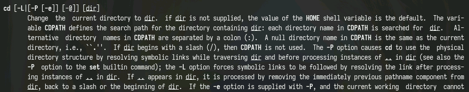{#fig:014 width=70%}

## man: pwd

1. -m - устанавливает права доступа создаваемой директории как chmod, синтаксис тоже как у chmod.
2. -p - позволяет рекурсивно создавать директории и их подкаталоги
3. -v - выводи сообщение о созданных директориях
4. -z - установить контекст SELinux для создаваемой директории по умолчанию
 

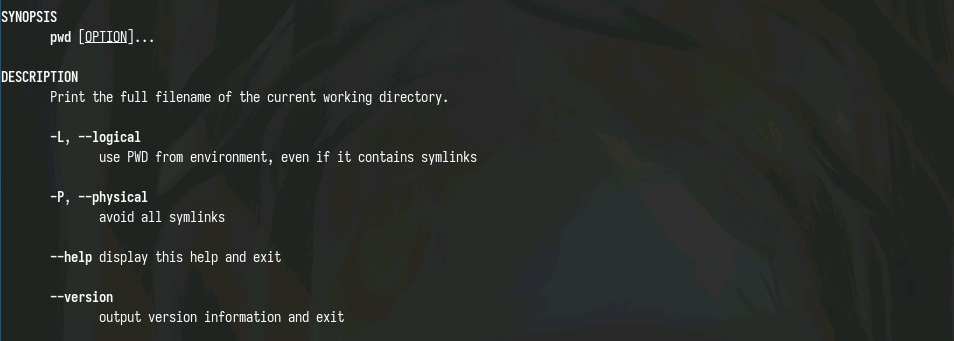{#fig:015 width=70%}

## man: mkdir

1. --ignore-fail-on-non-empty - отменяет вывод ошибки, если каталог не пустой, просто его игнорирует
2. -p - удаляет рекурсивно каталоги, если они все содержат в себе только удаляемый каталог
3. -v - выводит сообщение о каждом удалении  директории. 

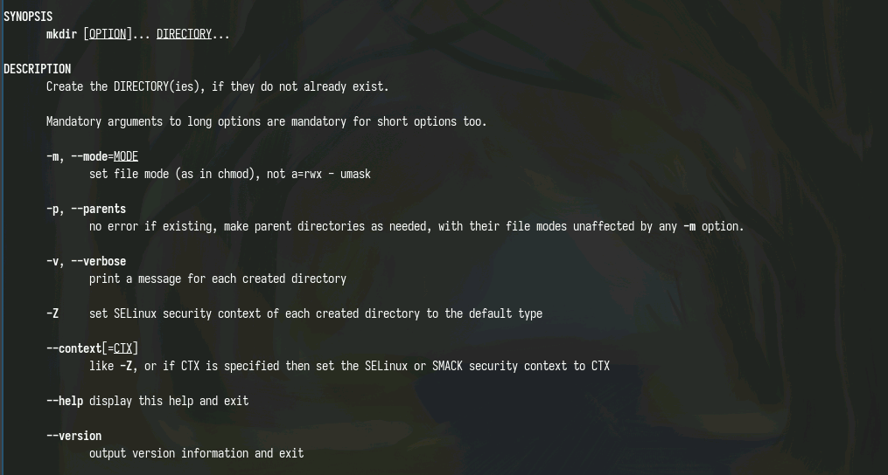{#fig:016 width=70%}

## man: rmdir

1. --ignore-fail-on-non-empty - отменяет вывод ошибки, если каталог не пустой, просто его игнорирует
2. -p - удаляет рекурсивно каталоги, если они все содержат в себе только удаляемый каталог
3. -v - выводит сообщение о каждом удалении  директории.

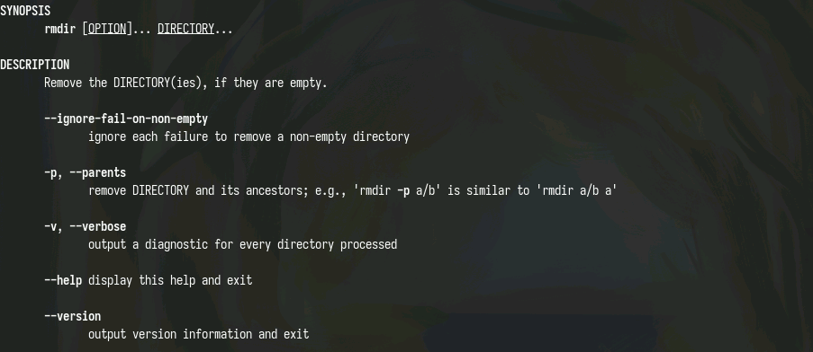{#fig:017 width=70%}

## man: rm

1. -f - игнорировать несуществующие файлы или аргументы, никогда не выводить запрос на подтверждение удаления
2. -i - выводить запрос на подтверждение удаления каждого файла
3. -I - вывести запрос на подтверждение удаления один раз, для всех файлов, если удаляется больше 3-х файлов или идет рекурсивное удаление
4. -r, -R - удаляет директории их содержимое рекурсивно
5. -d, --dir - удаляет пустые директории
6. -v - прописывает все действия команды

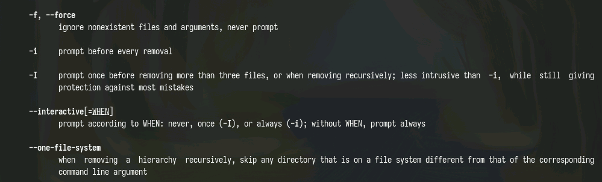{#fig:018 width=70%}

##Модификация команд из буфера обмена

Затем с выполним несколько модификаций и исполним команды из буфера обмена

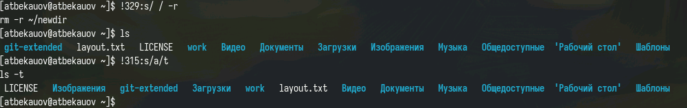{#fig:019 width=70%}

# Заключение

В ходе данной лаботраторной работы я приобрёл практические навыки взаимодействия пользователя с системой посредством командной строки.

## Выводы

В ходе данной лаботраторной работы я ознакомится с менеджером паролей pass и дополнительным программным обеспечением и научится работать с менеджером файлов конфигураций

