---
## Front matter
title: "Отчёт по лабораторной работе №6"
subtitle: "Операционные системы"
author: "Бекауов Артур Тимурович"

## Generic otions
lang: ru-RU
toc-title: "Содержание"

## Bibliography
bibliography: bib/cite.bib
csl: pandoc/csl/gost-r-7-0-5-2008-numeric.csl

## Pdf output format
toc: true # Table of contents
toc-depth: 2
lof: true # List of figures
lot: true # List of tables
fontsize: 12pt
linestretch: 1.5
papersize: a4
documentclass: scrreprt
## I18n polyglossia
polyglossia-lang:
  name: russian
  options:
	- spelling=modern
	- babelshorthands=true
polyglossia-otherlangs:
  name: english
## I18n babel
babel-lang: russian
babel-otherlangs: english
## Fonts
mainfont: PT Serif
romanfont: PT Serif
sansfont: PT Sans
monofont: PT Mono
mainfontoptions: Ligatures=TeX
romanfontoptions: Ligatures=TeX
sansfontoptions: Ligatures=TeX,Scale=MatchLowercase
monofontoptions: Scale=MatchLowercase,Scale=0.9
## Biblatex
biblatex: true
biblio-style: "gost-numeric"
biblatexoptions:
  - parentracker=true
  - backend=biber
  - hyperref=auto
  - language=auto
  - autolang=other*
  - citestyle=gost-numeric
## Pandoc-crossref LaTeX customization
figureTitle: "Рис."
tableTitle: "Таблица"
listingTitle: "Листинг"
lofTitle: "Список иллюстраций"
lotTitle: "Список таблиц"
lolTitle: "Листинги"
## Misc options
indent: true
header-includes:
  - \usepackage{indentfirst}
  - \usepackage{float} # keep figures where there are in the text
  - \floatplacement{figure}{H} # keep figures where there are in the text
---

# Цель работы

Цель данной лабораторной работы - приобретение практических навыков взаимодействия пользователя с системой посредством командной строки.

# Задание

1. Определите полное имя вашего домашнего каталога. Далее относительно этого каталога будут выполняться последующие упражнения.
2. Выполните следующие действия:
- Перейдите в каталог /tmp.
- Выведите на экран содержимое каталога /tmp. Для этого используйте команду ls
с различными опциями. Поясните разницу в выводимой на экран информации.
- Определите, есть ли в каталоге /var/spool подкаталог с именем cron?
- Перейдите в Ваш домашний каталог и выведите на экран его содержимое. Определите, кто является владельцем файлов и подкаталогов?
3. Выполните следующие действия:
- В домашнем каталоге создайте новый каталог с именем newdir.
- В каталоге ~/newdir создайте новый каталог с именем morefun.
- В домашнем каталоге создайте одной командой три новых каталога с именами
letters, memos, misk. Затем удалите эти каталоги одной командой.
- Попробуйте удалить ранее созданный каталог ~/newdir командой rm. Проверьте,
был ли каталог удалён.
- Удалите каталог ~/newdir/morefun из домашнего каталога. Проверьте, был ли
каталог удалён.
4. С помощью команды man определите, какую опцию команды ls нужно использовать для просмотра содержимое не только указанного каталога, но и подкаталогов,
входящих в него.
5. С помощью команды man определите набор опций команды ls, позволяющий отсортировать по времени последнего изменения выводимый список содержимого каталога
с развёрнутым описанием файлов.
6. Используйте команду man для просмотра описания следующих команд: cd, pwd, mkdir,
rmdir, rm. Поясните основные опции этих команд.
7. Используя информацию, полученную при помощи команды history, выполните модификацию и исполнение нескольких команд из буфера команд
# Выполнение лабораторной работы

С помощью pwd узнаю полное имя домашнего каталога (рис. [-@fig:001]).

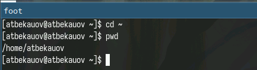{#fig:001 width=70%}

Далее с помощью cd перехожу в каталог /tmp (рис. [-@fig:002]).

{#fig:002 width=70%}

Затем просматриваю содержимое каталога /tmp с помощью команды ls без ключей (рис. [-@fig:003]).

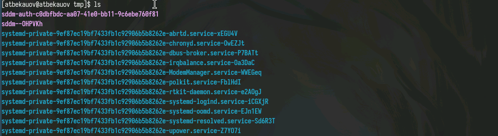{#fig:003 width=70%}

После этого использую команду ls с ключом a - он позволяет просматривать скрытые файлы и подкаталоги. (рис. [-@fig:004]).

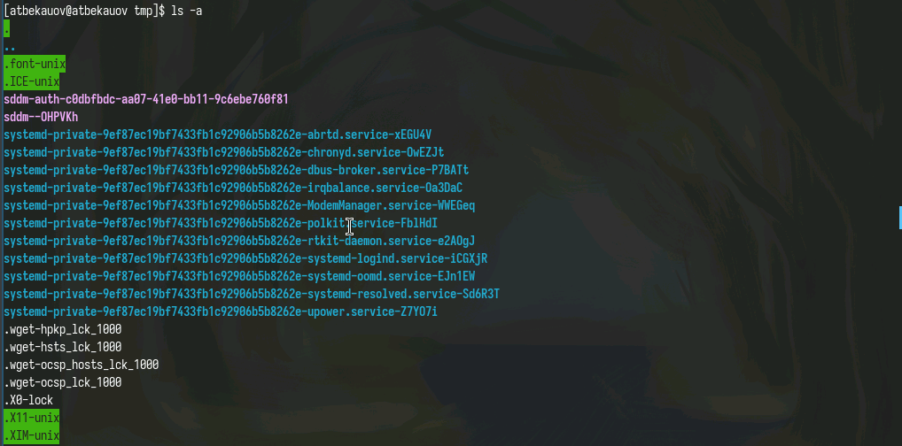{#fig:004 width=70%}

Далее использую команду ls c в сочетании с ключами a,l,F. Таким образом будут выведены также скрытые объекты, у них будет развернутое описание и у каждого из них в конце стоит суффикс указывающий на вид объекта  (рис. [-@fig:005]).

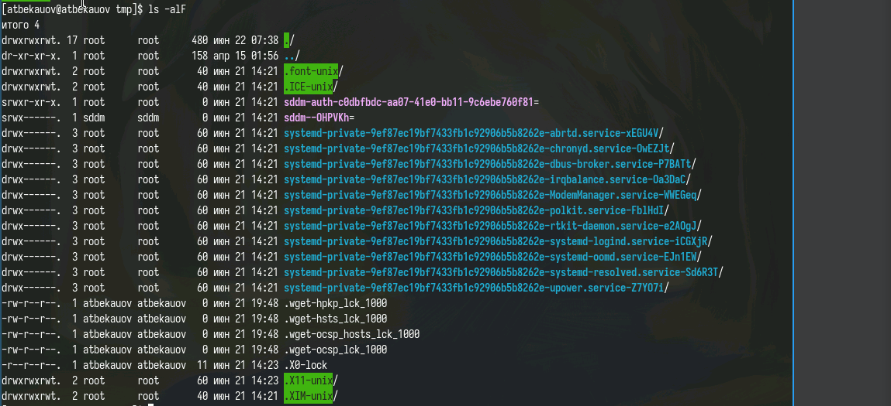{#fig:005 width=70%}

С помощью команды ls определяю, что в каталоге /var/spool существует подкаталог cron (рис. [-@fig:006]).

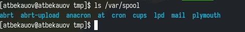{#fig:006 width=70%}

Затем с целью узнать владельца каталогов в домашней директории перехожу туда и использую ls -l - стало видно, что владельцем файлов является atbekauov (рис. [-@fig:007]).

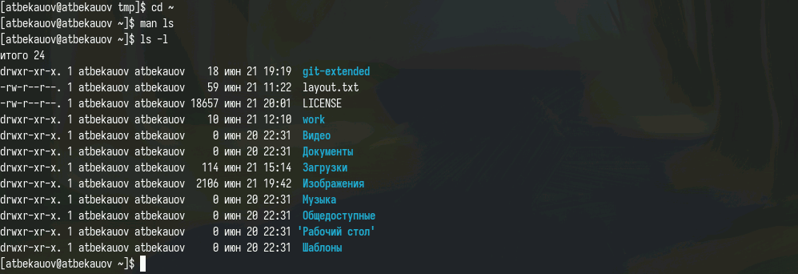{#fig:007 width=70%}

После этого в домашнем каталоге создаю новый каталог с именем newdir (с помощью mkdir). Далее создаю в newdir подкаталог morefun. Затем одной командой mkdir с тремя аргументами создаю каталоги letters, memos, misk и одной же командой rmdir удаляю их   (рис. [-@fig:008]).

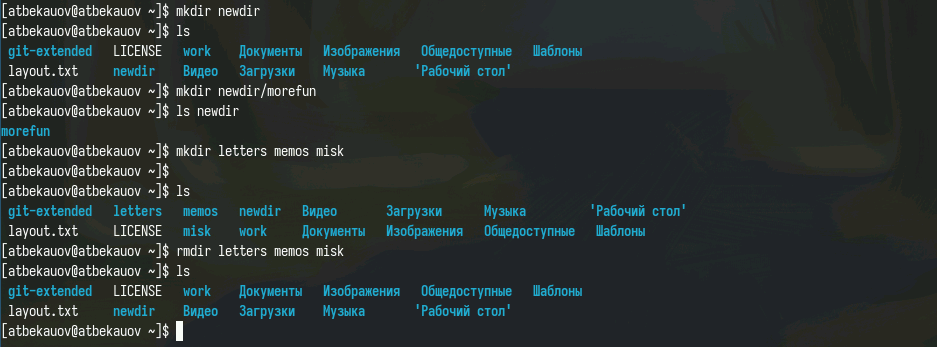{#fig:008 width=70%}

Попробую удалить каталог newdir с помощью команды rm. Как видим не получилось, т.к newdir это каталог. (рис. [-@fig:009]).

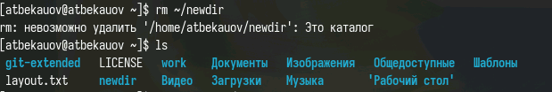{#fig:009 width=70%}

Далее удаляю каталог ~/newdir/morefun с помощью команды rmdir. Как видим каталог удалён.   (рис. [-@fig:010]).

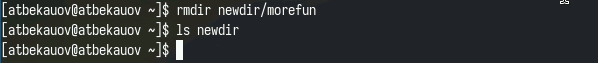{#fig:010 width=70%}

Затем с помощью команды man нахожу, какую опцию команды ls нужно использовать для просмотра содержимое не только указанного каталога, но и подкаталогов,
входящих в него. Это опция -R или --recursive (рис. [-@fig:011]).

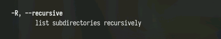{#fig:011 width=70%}

После командой man нахожу, набор опций команды ls, позволяющий отсортировать по времени последнего изменения выводимый список содержимого каталога
с развёрнутым описанием файлов. Это набор опций -t и -l (рис. [-@fig:012]), (рис. [-@fig:013]).

{#fig:012 width=70%}

{#fig:013 width=70%}

С помощью man cd узнаю описание команды cd и ее опции. Основных опций немного (рис. [-@fig:014]).
1. -P - позволяет следовать по символическим ссылкам перед тем, как обработаны все переходы '..'
2. -L - переходит по символическим ссылкам только после того, как обработаны все переходы ".."
3. -e - позволяет выйти с ошибкой, если диреткория, в которую нужно перейти, не найдена.(рис. [-@fig:014]).

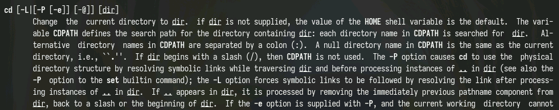{#fig:014 width=70%}

С помощью man pwd узнаю описание команды pwd и ее опции (рис. [-@fig:015]).
1. -L - брать директорию из переменной окружения, даже если она содержит символические ссылки.
2. -P - отбрасывать все символические ссылки. 

{#fig:015 width=70%}

С помощью man mkdir узнаю описание команды mkdir и ее опции (рис. [-@fig:016]).
1. -m - устанавливает права доступа создаваемой директории как chmod, синтаксис тоже как у chmod.
2. -p - позволяет рекурсивно создавать директории и их подкаталоги
3. -v - выводи сообщение о созданных директориях
4. -z - установить контекст SELinux для создаваемой директории по умолчанию
5. -context - установить контекст SELinux для создаваемой директории в значении CTX 

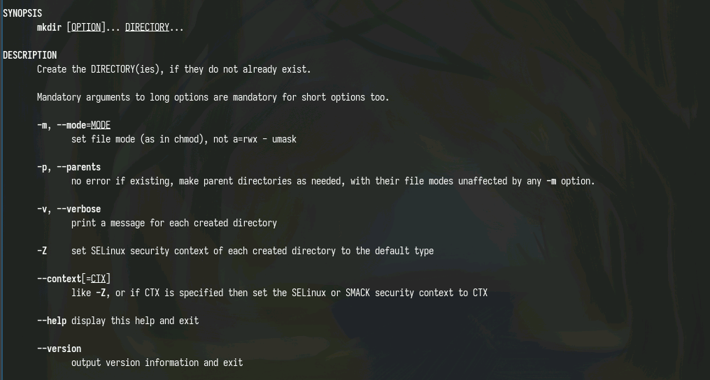{#fig:016 width=70%}

С помощью man rmdir узнаю описание команды rmdir и ее опции (рис. [-@fig:017]).
1. --ignore-fail-on-non-empty - отменяет вывод ошибки, если каталог не пустой, просто его игнорирует
2. -p - удаляет рекурсивно каталоги, если они все содержат в себе только удаляемый каталог
3. -v - выводит сообщение о каждом удалении  директории. 

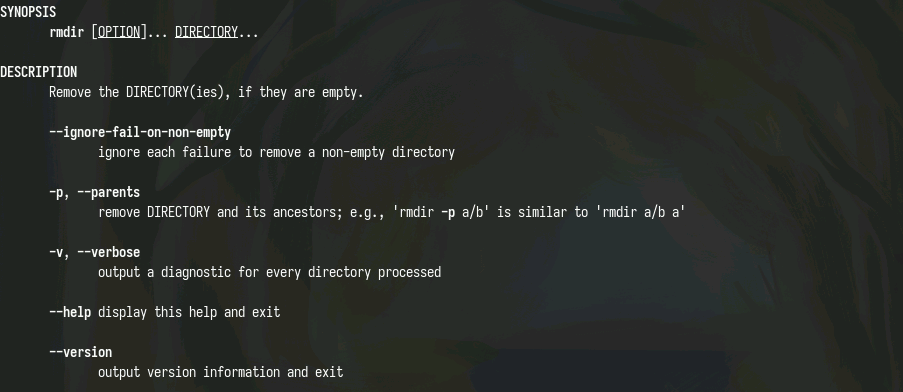{#fig:017 width=70%}

С помощью man rm узнаю описание команды rm и ее опции (рис. [-@fig:018]).
1. -f - игнорировать несуществующие файлы или аргументы, никогда не выводить запрос на подтверждение удаления
2. -i - выводить запрос на подтверждение удаления каждого файла
3. -I - вывести запрос на подтверждение удаления один раз, для всех файлов, если удаляется больше 3-х файлов или идет рекурсивное удаление
4. --interactive - заменяет предыдущие три опции, можно выбрать одну из них.
5. --one-file-system - во время рекурсивного удаления пропускать директории из других файловых систем
6. --no-preserve-root если в качестве директории задана корневая, то считать что это обычная директория и начать удаление.
7. -r, -R - удаляет директории их содержимое рекурсивно
8. -d, --dir - удаляет пустые директории
9. -v - прописывает все действия команды

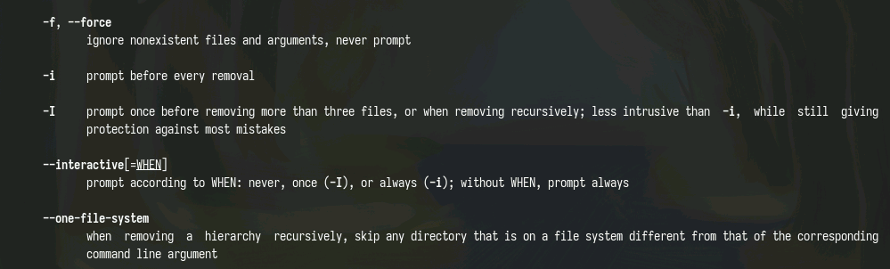{#fig:018 width=70%}

Затем с выполним несколько модификаций и исполним команды из буфера обмена (рис. [-@fig:019]).

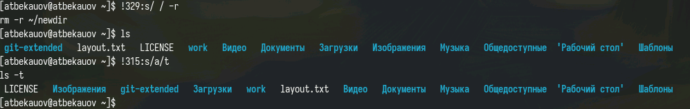{#fig:019 width=70%}

# Выводы

В ходе данной лаботраторной работы я приобрёл практические навыки взаимодействия пользователя с системой посредством командной строки.

# Ответы на онтрольные вопросы

1. Командная строка - это текстовая система, которая передает команды компьютеру и возвращает результаты пользователю. В операционной системе типа Linux взаимодействие пользователя с системой обычно
осуществляется с помощью командной строки посредством построчного ввода команд.
2. Для определения абсолютного пути к текущему каталогу используется команда pwd. Например: если я введу
pwd в своем домашнем каталоге то получу /home/evdvorkina
3. С помощью команды ls можно определить имена файлов, при помощи опции -F уже мы сможем определить тип файлов, если нам необходимы скрытые файлы, добавим опцию -a. Пример есть в лабораторной работе.
4. С помощью команды ls можно определить имена файлов, если нам необходимы скрытые файлы, добавим опцию -a. Пример есть в лабораторной работе.
5. rmdir по умолчанию удаляет пустые каталоги, не удаляет файлы. rm удаляет файлы, без дополнительных опций (-d, -r) не будет удалять каталоги. Удалить в одной строчке одной командой можно файл и каталог. Если файл находится в каталоге, используем рекурсивное удаление, если файл и каталог не связаны подобным образом, то добавим опцию -d, введя имена через пробел после утилиты.
6. Вывести информацию о последних выполненных пользователем команд можно с помощью history. Пример приведет в лабораторной работе.
7. Используем синтаксиси !номеркоманды в выводе history:s/что заменяем/на что заменяем Примеры приведены в лабораторной работе.
8. Предположим, я нахожусь не в домашнем каталоге. Если я введу "cd ; ls", то окажусь в домашнем каталоге и получу вывод файлов внутри него.
9. Символ экранирования - (обратный слеш) добавление перед спецсимволом обратный слеш, чтобы использовать специальный символ как обычный. Также позволяет читать системе название директорий с пробелом. Пример: cd work/Операционные\ системы/
10. Опция -l позволит увидеть дополнительную информацию о файлах в каталоге: время создания, владельца, права доступа
11. Относительный путь к файлу начинается из той директории, где вы находитесь (она сама не прописывается в пути), он прописывается относительно данной директории. Абсолютный путь начинается с корневого каталога.
12. Использовать man <имя команды> или <имя команды> --help
13. Клавиша Tab.

