---
## Front matter
lang: ru-RU
title: Лабораторная работа №7
subtitle: Операционные системы
  - Бекауов А.Т
institute:
  - Российский университет дружбы народов, Москва, Россия

## i18n babel
babel-lang: russian
babel-otherlangs: english

## Formatting pdf
toc: false
toc-title: Содержание
slide_level: 2
aspectratio: 169
section-titles: true
theme: metropolis
header-includes:
 - \metroset{progressbar=frametitle,sectionpage=progressbar,numbering=fraction}
 - '\makeatletter'
 - '\beamer@ignorenonframefalse'
 - '\makeatother'

##Fonts
mainfont: PT Serif
romanfont: PT Serif
sansfont: PT Sans
monofont: PT Mono
mainfontoptions: Ligatures=TeX
romanfontoptions: Ligatures=TeX
sansfontoptions: Ligatures=TeX,Scale=MatchLowercase
monofontoptions: Scale=MatchLowercase,Scale=0.9
---

# Введение

## Цель работы

Цель данной лабораторной работы - ознакомление с файловой системой Linux, её структурой, именами и содержанием каталогов. Приобретение практических навыков по применению команд для работы с файлами и каталогами, по управлению процессами (и работами), по проверке использования диска и обслуживанию файловой системы.

# Выполнение лабораторной работы

## Выполнение примеров 1

Сначала выполняю все примеры, приведённые в первой части лабораторной работы

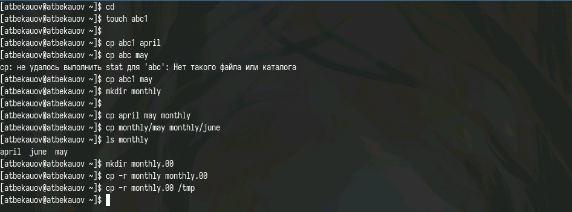{#fig:001 width=70%}

## Выполнение примеров 2

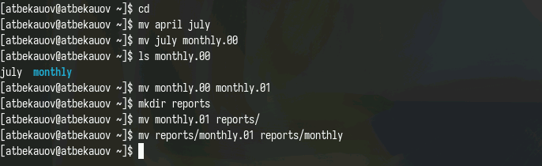{#fig:002 width=70%}

## Выполнение примеров 3

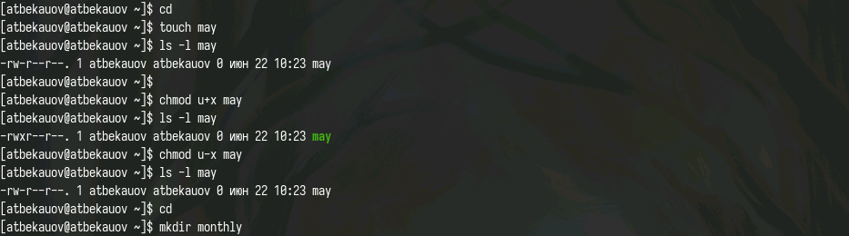{#fig:003 width=70%}

## Выполнение примеров 4

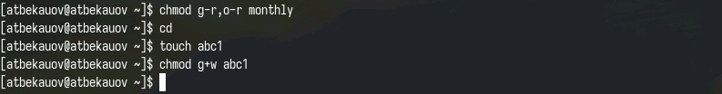{#fig:004 width=70%}

## Выполнение примеров 5

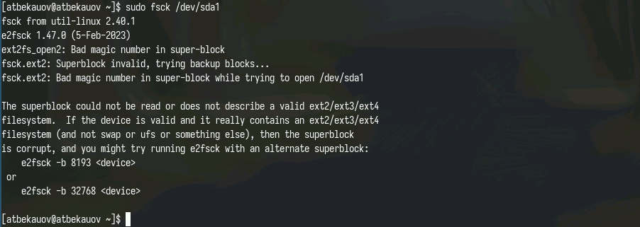{#fig:005 width=70%}

## Выполнение примеров 6 

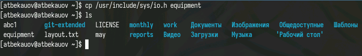{#fig:006 width=70%}

## Задания 2 - использование cp и mv

Затем выполняю упражнения под цифрой 2, которые требуют от меня использования cp, ls, mkdir и mv.

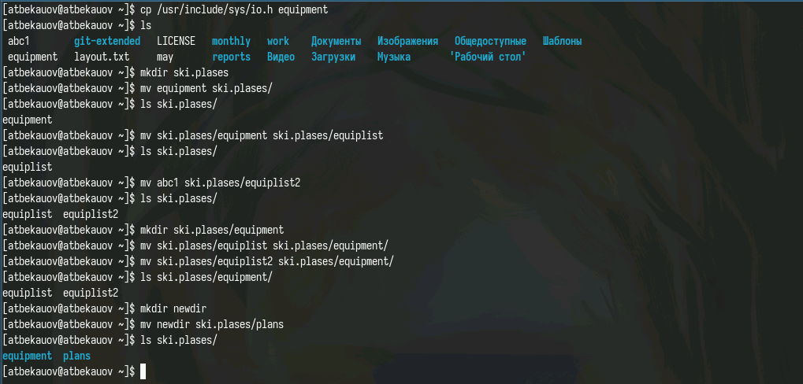{#fig:007 width=70%}

## Задание 3 - использование chmod

Далее выполняю задания под цифрой 3, где требуется задать права доступа файлам, с помощью команды chmod

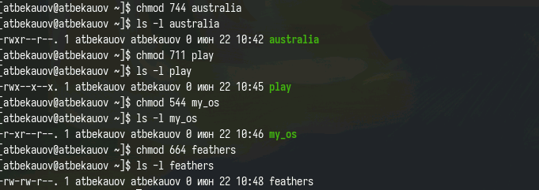{#fig:008 width=70%}

## Задание 4 - использование cat

Затем использую команду cat вывожу на экран содержимое /etc/passwd.

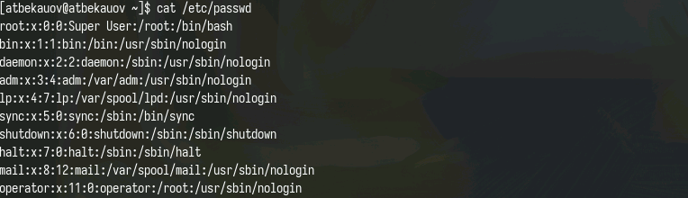{#fig:009 width=70%}

## Задание 4 - использование mv и cp

После этого провожу череду копирований и перемещений и папок с помощью команд mv и cp 

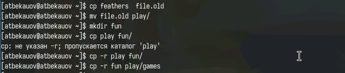{#fig:010 width=70%}

## 4 - chmod - ограничение прав на чтение файла

Затем с помощью команды chmod отключая у владельца файла feathers право на чтение. Файл становится недоступен ни для чтения, ни для копирования. Возвращаю права.

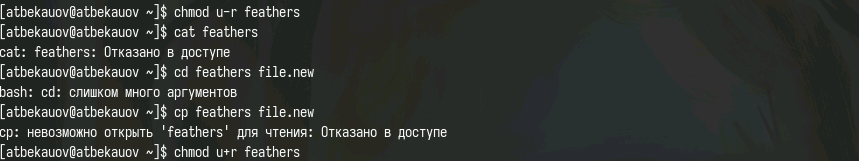{#fig:011 width=70%}

## 4 - ограничение прав на исполнение каталога

Далее ограничиваю право на исполнение каталога play. При попытке войти в каталог получаем отказ. Возвращаю права.

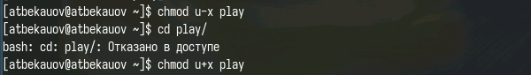{#fig:012 width=70%}

## Задание 5 - использование man

С помощью man узнаю информацию о командах mount, fsck, mkfs, kill

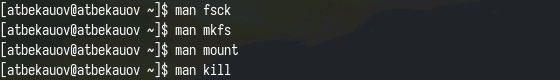{#fig:013 width=70%}

## mount

- mount — утилита командной строки в UNIX-подобных операционных системах. Применяется для монтирования файловых систем.

## fsck

- fsck (проверка файловой системы) - это утилита командной строки, которая позволяет выполнять проверки согласованности и интерактивное исправление в одной или нескольких файловых системах Linux. Он использует программы, специфичные для типа файловой системы, которую он проверяет.

## mkfs

- mkfs используется для создания файловой системы Linux на некотором устройстве, обычно в разделе жёсткого диска. В качестве аргумента filesys для файловой системы может выступать или название устройства

## kill

- Команда Kill посылает указанный сигнал указанному процессу. Если не указано ни одного сигнала, посылается сигнал SIGTERM. Сигнал SIGTERM завершает лишь те процессы, которые не обрабатывают его приход. Для других процессов может быть необходимым послать сигнал SIGKILL, поскольку этот сигнал перехватить невозможно.

# Заключение

## Выводы

В ходе данной лаботраторной работы я ознакомлся с файловой системой Linux, её структурой, именами и содержанием каталогов. Приобрёл практические навыки по применению команд для работы с файлами и каталогами, по управлению процессами (и работами), по проверке использования диска и обслуживанию файловой системы.

