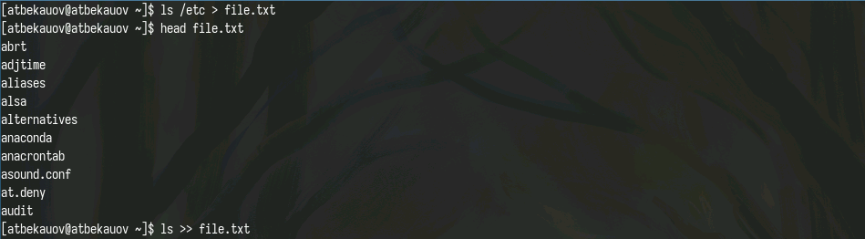
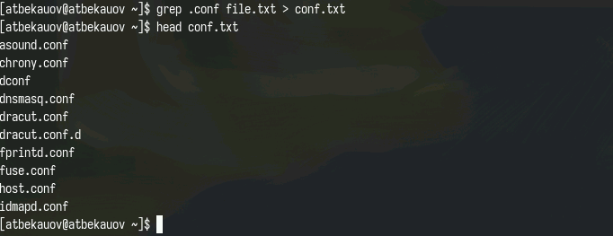
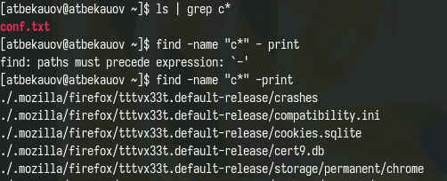
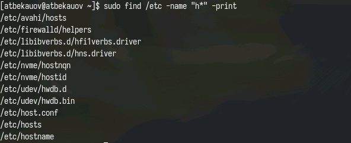
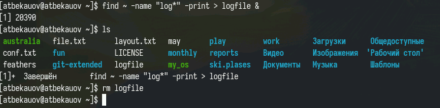
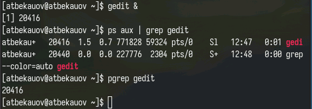
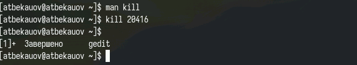
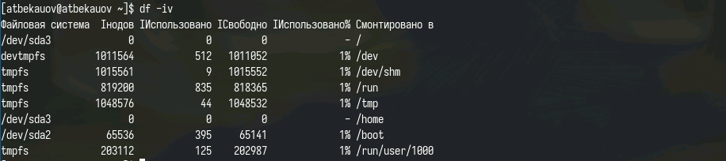
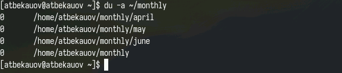
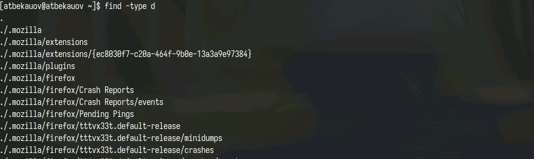

---
## Front matter
lang: ru-RU
title: Лабораторная работа №8
subtitle: Операционные системы
  - Бекауов А.Т
institute:
  - Российский университет дружбы народов, Москва, Россия

## i18n babel
babel-lang: russian
babel-otherlangs: english

## Formatting pdf
toc: false
toc-title: Содержание
slide_level: 2
aspectratio: 169
section-titles: true
theme: metropolis
header-includes:
 - \metroset{progressbar=frametitle,sectionpage=progressbar,numbering=fraction}
 - '\makeatletter'
 - '\beamer@ignorenonframefalse'
 - '\makeatother'

##Fonts
mainfont: PT Serif
romanfont: PT Serif
sansfont: PT Sans
monofont: PT Mono
mainfontoptions: Ligatures=TeX
romanfontoptions: Ligatures=TeX
sansfontoptions: Ligatures=TeX,Scale=MatchLowercase
monofontoptions: Scale=MatchLowercase,Scale=0.9
---

# Введение

## Цель работы

Цель данной лабораторной работы - ознакомление с инструментами поиска файлов и фильтрации текстовых данных. Приобретение практических навыков: по управлению процессами (и заданиями), по проверке использования диска и обслуживанию файловых систем.

# Выполнение лабораторной работы

## Задание 1 и 2 - использование >

Сначала в файл file.txt записываю  названия файлов, содержащихся в каталоге /etc с помощью перенаправления ">". Также с помощью перенаправления в режиме добавления ">>" дополняю file.txt выводом команды ls.

{#fig:001 width=70%}

## Задание 3 - использование grep и >

Затем в файл conf.txt, ввожу имена всех файлов из file.txt имеющих расширение .conf. Делаю я это с помощью команды grep и перенаправления >.

{#fig:002 width=70%}

## Задание 4 - поиск файлов

Вывожу файлы в домашнем каталоге начинающиеся с буквы "c" двумя вариантами:
1. С помощью команд ls и grep c фильтром. 
2. С помощью команды find с ключами name и print

{#fig:003 width=70%}

## Задание 5 - поиск файлов в /etc

После этого использую команду find как в прошлом задании, чтобы вывести имена файлов в /etc, начинающиеся на "h" 

{#fig:004 width=70%}

## Задание 6 и 7 - фоновый процесс find

Далее запускаю в фоновом режииме процесс, который с помощью find и > записывает в файл logfile имена файлов, которые начинаются с log. Дожидаюсь завершения процесса и удаляю logfile.

{#fig:005 width=70%}

## Задание 8 и 9 - идентификатор процесса

Запускаю в фоновом режиме текстовый редактор gedit, с помощью команды ps определяю идентификаьло процеса gedit (можно также с помощью pgrep) 

{#fig:006 width=70%}

## Задание 10 - Использование kill

Прочитав справку по команде kill, использую её в паре с идентификатором процесса gedit, чтобы этот процесс завершить.

{#fig:007 width=70%}

## Задание 11 - Использование df

Прочитав справку по df и du, использую команду df с ключами i и v, чтобы вывести информацию об использовании памяти в моей файловой системе 

{#fig:008 width=70%}

## Задание 11 - Использование du

Также использую команду du, чтобы вывести информацию о том сколько места занимают файлы в директории ~/mounthly.

{#fig:009 width=70%}

## Задание 12 - Использование find

Затем с помощью команды find нахожу имена всех директорий в моём домашнем каталоге

{#fig:010 width=70%}

# Заключение

## Выводы

В ходе данной лаботраторной работы я ознакомился с инструментами поиска файлов и фильтрации текстовых данных. Приобрёл практические навыки: по управлению процессами (и заданиями), по проверке использования диска и обслуживанию файловых систем.

