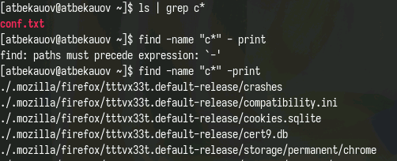
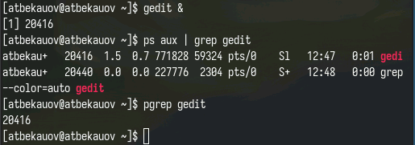
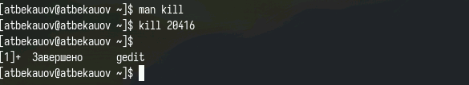
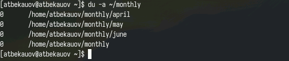

---
## Front matter
title: "Отчёт по лабораторной работе №8"
subtitle: "Операционные системы"
author: "Бекауов Артур Тимурович"

## Generic otions
lang: ru-RU
toc-title: "Содержание"

## Bibliography
bibliography: bib/cite.bib
csl: pandoc/csl/gost-r-7-0-5-2008-numeric.csl

## Pdf output format
toc: true # Table of contents
toc-depth: 2
lof: true # List of figures
lot: true # List of tables
fontsize: 12pt
linestretch: 1.5
papersize: a4
documentclass: scrreprt
## I18n polyglossia
polyglossia-lang:
  name: russian
  options:
	- spelling=modern
	- babelshorthands=true
polyglossia-otherlangs:
  name: english
## I18n babel
babel-lang: russian
babel-otherlangs: english
## Fonts
mainfont: PT Serif
romanfont: PT Serif
sansfont: PT Sans
monofont: PT Mono
mainfontoptions: Ligatures=TeX
romanfontoptions: Ligatures=TeX
sansfontoptions: Ligatures=TeX,Scale=MatchLowercase
monofontoptions: Scale=MatchLowercase,Scale=0.9
## Biblatex
biblatex: true
biblio-style: "gost-numeric"
biblatexoptions:
  - parentracker=true
  - backend=biber
  - hyperref=auto
  - language=auto
  - autolang=other*
  - citestyle=gost-numeric
## Pandoc-crossref LaTeX customization
figureTitle: "Рис."
tableTitle: "Таблица"
listingTitle: "Листинг"
lofTitle: "Список иллюстраций"
lotTitle: "Список таблиц"
lolTitle: "Листинги"
## Misc options
indent: true
header-includes:
  - \usepackage{indentfirst}
  - \usepackage{float} # keep figures where there are in the text
  - \floatplacement{figure}{H} # keep figures where there are in the text
---

# Цель работы

Цель данной лабораторной работы - ознакомление с инструментами поиска файлов и фильтрации текстовых данных. Приобретение практических навыков: по управлению процессами (и заданиями), по проверке использования диска и обслуживанию файловых систем.

# Задание

1. Осуществите вход в систему, используя соответствующее имя пользователя.
2. Запишите в файл file.txt названия файлов, содержащихся в каталоге /etc. Допишите в этот же файл названия файлов, содержащихся в вашем домашнем каталоге.
3. Выведите имена всех файлов из file.txt, имеющих расширение .conf, после чего
запишите их в новый текстовой файл conf.txt.
4. Определите, какие файлы в вашем домашнем каталоге имеют имена, начинавшиеся
с символа c? Предложите несколько вариантов, как это сделать.
5. Выведите на экран (по странично) имена файлов из каталога /etc, начинающиеся
с символа h.
6. Запустите в фоновом режиме процесс, который будет записывать в файл ~/logfile
файлы, имена которых начинаются с log.
7. Удалите файл ~/logfile.
8. Запустите из консоли в фоновом режиме редактор gedit.
9. Определите идентификатор процесса gedit, используя команду ps, конвейер и фильтр
grep. Как ещё можно определить идентификатор процесса?
10. Прочтите справку (man) команды kill, после чего используйте её для завершения
процесса gedit.
11. Выполните команды df и du, предварительно получив более подробную информацию
об этих командах, с помощью команды man.
12. Воспользовавшись справкой команды find, выведите имена всех директорий, имеющихся в вашем домашнем каталоге.

# Выполнение лабораторной работы

Осуществив вход в систему под именем atbekauov, приступаю к выполнению лабораторной работы. Сначала в файл file.txt записываю  названия файлов, содержащихся в каталоге /etc с помощью перенаправления ">". Также с помощью перенаправления в режиме добавления ">>" дополняю file.txt выводом команды ls.(рис. [-@fig:001]).

{#fig:001 width=70%}

Затем в файл conf.txt, ввожу имена всех файлов из file.txt имеющих расширение .conf. Делаю я это с помощью команды grep и перенаправления >. (рис. [-@fig:002]).

{#fig:002 width=70%}

Вывожу файлы в домашнем каталоге начинающиеся с буквы "c" двумя вариантами:
1. С помощью команд ls и grep c фильтром. 
2. С помощью команды find с ключами name и print
(рис. [-@fig:003]).

{#fig:003 width=70%}

После этого использую команду find как в прошлом задании, чтобы вывести имена файлов в /etc, начинающиеся на "h" (рис. [-@fig:004]).

{#fig:004 width=70%}

Далее запускаю в фоновом режииме процесс, который с помощью find и > записывает в файл logfile имена файлов, которые начинаются с log. Дожидаюсь завершения процесса и удаляю logfile.  (рис. [-@fig:005]).

{#fig:005 width=70%}

Запускаю в фоновом режиме текстовый редактор gedit, с помощью команды ps определяю идентификаьло процеса gedit (можно также с помощью pgrep) (рис. [-@fig:006]).

{#fig:006 width=70%}

Прочитав справку по команде kill, использую её в паре с идентификатором процесса gedit, чтобы этот процесс завершить. (рис. [-@fig:007]).

{#fig:007 width=70%}

Прочитав справку по df и du, использую команду df с ключами i и v, чтобы вывести информацию об использовании памяти в моей файловой системе  (рис. [-@fig:008]).

{#fig:008 width=70%}

Также использую команду du, чтобы вывести информацию о том сколько места занимают файлы в директории ~/mounthly. (рис. [-@fig:009]).

{#fig:009 width=70%}

Затем с помощью команды find нахожу имена всех директорий в моём домашнем каталоге   (рис. [-@fig:010]).

{#fig:010 width=70%}

# Выводы

В ходе данной лаботраторной работы я ознакомился с инструментами поиска файлов и фильтрации текстовых данных. Приобрёл практические навыки: по управлению процессами (и заданиями), по проверке использования диска и обслуживанию файловых систем.

# Ответы на онтрольные вопросы

1. Какие потоки ввода вывода вы знаете? В системе по умолчанию открыто три специальных потока: – stdin — стандартный поток ввода (по умолчанию: клавиатура), файловый дескриптор 0; – stdout — стандартный поток вывода (по умолчанию: консоль), файловый дескриптор 1; – stderr — стандартный поток вывод сообщений об ошибках (по умолчанию: консоль), файловый дескриптор 2.

2. Объясните разницу между операцией > и ». Этот знак > - перенаправление ввода/вывода, а » - перенаправление в режиме добавления.

3. Что такое конвейер? Конвейер (pipe) служит для объединения простых команд или утилит в цепочки, в которых результат работы предыдущей команды передаётся последующей.

4. Что такое процесс? Чем это понятие отличается от программы? Главное отличие между программой и процессом заключается в том, что программа - это набор инструкций, который позволяет ЦПУ выполнять определенную задачу, в то время как процесс - это исполняемая программа.

5. Что такое PID и GID? PPID - (parent process ID) идентификатор родительского процесса. Процесс может порождать и другие процессы. UID, GID - реальные идентификаторы пользователя и его группы, запустившего данный процесс.

6. Что такое задачи и какая команда позволяет ими управлять? Запущенные фоном программы называются задачами (jobs). Ими можно управлять с помощью команды jobs, которая выводит список запущенных в данный момент задач.

7. Найдите информацию об утилитах top и htop. Каковы их функции?

Команда htop похожа на команду top по выполняемой функции: они обе показывают информацию о процессах в реальном времени, выводят данные о потреблении системных ресурсов и позволяют искать, останавливать и управлять процессами.

У обеих команд есть свои преимущества. Например, в программе htop реализован очень удобный поиск по процессам, а также их фильтрация. В команде top это не так удобно — нужно знать кнопку для вывода функции поиска.

Зато в top можно разделять область окна и выводить информацию о процессах в соответствии с разными настройками. В целом top намного более гибкая в настройке отображения процессов.

8. Назовите и дайте характеристику команде поиска файлов. Приведите примеры использования этой команды.

Команда find - это одна из наиболее важных и часто используемых утилит системы Linux. Это команда для поиска файлов и каталогов на основе специальных условий. Ее можно использовать в различных обстоятельствах, например, для поиска файлов по разрешениям, владельцам, группам, типу, размеру и другим подобным критериям.

Утилита find предустановлена по умолчанию во всех Linux дистрибутивах, поэтому вам не нужно будет устанавливать никаких дополнительных пакетов. Это очень важная находка для тех, кто хочет использовать командную строку наиболее эффективно.

Команда find имеет такой синтаксис: find [папка] [параметры] критерий шаблон [действие] Пример: find /etc -name "p*" -print

9. Можно ли по контексту (содержанию) найти файл? Если да, то как? find / -type f -exec grep -H 'текстДляПоиска' {} ;

10. Как определить объем свободной памяти на жёстком диске? С помощью команды df -h.

11. Как определить объем вашего домашнего каталога? С помощью команды du -s.

12. Как удалить зависший процесс? С помощью команды kill% номер задачи.
