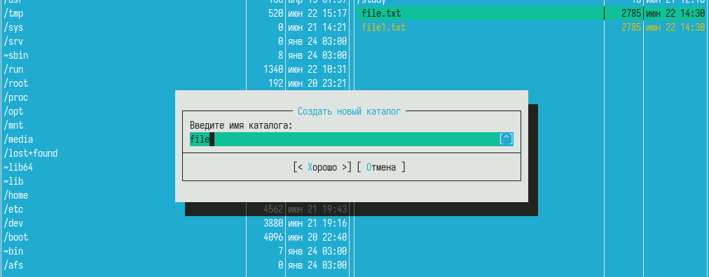

---
## Front matter
lang: ru-RU
title: Лабораторная работа №9
subtitle: Операционные системы
  - Бекауов А.Т
institute:
  - Российский университет дружбы народов, Москва, Россия

## i18n babel
babel-lang: russian
babel-otherlangs: english

## Formatting pdf
toc: false
toc-title: Содержание
slide_level: 2
aspectratio: 169
section-titles: true
theme: metropolis
header-includes:
 - \metroset{progressbar=frametitle,sectionpage=progressbar,numbering=fraction}
 - '\makeatletter'
 - '\beamer@ignorenonframefalse'
 - '\makeatother'

##Fonts
mainfont: PT Serif
romanfont: PT Serif
sansfont: PT Sans
monofont: PT Mono
mainfontoptions: Ligatures=TeX
romanfontoptions: Ligatures=TeX
sansfontoptions: Ligatures=TeX,Scale=MatchLowercase
monofontoptions: Scale=MatchLowercase,Scale=0.9
---

# Введение

## Цель работы

Цель данной лабораторной работы - освоение основных возможностей командной оболочки Midnight Commander. Приобретение навыков практической работы по просмотру каталогов и файлов; манипуляций с ними.

# Выполнение лабораторной работы

# Задания по mc

## Задание 1: man: mc

Первым делом изучаю информацию  о mc, вызвав в командной строке man mc

{#fig:001 width=70%}

## Задание 2: Окно mc

Далее запускаю mc и изучаб его структуру и меню

{#fig:002 width=70%}

## Задание 2: Навигация 

С помощью стрелок влево и вправо имею возможность двигаться вверх и вниз по директориям, клавиши вверх и вниз позволяют перебирать объекты в пределах выбранной директории

## Задание 3: Копирование

С помощью f5 могу копировать объекты из директории открытой в одном окне, в директорию второго окна 

{#fig:003 width=70%}

## Задание 3: Перемещение

С помощью f6 могу перемещать объекты из директории открытой в одном окне, в директорию второго окна

{#fig:004 width=70%}

## Задание 4: Информация о файлах

Выбраю в падающем списке "левая/правая панель" пункт информация, выбранное окно теперь выводит информацию о файлах выделенны на втором окне.

{#fig:005 width=70%}

## Задание 5: Просмотр содержимого

Выбраю в падающем списке "Файл" пункт просмотр содержимого, окно mc теперь выводит содержимое выбранного файла 

{#fig:006 width=70%}

## Задание 5: Создание каталога

Выбраю в падающем списке "Файл" пункт создание каталога, mc теперь выводит окно, в которое нужно ввести имя нового каталога.

{#fig:007 width=70%}

## Задание 6: Поиск файла

Далее в падающем списке "Команда" выбираю пункт поиск файла, ввожу поиск по ~, с параметрами: имя "*.cpp" , содержание "main". Найден файл cpp подготовленный мной в ходе лабораторной

{#fig:008 width=70%}

#Задание по встроенному редактору mc

## Задание 1 и 2

Создал текстовый файл text.txt, открою его с помощью встроенного в mc редактора (f4)

{#fig:009 width=70%}

## Задание 3: text.txt в mcedit

Вставил в Файл text.txt случайный текст.

{#fig:010 width=70%}

## Задание 4: удаление строки

С помощью комбинации клавиш Ctrl+y удалю первую строку текста

{#fig:011 width=70%}

## Задание 4: копирование фрагмента

Выделяю последнюю строчку текста и с помощью кнопки f5 копирую её.

{#fig:012 width=70%}

## Задание 4: перемещение фрагмента

Выделяю последнюю строчку текста и с помощью кнопки f6 перемещаю её.

{#fig:013 width=70%}

## Задание 4: сохранение файла

С помощью клавиши f2 сохраняю файл.

{#fig:014 width=70%}

## Задание 4: Остальные действия

В начало и конец текста можно перемещаться с помощью клавиш PG UP и PG DN. С помощью комбиинации Ctrl+u можно отменять последнее действие. Сохроняю и закрываю файл с помощью кнопки f10.

##Задание 5 и 6: Подсветка синтаксиса

Открою файл программы на с++, в mcedit. Вижу, что синтаксис файла подсвечен. 

{#fig:015 width=70%}

# Заключение

## Выводы

В ходе данной лабораторной работы я освоил основные возможности командной оболочки Midnight Commander. Приобрёл навыки практической работы по просмотру каталогов и файлов; манипуляций с ними.

