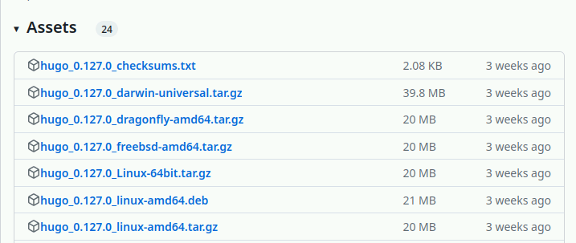

---
## Front matter
lang: ru-RU
title: Первый этап Индивидуального проекта
subtitle: Операционные системы
  - Бекауов А.Т
institute:
  - Российский университет дружбы народов, Москва, Россия

## i18n babel
babel-lang: russian
babel-otherlangs: english

## Formatting pdf
toc: false
toc-title: Содержание
slide_level: 2
aspectratio: 169
section-titles: true
theme: metropolis
header-includes:
 - \metroset{progressbar=frametitle,sectionpage=progressbar,numbering=fraction}
 - '\makeatletter'
 - '\beamer@ignorenonframefalse'
 - '\makeatother'

##Fonts
mainfont: PT Serif
romanfont: PT Serif
sansfont: PT Sans
monofont: PT Mono
mainfontoptions: Ligatures=TeX
romanfontoptions: Ligatures=TeX
sansfontoptions: Ligatures=TeX,Scale=MatchLowercase
monofontoptions: Scale=MatchLowercase,Scale=0.9
---

# Введение

## Цель работы

Целью данной работы является обучение размещению сайтов на Github pages. Выполнить первый этап индивидуального проекта.

# Выполнение лабораторной работы

## Скачивание архива hugo

Сначала скачивая актуальную версию hugo для своей ОС и архитектуры процессора.

{#fig:001 width=70%}

## Подготовка hugo

Распаковываю скачанный архив и перемещаю исполняемый файл hugo в созданную папку ~/bin.

{#fig:002 width=70%}

## Репозиторий - шаблон

Заходим на репозиторий GH с шаблоном сайта

{#fig:003 width=70%}

## Создание репозитрия по шаблону

Создаю свой репозиторий Ind_project по этому шаблону.

{#fig:004 width=70%}

## Клонирование репозитория

Клонирую созданный репозиторий в свой локальный

{#fig:005 width=70%}

## Запуск исполняемого файла hugo

Захожу в клонированный репозиторий и запускаю исполняемый файл hugo. 

{#fig:006 width=70%}

## Сайт на локальном сервере

Ввожу в репозитории Ind_project команду /~/bin/hugo server. Нажимаю на появившуся ссылку и в браузере открывается сайт на локальном сервере.

{#fig:007 width=70%}

## Создание пустого репозитория

Создаю новый пустой репозиторий, имя которого будет адресом сайта.

{#fig:008 width=70%}

## Создание пустого репозитория

Клонирую пустой репозиторий в локальную директорию.

{#fig:009 width=70%}

## Активация нового репозитория

Создаю главную ветку в пустом репозитории и добавляю в него пустой файл README.md. Далее составляю коммит и отправляю его на глобальный репозиторий, чтобы его активировать.

{#fig:010 width=70%}

## Подключение репозитория к каталогу

Далее захожу в репозиторий Ind_project, удаляю папку private и подключаю репозиторий к каталогу public (автоматически создан)

{#fig:011 width=70%}

## Использование hugo

Опять выполняю команду ~/bin/hugo, чтобы наполнить каталог public.

{#fig:012 width=70%}

## Наполнение сайта

Захожу в каталог public и отправляю все изменения на репозиторий atbekauov.github.io

{#fig:013 width=70%}

## Переход на сайт

Дальше вбиваем название репозитория atbekauov.github.io в браузере и переходим на созданный сайт

{#fig:014 width=70%}

# Заключение

## Выводы

В ходе данной лаботраторной работы я научился размещать сайт на GH pages и выполнил первый этап индивидуального проекта.

