---
## Front matter
title: "Отчёт по первому этапу Индивидуального проекта"
subtitle: "Операционные системы"
author: "Бекауов Артур Тимурович"

## Generic otions
lang: ru-RU
toc-title: "Содержание"

## Bibliography
bibliography: bib/cite.bib
csl: pandoc/csl/gost-r-7-0-5-2008-numeric.csl

## Pdf output format
toc: true # Table of contents
toc-depth: 2
lof: true # List of figures
lot: true # List of tables
fontsize: 12pt
linestretch: 1.5
papersize: a4
documentclass: scrreprt
## I18n polyglossia
polyglossia-lang:
  name: russian
  options:
	- spelling=modern
	- babelshorthands=true
polyglossia-otherlangs:
  name: english
## I18n babel
babel-lang: russian
babel-otherlangs: english
## Fonts
mainfont: PT Serif
romanfont: PT Serif
sansfont: PT Sans
monofont: PT Mono
mainfontoptions: Ligatures=TeX
romanfontoptions: Ligatures=TeX
sansfontoptions: Ligatures=TeX,Scale=MatchLowercase
monofontoptions: Scale=MatchLowercase,Scale=0.9
## Biblatex
biblatex: true
biblio-style: "gost-numeric"
biblatexoptions:
  - parentracker=true
  - backend=biber
  - hyperref=auto
  - language=auto
  - autolang=other*
  - citestyle=gost-numeric
## Pandoc-crossref LaTeX customization
figureTitle: "Рис."
tableTitle: "Таблица"
listingTitle: "Листинг"
lofTitle: "Список иллюстраций"
lotTitle: "Список таблиц"
lolTitle: "Листинги"
## Misc options
indent: true
header-includes:
  - \usepackage{indentfirst}
  - \usepackage{float} # keep figures where there are in the text
  - \floatplacement{figure}{H} # keep figures where there are in the text
---

# Цель работы

Целью данной работы является обучение размещению сайтов на Github pages. Выполнить первый этап индивидуального проекта.

# Задание

Размещение на Github pages заготовки для персонального сайта:

1. Установить необходимое программное обеспечение.

2. Скачать шаблон темы сайта.

3. Разместить его на хостинге git.

4. Установить параметр для URLs сайта.

5. Разместить заготовку сайта на Github pages.

# Выполнение этапа индивидуального проекта

Сначала скачивая актуальную версию hugo для своей ОС и архитектуры процессора. (рис. [-@fig:001]).

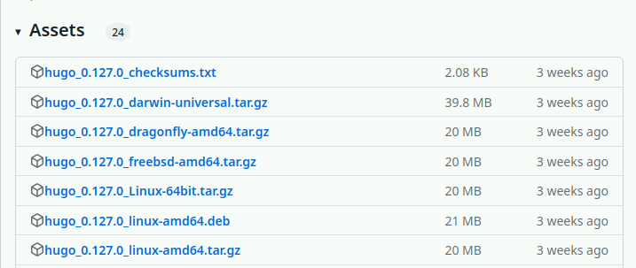{#fig:001 width=70%}

Распаковываю скачанный архив и перемещаю исполняемый файл hugo в созданную папку ~/bin. (рис. [-@fig:002]).

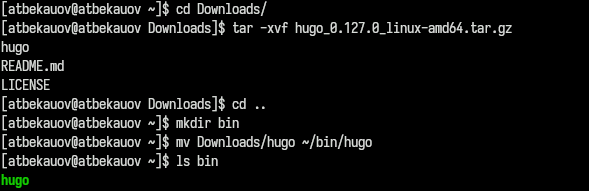{#fig:002 width=70%}

Заходим на репозиторий GH с шаблоном сайта (рис. [-@fig:003]).

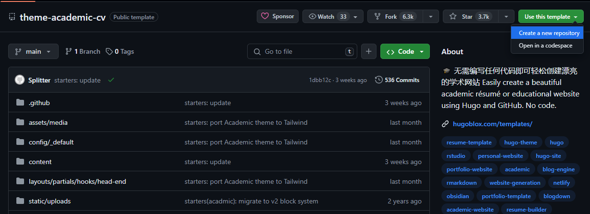{#fig:003 width=70%}

Создаю свой репозиторий Ind_project по этому шаблону. (рис. [-@fig:004]).

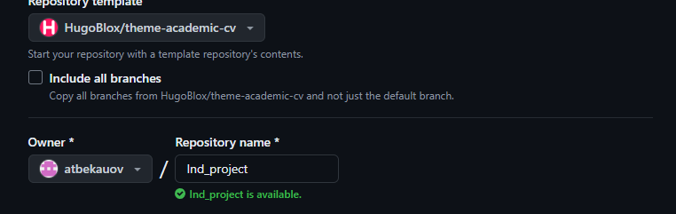{#fig:004 width=70%}

Клонирую созданный репозиторий в свой локальный (рис. [-@fig:005]).

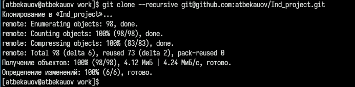{#fig:005 width=70%}

Захожу в клонированный репозиторий и запускаю исполняемый файл hugo. (рис. [-@fig:006]).

{#fig:006 width=70%}

Ввожу в репозитории Ind_project команду /~/bin/hugo server. Нажимаю на появившуся ссылку и в браузере открывается сайт на локальном сервере. (рис. [-@fig:007]).

{#fig:007 width=70%}

Создаю новый пустой репозиторий, имя которого будет адресом сайта. (рис. [-@fig:008]).

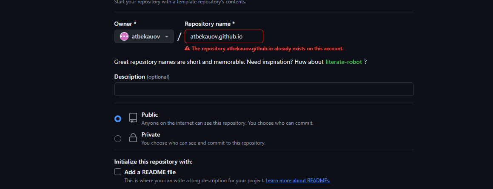{#fig:008 width=70%}

Клонирую пустой репозиторий в локальную директорию. (рис. [-@fig:009]).

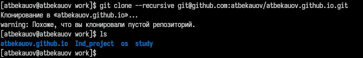{#fig:009 width=70%}

Создаю главную ветку в пустом репозитории и добавляю в него пустой файл README.md. Далее составляю коммит и отправляю его на глобальный репозиторий, чтобы его активировать.   (рис. [-@fig:010]).

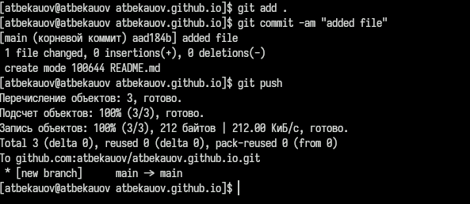{#fig:010 width=70%}

Далее захожу в репозиторий Ind_project, удаляю папку public и подключаю репозиторий к каталогу public (автоматически создан) (рис. [-@fig:011]).

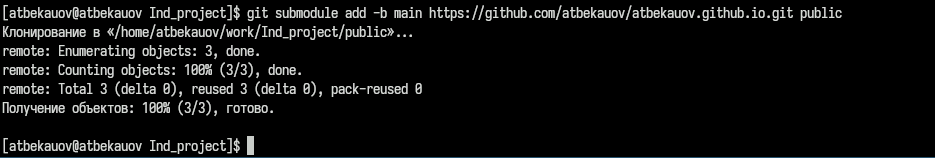{#fig:011 width=70%}

Опять выполняю команду ~/bin/hugo, чтобы наполнить каталог public. (рис. [-@fig:012])

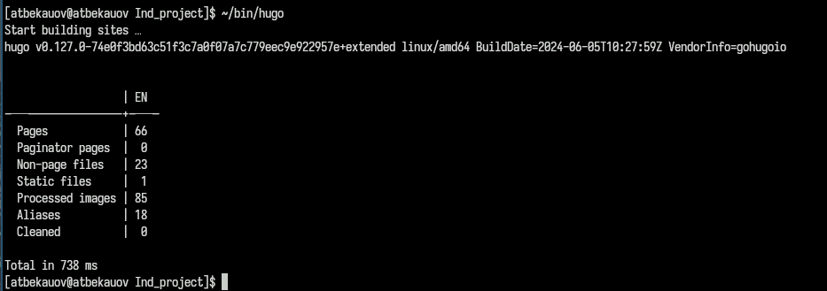{#fig:012 width=70%}

Захожу в каталог public и отправляю все изменения на репозиторий atbekauov.github.io (рис. [-@fig:013]).

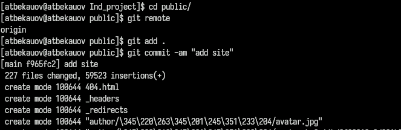{#fig:013 width=70%}

Дальше вбиваем название репозитория atbekauov.github.io в браузере и переходим на созданный сайт  (рис. [-@fig:014])

{#fig:014 width=70%}

# Выводы

В ходе данной лаботраторной работы я научился размещать сайт на GH pages и выполнил первый этап индивидуального проекта.

