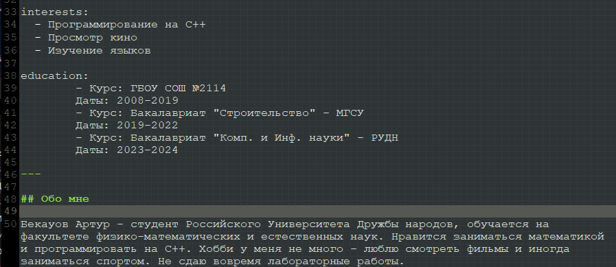
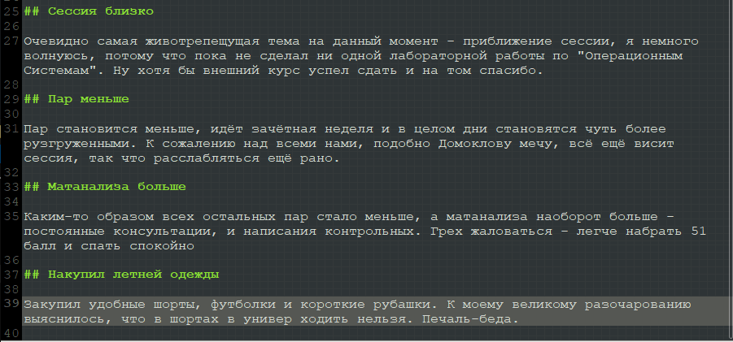
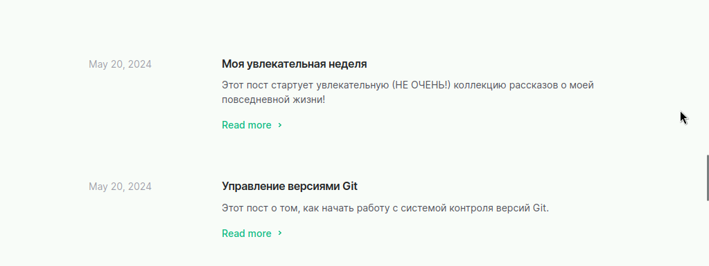
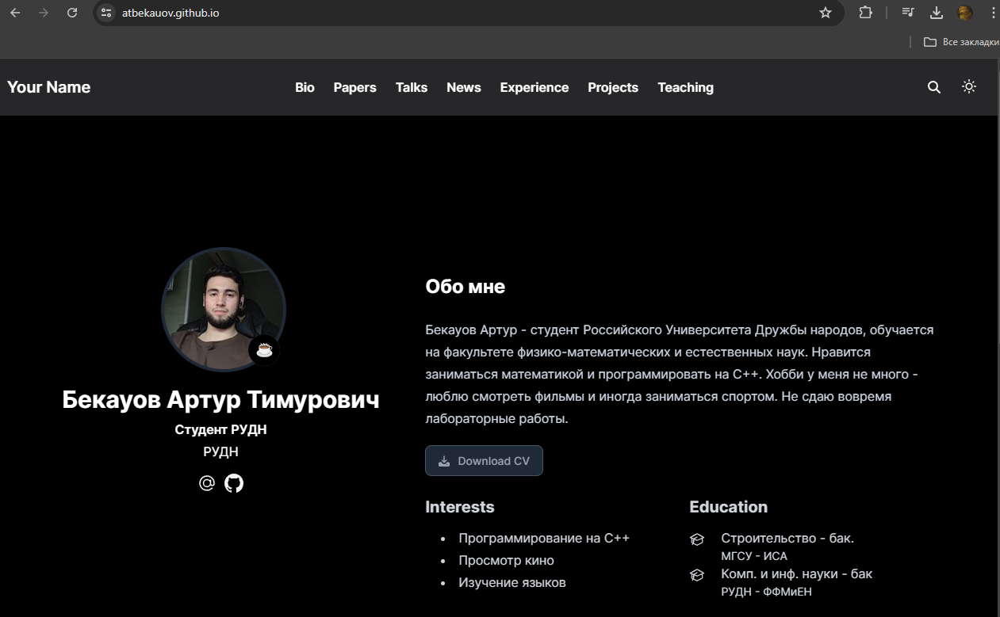

---
## Front matter
title: "Отчёт по второму этапу Индивидуального проекта"
subtitle: "Операционные системы"
author: "Бекауов Артур Тимурович"

## Generic otions
lang: ru-RU
toc-title: "Содержание"

## Bibliography
bibliography: bib/cite.bib
csl: pandoc/csl/gost-r-7-0-5-2008-numeric.csl

## Pdf output format
toc: true # Table of contents
toc-depth: 2
lof: true # List of figures
lot: true # List of tables
fontsize: 12pt
linestretch: 1.5
papersize: a4
documentclass: scrreprt
## I18n polyglossia
polyglossia-lang:
  name: russian
  options:
	- spelling=modern
	- babelshorthands=true
polyglossia-otherlangs:
  name: english
## I18n babel
babel-lang: russian
babel-otherlangs: english
## Fonts
mainfont: PT Serif
romanfont: PT Serif
sansfont: PT Sans
monofont: PT Mono
mainfontoptions: Ligatures=TeX
romanfontoptions: Ligatures=TeX
sansfontoptions: Ligatures=TeX,Scale=MatchLowercase
monofontoptions: Scale=MatchLowercase,Scale=0.9
## Biblatex
biblatex: true
biblio-style: "gost-numeric"
biblatexoptions:
  - parentracker=true
  - backend=biber
  - hyperref=auto
  - language=auto
  - autolang=other*
  - citestyle=gost-numeric
## Pandoc-crossref LaTeX customization
figureTitle: "Рис."
tableTitle: "Таблица"
listingTitle: "Листинг"
lofTitle: "Список иллюстраций"
lotTitle: "Список таблиц"
lolTitle: "Листинги"
## Misc options
indent: true
header-includes:
  - \usepackage{indentfirst}
  - \usepackage{float} # keep figures where there are in the text
  - \floatplacement{figure}{H} # keep figures where there are in the text
---

# Цель работы

Целью данной работы добавление данных о себе на сайт. Выполнить второй этап индивидуального проекта.

# Задание

1. Разместить фотографию владельца сайта.

2. Разместить краткое описание владельца сайта (Biography).

3. Добавить информацию об интересах (Interests).

4. Добавить информацию от образовании (Education).

5. Сделать пост по прошедшей неделе.

6. Управление версиями. Git.

# Выполнение этапа индивидуального проекта

Первым делом я добавил в реопзиторий Ind_project в content/authors/admin свою фотографию вместо шаблонной. (рис. [-@fig:001]).

{#fig:001 width=70%}

В той же папке открываю файл _index.md в редакторе gedit и ввожу информацию о себе (краткое описание, интересы, образование). (рис. [-@fig:002]).

{#fig:002 width=70%}

с помощью hugo server запускаю локальный сервер и проверяю корректность изменений. (рис. [-@fig:003]).

{#fig:003 width=70%}

Далее перехожу в каталог Ind_project/content/posts и создаю две папки post 1 и post 2 на подобе остальных имеющихся там. Открываю папку post 1, открываю в gedit файл index.md и делаю пост о прошедшей неделе. (рис. [-@fig:004]).

{#fig:004 width=70%}

Открываю папку post 2, открываю в gedit файл index.md и делаю пост о системе контроля версий Git  (рис. [-@fig:005]).

{#fig:005 width=70%}

Ещё раз запускаю локальный сервер и проверяю посты. (рис. [-@fig:006]).

{#fig:006 width=70%}

Ввожу в репозитории Ind_project команду /~/bin/hugo. Далее перехожу в public и отправляю изменения на репозиторий atbekauov.github.io. (рис. [-@fig:007]).

{#fig:007 width=70%}

Захожу на сайт и проверяю свою карточку. (рис. [-@fig:008]).

{#fig:008 width=70%}

Также проверяю пост про неделю. (рис. [-@fig:009]).

{#fig:009 width=70%}

Затем проверяю пост про Git.   (рис. [-@fig:010]).

{#fig:010 width=70%}

# Выводы

В ходе данной лаботраторной работы я добавил данные о себе на сайт и выполнил второй этап индивидуального проекта.

