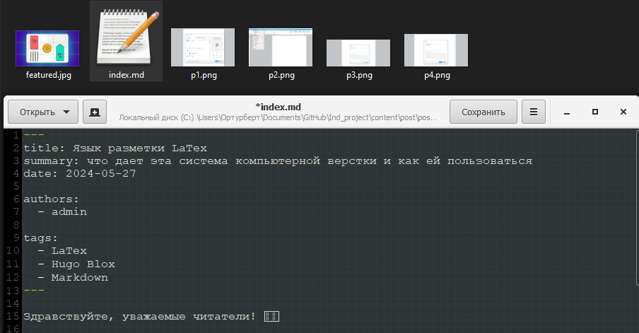

---
## Front matter
lang: ru-RU
title: Третий этап Индивидуального проекта
subtitle: Операционные системы
  - Бекауов А.Т
institute:
  - Российский университет дружбы народов, Москва, Россия

## i18n babel
babel-lang: russian
babel-otherlangs: english

## Formatting pdf
toc: false
toc-title: Содержание
slide_level: 2
aspectratio: 169
section-titles: true
theme: metropolis
header-includes:
 - \metroset{progressbar=frametitle,sectionpage=progressbar,numbering=fraction}
 - '\makeatletter'
 - '\beamer@ignorenonframefalse'
 - '\makeatother'

##Fonts
mainfont: PT Serif
romanfont: PT Serif
sansfont: PT Sans
monofont: PT Mono
mainfontoptions: Ligatures=TeX
romanfontoptions: Ligatures=TeX
sansfontoptions: Ligatures=TeX,Scale=MatchLowercase
monofontoptions: Scale=MatchLowercase,Scale=0.9
---

# Введение

## Цель работы

Целью данной работы продолжения редактирования сайта. Выполнить третий этап индивидуального проекта.

# Выполнение лабораторной работы

## Добавление умений и хобби

Первым делом зашёл в реопзиторий Ind_project в content/authors/admin и открыл в текстовом редакторе gedit файл _index.md. Первым делом в этом файле я добавил себе умения и хобби.

{#fig:001 width=70%}

## Добавление опыта работы

В том же файле _index.md ввожу информацию об опыте работы .

{#fig:002 width=70%}

## Добавление достижений

Там же дописываю свои достижения.

{#fig:003 width=70%}

## Пост о прошедшей неделе

Затем перехожу в каталог Ind_project/content/posts и создаю две папки post 3 и post 4 на подобие post 1 и post 2. Открываю папку post 3, открываю в gedit файл index.md и делаю пост о прошедшей неделе.

{#fig:004 width=70%}

## Пост о Latex

Открываю папку post 4, открываю в gedit файл index.md и делаю пост о Latex 

{#fig:005 width=70%}

## Локальный сервер - проверка постов

Запускаю локальный сервер, с помощью hugo server и проверяю посты.

{#fig:006 width=70%}

## Перенос изменений на сайт

Ввожу в репозитории Ind_project команду /~/bin/hugo. Далее перехожу в public и отправляю изменения на репозиторий atbekauov.github.io.

{#fig:007 width=70%}

## Проверка сайта - пост про неделю

Захожу на сайт и проверяю пост про неделю.

{#fig:008 width=70%}

## Проверка сайта - пост про LaTex

Также проверяю пост про Latex.

{#fig:009 width=70%}

## Проверка сайта - Опыт

Затем проверяю Вкладку Опыт.

{#fig:010 width=70%}

## Проверка сайта - Навыки и достижения

В конце концов проверяю навыки/хобби и достижения

{#fig:011 width=70%}

# Заключение

## Выводы

В ходе данной лаботраторной работы я продолжил редактирование сайта и выполнил второй этап индивидуального проекта.

