---
## Front matter
title: "Отчёт по третьему этапу Индивидуального проекта"
subtitle: "Операционные системы"
author: "Бекауов Артур Тимурович"

## Generic otions
lang: ru-RU
toc-title: "Содержание"

## Bibliography
bibliography: bib/cite.bib
csl: pandoc/csl/gost-r-7-0-5-2008-numeric.csl

## Pdf output format
toc: true # Table of contents
toc-depth: 2
lof: true # List of figures
lot: true # List of tables
fontsize: 12pt
linestretch: 1.5
papersize: a4
documentclass: scrreprt
## I18n polyglossia
polyglossia-lang:
  name: russian
  options:
	- spelling=modern
	- babelshorthands=true
polyglossia-otherlangs:
  name: english
## I18n babel
babel-lang: russian
babel-otherlangs: english
## Fonts
mainfont: PT Serif
romanfont: PT Serif
sansfont: PT Sans
monofont: PT Mono
mainfontoptions: Ligatures=TeX
romanfontoptions: Ligatures=TeX
sansfontoptions: Ligatures=TeX,Scale=MatchLowercase
monofontoptions: Scale=MatchLowercase,Scale=0.9
## Biblatex
biblatex: true
biblio-style: "gost-numeric"
biblatexoptions:
  - parentracker=true
  - backend=biber
  - hyperref=auto
  - language=auto
  - autolang=other*
  - citestyle=gost-numeric
## Pandoc-crossref LaTeX customization
figureTitle: "Рис."
tableTitle: "Таблица"
listingTitle: "Листинг"
lofTitle: "Список иллюстраций"
lotTitle: "Список таблиц"
lolTitle: "Листинги"
## Misc options
indent: true
header-includes:
  - \usepackage{indentfirst}
  - \usepackage{float} # keep figures where there are in the text
  - \floatplacement{figure}{H} # keep figures where there are in the text
---

# Цель работы

Целью данной работы продолжения редактирования сайта. Выполнить третий этап индивидуального проекта.

# Задание

1. Добавить информацию о навыках (Skills).

2. Добавить информацию об опыте (Experience).

3. Добавить информацию о достижениях (Accomplishments).

4. Сделать пост по прошедшей неделе.

5. Добавить пост по LaTex

# Выполнение этапа индивидуального проекта

Первым делом зашёл в реопзиторий Ind_project в content/authors/admin и открыл в текстовом редакторе gedit файл _index.md. Первым делом в этом файле я добавил себе умения и хобби. (рис. [-@fig:001]).

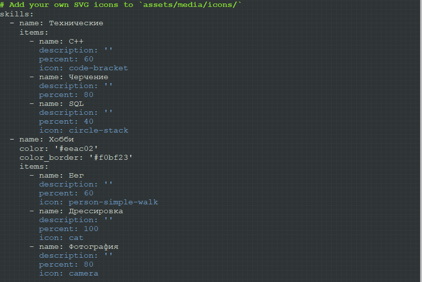{#fig:001 width=70%}

В том же файле _index.md ввожу информацию об опыте работы . (рис. [-@fig:002]).

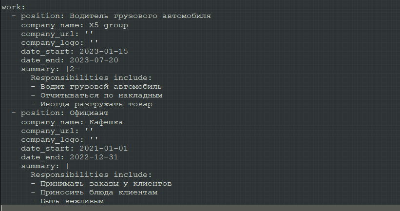{#fig:002 width=70%}

Там же дописываю свои достижения. (рис. [-@fig:003]).

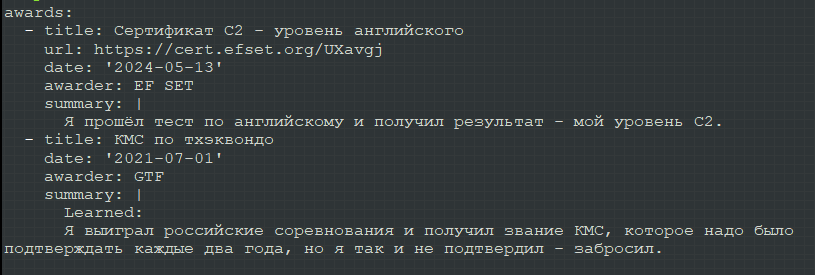{#fig:003 width=70%}

Затем перехожу в каталог Ind_project/content/posts и создаю две папки post 3 и post 4 на подобие post 1 и post 2. Открываю папку post 3, открываю в gedit файл index.md и делаю пост о прошедшей неделе. (рис. [-@fig:004]).

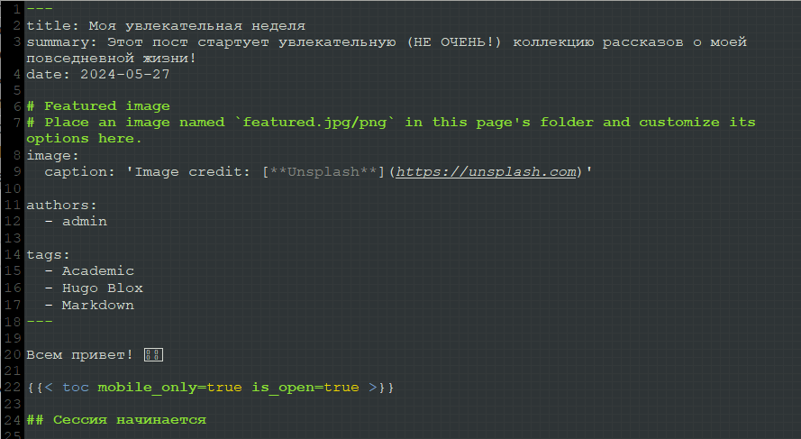{#fig:004 width=70%}

Открываю папку post 4, открываю в gedit файл index.md и делаю пост о Latex  (рис. [-@fig:005]).

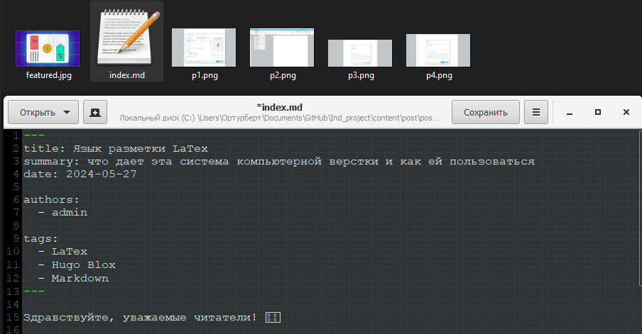{#fig:005 width=70%}

Запускаю локальный сервер, с помощью hugo server и проверяю посты. (рис. [-@fig:006]).

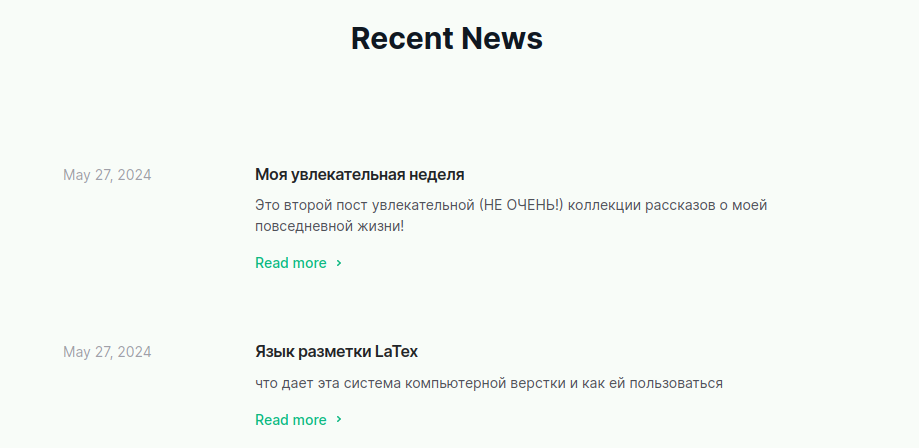{#fig:006 width=70%}

Ввожу в репозитории Ind_project команду /~/bin/hugo. Далее перехожу в public и отправляю изменения на репозиторий atbekauov.github.io. (рис. [-@fig:007]).

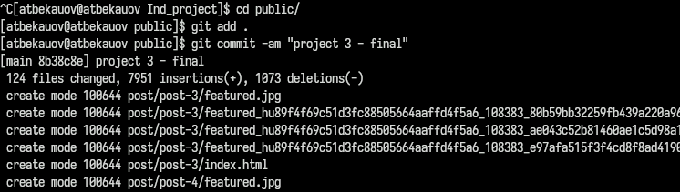{#fig:007 width=70%}

Захожу на сайт и проверяю пост про неделю. (рис. [-@fig:008]).

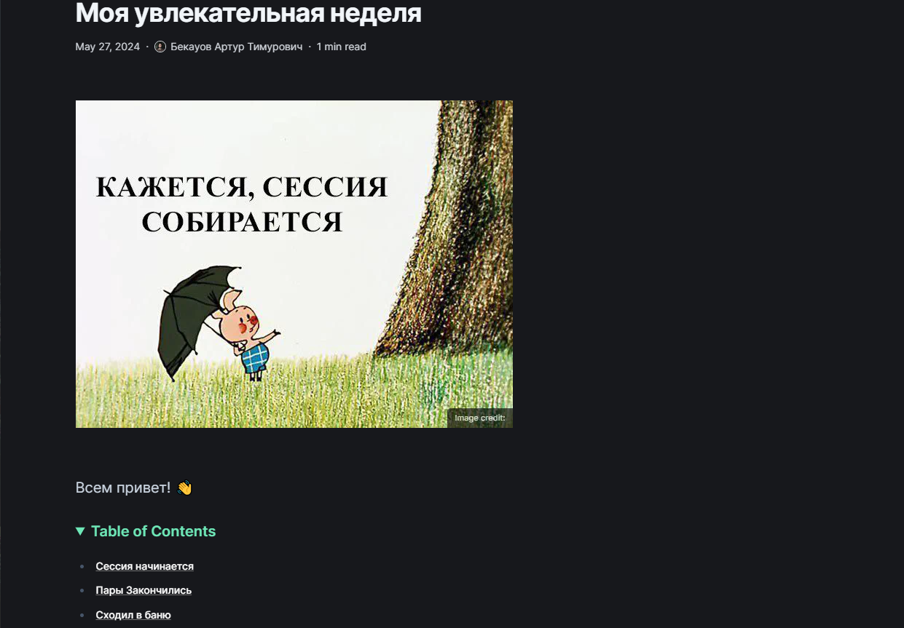{#fig:008 width=70%}

Также проверяю пост про Latex. (рис. [-@fig:009]).

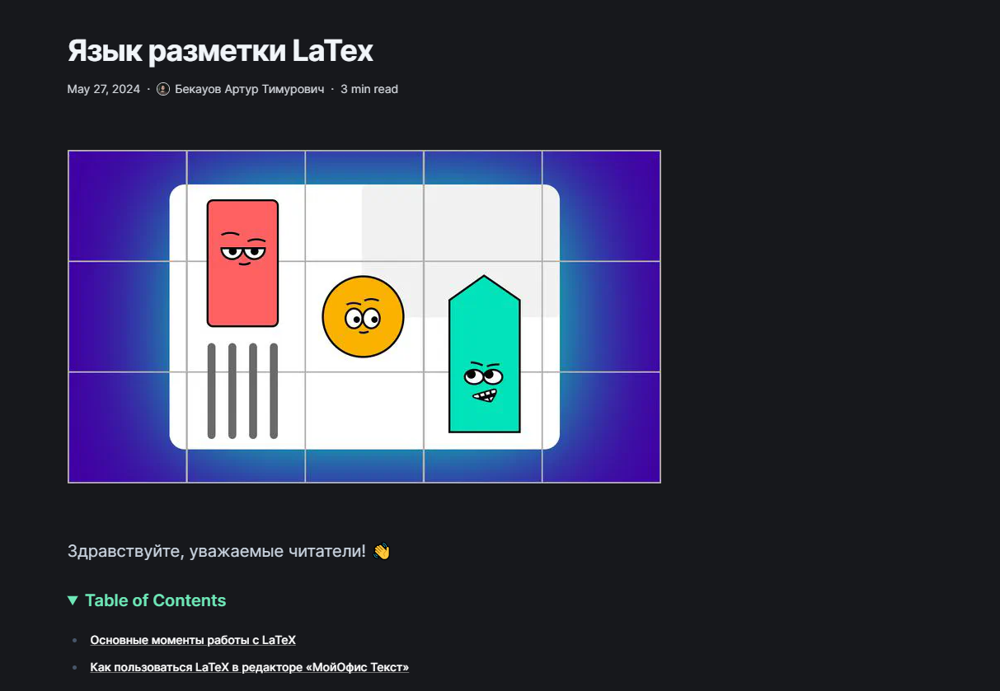{#fig:009 width=70%}

Затем проверяю Вкладку Опыт.   (рис. [-@fig:010]).

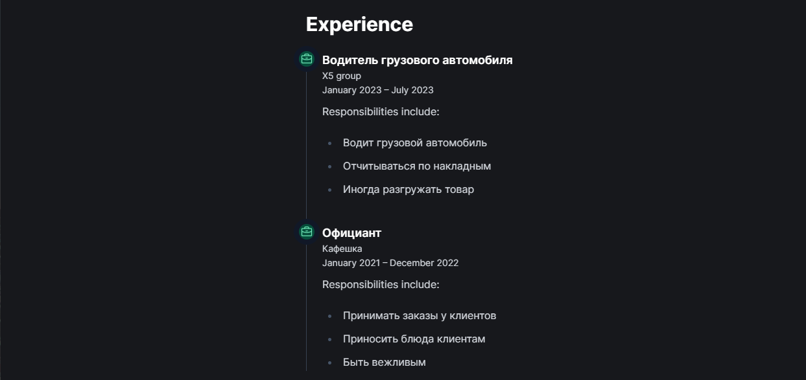{#fig:010 width=70%}

В конце концов проверяю навыки/хобби и достижения (рис. [-@fig:011]).

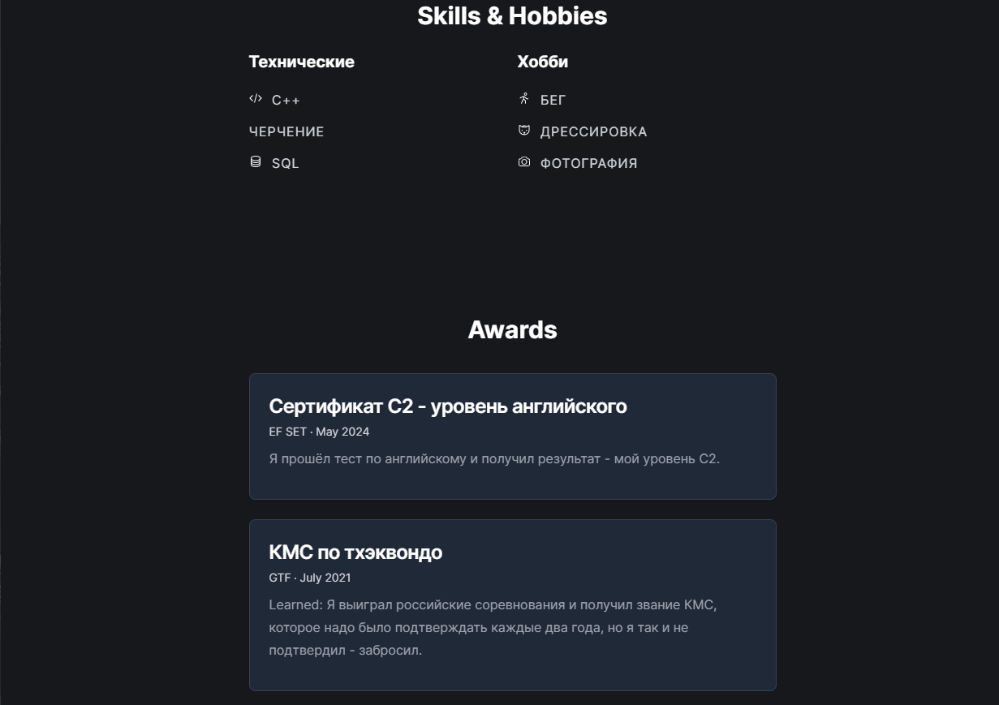{#fig:011 width=70%}

# Выводы

В ходе данной лаботраторной работы я продолжил редактирование сайта и выполнил второй этап индивидуального проекта.

