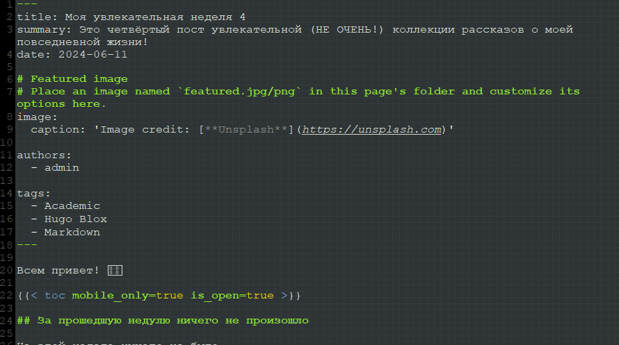

---
## Front matter
lang: ru-RU
title: Пятый этап Индивидуального проекта
subtitle: Операционные системы
  - Бекауов А.Т
institute:
  - Российский университет дружбы народов, Москва, Россия

## i18n babel
babel-lang: russian
babel-otherlangs: english

## Formatting pdf
toc: false
toc-title: Содержание
slide_level: 2
aspectratio: 169
section-titles: true
theme: metropolis
header-includes:
 - \metroset{progressbar=frametitle,sectionpage=progressbar,numbering=fraction}
 - '\makeatletter'
 - '\beamer@ignorenonframefalse'
 - '\makeatother'

##Fonts
mainfont: PT Serif
romanfont: PT Serif
sansfont: PT Sans
monofont: PT Mono
mainfontoptions: Ligatures=TeX
romanfontoptions: Ligatures=TeX
sansfontoptions: Ligatures=TeX,Scale=MatchLowercase
monofontoptions: Scale=MatchLowercase,Scale=0.9
---

# Введение

## Цель работы

Целью данной работы продолжение редактирования сайта. Выполнить пятый этап индивидуального проекта.

# Выполнение этапа работы

## Добавления проекта ЛР

Первым делом зашёл в реопзиторий Ind_project в content/project и создал там папкт Labs_OS и Site_OS , зашёл в Labs_Os и запустил в редакторе gedit файл _index.md. В этом файле расписал проект выполнения лабораторных работ.

{#fig:001 width=70%}

## Добавление проекта сайта

Затем перешёл в каталог Site_OS и запустил в редакторе gedit файл _index.md. В этом файле расписал проект выполнения индивидуального проекта.

{#fig:002 width=70%}

## Пост о прошедшей неделе

Затем перехожу в каталог Ind_project/content/posts и создаю две папки post 7 и post 8. Открываю папку post 7, открываю в gedit файл index.md и делаю пост о прошедшей неделе.

{#fig:003 width=70%}

## Пост о языках программирования

Открываю папку post 8, открываю в gedit файл index.md и делаю пост о языках научного программирования

{#fig:004 width=70%}

## Локальный сервер - проверка постов

Запускаю локальный сервер, с помощью hugo server и проверяю посты.

{#fig:005 width=70%}

## Перенос изменений на сайт

Ввожу в репозитории Ind_project команду /~/bin/hugo. Далее перехожу в public и отправляю изменения на репозиторий atbekauov.github.io.

{#fig:006 width=70%}

## Проверка сайта - пост про неделю

Захожу на сайт и проверяю пост про неделю.

{#fig:007 width=70%}

## Проверка сайта - пост про языки

Также проверяю пост про языки программирования.

{#fig:008 width=70%}

## Проверка сайта - проекты

В конце проверяю проекты

{#fig:008 width=70%}

# Заключение

## Выводы

В ходе данной лаботраторной работы я продолжил редактирование сайта и выполнил пятый этап индивидуального проекта.

