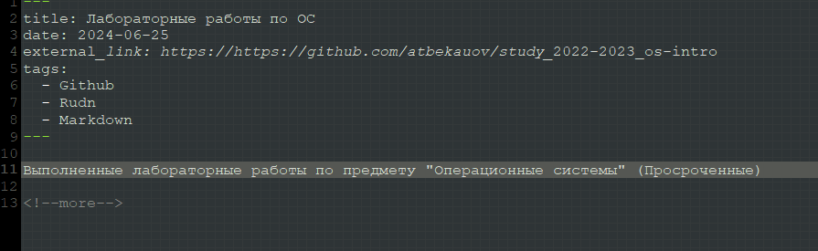
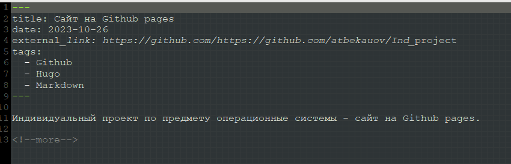
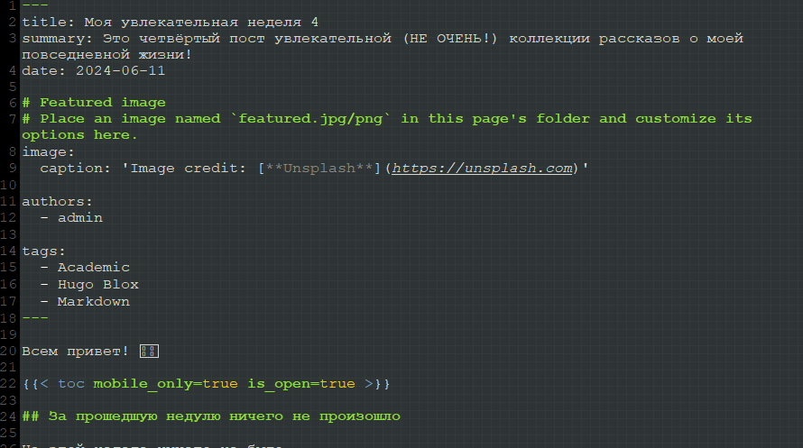
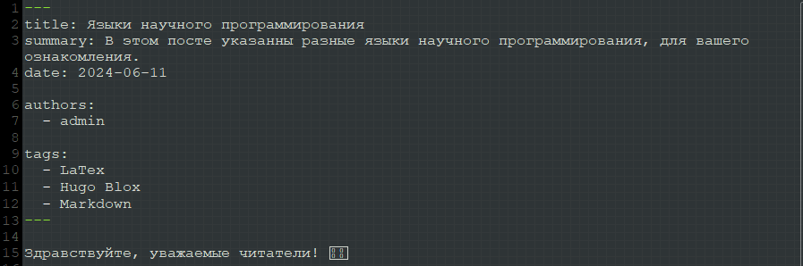
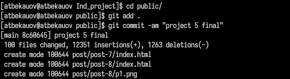
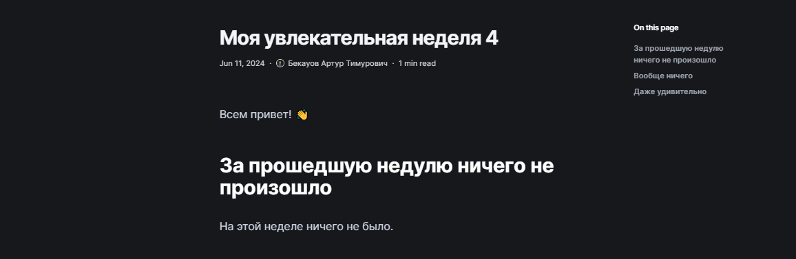
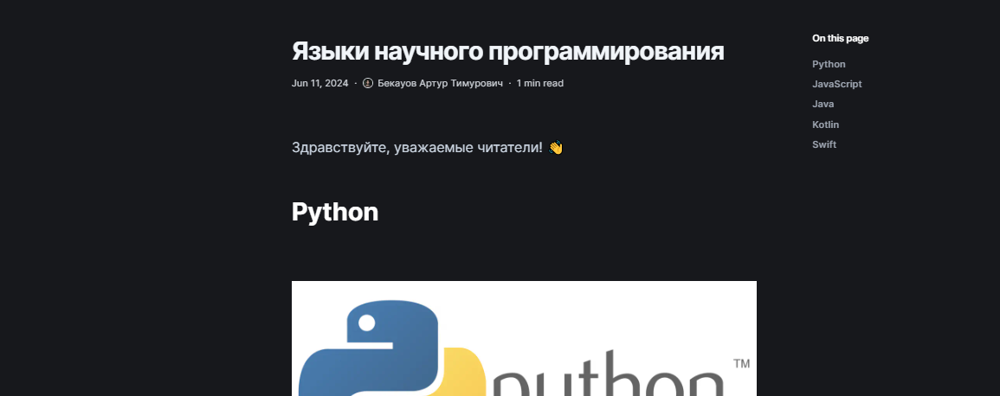
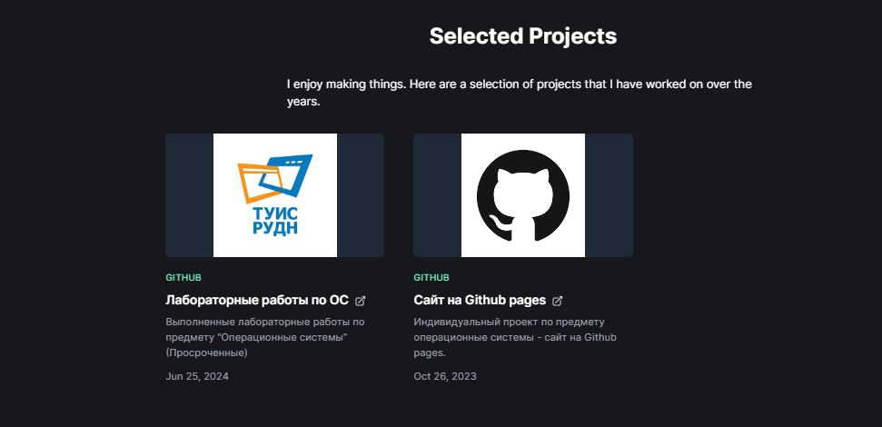

---
## Front matter
title: "Отчёт по пятому этапу Индивидуального проекта"
subtitle: "Операционные системы"
author: "Бекауов Артур Тимурович"

## Generic otions
lang: ru-RU
toc-title: "Содержание"

## Bibliography
bibliography: bib/cite.bib
csl: pandoc/csl/gost-r-7-0-5-2008-numeric.csl

## Pdf output format
toc: true # Table of contents
toc-depth: 2
lof: true # List of figures
lot: true # List of tables
fontsize: 12pt
linestretch: 1.5
papersize: a4
documentclass: scrreprt
## I18n polyglossia
polyglossia-lang:
  name: russian
  options:
	- spelling=modern
	- babelshorthands=true
polyglossia-otherlangs:
  name: english
## I18n babel
babel-lang: russian
babel-otherlangs: english
## Fonts
mainfont: PT Serif
romanfont: PT Serif
sansfont: PT Sans
monofont: PT Mono
mainfontoptions: Ligatures=TeX
romanfontoptions: Ligatures=TeX
sansfontoptions: Ligatures=TeX,Scale=MatchLowercase
monofontoptions: Scale=MatchLowercase,Scale=0.9
## Biblatex
biblatex: true
biblio-style: "gost-numeric"
biblatexoptions:
  - parentracker=true
  - backend=biber
  - hyperref=auto
  - language=auto
  - autolang=other*
  - citestyle=gost-numeric
## Pandoc-crossref LaTeX customization
figureTitle: "Рис."
tableTitle: "Таблица"
listingTitle: "Листинг"
lofTitle: "Список иллюстраций"
lotTitle: "Список таблиц"
lolTitle: "Листинги"
## Misc options
indent: true
header-includes:
  - \usepackage{indentfirst}
  - \usepackage{float} # keep figures where there are in the text
  - \floatplacement{figure}{H} # keep figures where there are in the text
---

# Цель работы

Целью данной работы продолжение редактирования сайта. Выполнить пятый этап индивидуального проекта.

# Задание

1. Сделать записи для персональных проектов.

2. Сделать пост по прошедшей неделе.

3. Добавить пост на тему языки научного программирования.

# Выполнение этапа индивидуального проекта

Первым делом зашёл в реопзиторий Ind_project в content/project и создал там папкт Labs_OS и Site_OS , зашёл в Labs_Os и запустил в редакторе gedit файл _index.md. В этом файле расписал проект выполнения лабораторных работ. (рис. [-@fig:001]).

{#fig:001 width=70%}

Затем перешёл в каталог Site_OS и запустил в редакторе gedit файл _index.md. В этом файле расписал проект выполнения индивидуального проекта. (рис. [-@fig:002]).

{#fig:002 width=70%}

Затем перехожу в каталог Ind_project/content/posts и создаю две папки post 7 и post 8. Открываю папку post 7, открываю в gedit файл index.md и делаю пост о прошедшей неделе. (рис. [-@fig:003]).

{#fig:003 width=70%}

Открываю папку post 8, открываю в gedit файл index.md и делаю пост о языках научного программирования (рис. [-@fig:004]).

{#fig:004 width=70%}

Запускаю локальный сервер, с помощью hugo server и проверяю посты.  (рис. [-@fig:005]).

{#fig:005 width=70%}

Ввожу в репозитории Ind_project команду /~/bin/hugo. Далее перехожу в public и отправляю изменения на репозиторий atbekauov.github.io. (рис. [-@fig:006]).

{#fig:006 width=70%}

Захожу на сайт и проверяю пост про неделю. (рис. [-@fig:007]).

{#fig:007 width=70%}

Также проверяю пост про языки программирования. (рис. [-@fig:008]).

{#fig:008 width=70%}

В конце проверяю проекты (рис. [-@fig:009]).

{#fig:009 width=70%}

# Выводы

В ходе данной лаботраторной работы я продолжил редактирование сайта и выполнил пятый этап индивидуального проекта.

