---
## Front matter
lang: ru-RU
title: Шестой этап Индивидуального проекта
subtitle: Операционные системы
  - Бекауов А.Т
institute:
  - Российский университет дружбы народов, Москва, Россия

## i18n babel
babel-lang: russian
babel-otherlangs: english

## Formatting pdf
toc: false
toc-title: Содержание
slide_level: 2
aspectratio: 169
section-titles: true
theme: metropolis
header-includes:
 - \metroset{progressbar=frametitle,sectionpage=progressbar,numbering=fraction}
 - '\makeatletter'
 - '\beamer@ignorenonframefalse'
 - '\makeatother'

##Fonts
mainfont: PT Serif
romanfont: PT Serif
sansfont: PT Sans
monofont: PT Mono
mainfontoptions: Ligatures=TeX
romanfontoptions: Ligatures=TeX
sansfontoptions: Ligatures=TeX,Scale=MatchLowercase
monofontoptions: Scale=MatchLowercase,Scale=0.9
---

# Введение

## Цель работы

Целью данной работы окончание работы над редактирования сайта. Выполнить шестой этап индивидуального проекта.

# Выполнение этапа работы

## Создание папок ru и en

Первым делом зашёл в реопзиторий Ind_project в content и создал там две папки: ru и en, в каждую из которых скопировал остальные объекты директории

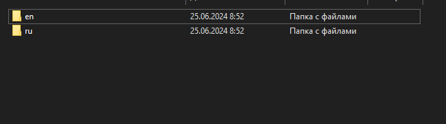{#fig:001 width=70%}

## Скачивание en.yaml и ru.yaml

Затем скачиваю руссский и английский локализаторы из модулей hugo.

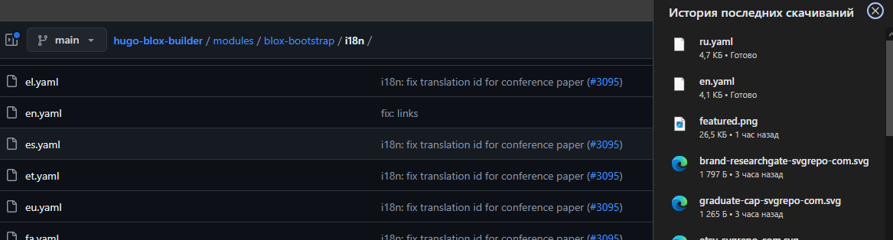{#fig:002 width=70%}

## Настройка английского языка

Перемещаю en.yaml в папку en

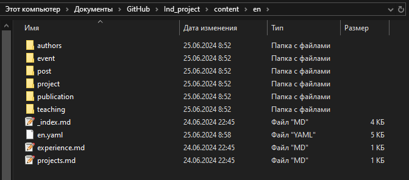{#fig:003 width=70%}

## Настройка русского языка

Перемещаю ru.yaml в папку ru

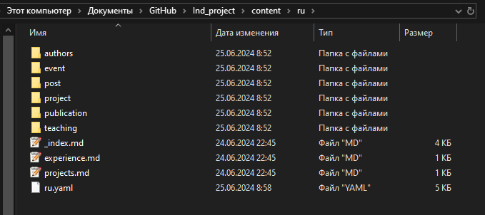{#fig:004 width=70%}

## Замена languages.yaml

Затем открываю файл конфигурации languages.yaml и переписываю его текст следующим образом.

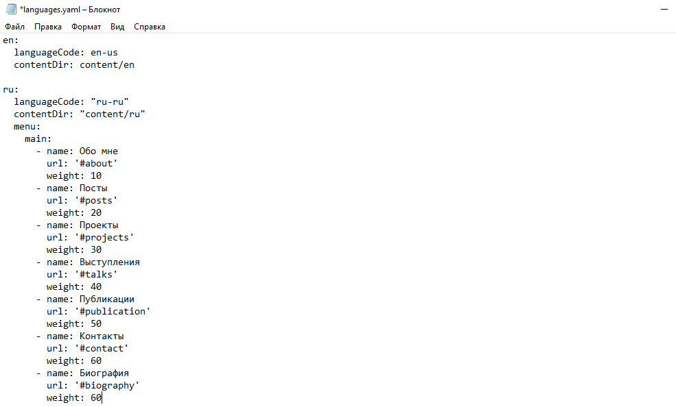{#fig:005 width=70%}

## Локальный сервер - проверка локализации

Запускаю локальный сервер с помощью hugo server и проверяю, что смена языка работает корректно

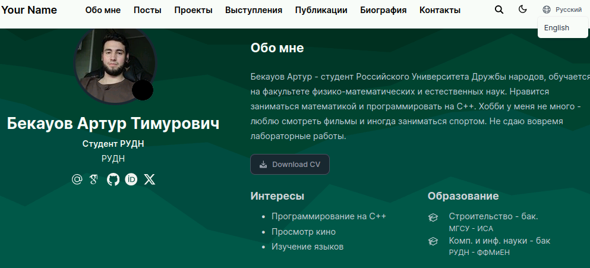{#fig:006 width=70%}

## Пост про неделю

Далее захожу в posts и создаю папку post 9, открываю в ней index.md, и расписываю, как прошла моя неделя. Аналагичную папку на на английском размещаю в en/posts.

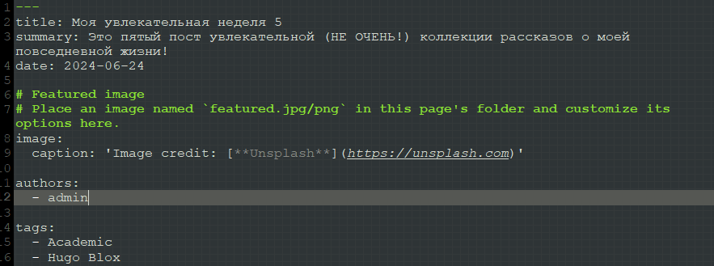{#fig:007 width=70%}

## Пост про черепах

Затем создаю папку post 10, открываю index.md и пишу там пост о черепахах. В en/posts оставляю английский аналог 

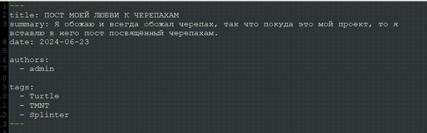{#fig:008 width=70%}

## Локальный сервер - проверка постов

Запускаю hugo server и проверяю посты. 

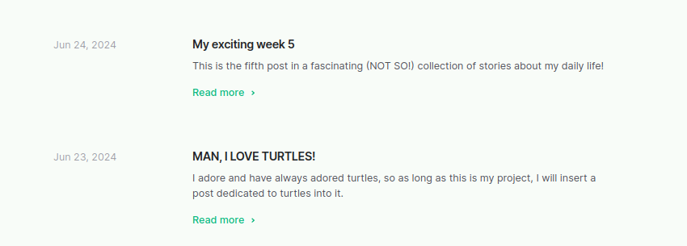{#fig:008 width=70%}

## Изменение сайта

С постами всё отлично, ввожу в репозитории Ind_project ~/bin/hugo. Затем перехожу в каталог public  и отправляю все изменения на репозиторий atbekauov.github.io 

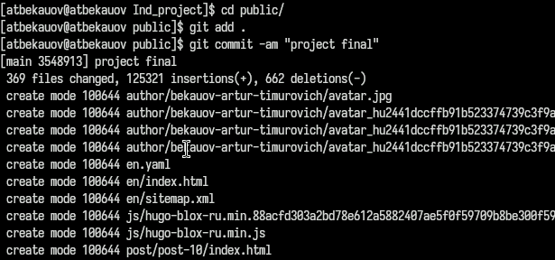{#fig:008 width=70%}

## Проверка сайта

Проверяю работу сайта и локализаций.

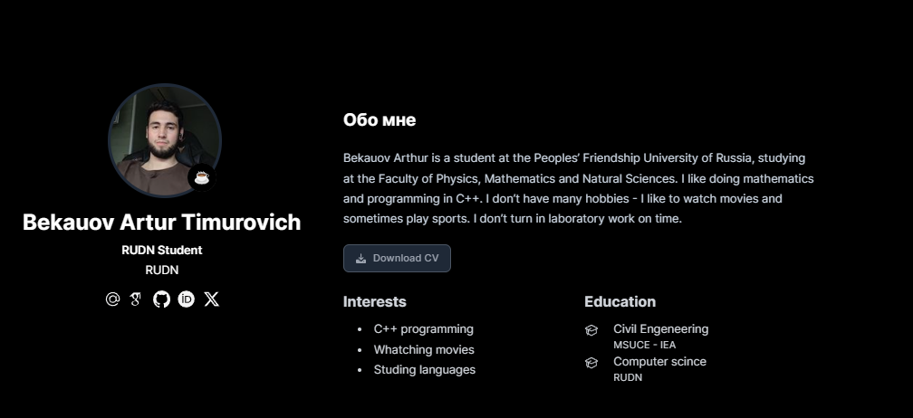{#fig:008 width=70%}

# Заключение

## Выводы

В ходе данной лаботраторной работы я завершил редактирование сайта и выполнил шестой этап индивидуального проекта.

