---
## Front matter
title: "Отчёт по шестому этапу Индивидуального проекта"
subtitle: "Операционные системы"
author: "Бекауов Артур Тимурович"

## Generic otions
lang: ru-RU
toc-title: "Содержание"

## Bibliography
bibliography: bib/cite.bib
csl: pandoc/csl/gost-r-7-0-5-2008-numeric.csl

## Pdf output format
toc: true # Table of contents
toc-depth: 2
lof: true # List of figures
lot: true # List of tables
fontsize: 12pt
linestretch: 1.5
papersize: a4
documentclass: scrreprt
## I18n polyglossia
polyglossia-lang:
  name: russian
  options:
	- spelling=modern
	- babelshorthands=true
polyglossia-otherlangs:
  name: english
## I18n babel
babel-lang: russian
babel-otherlangs: english
## Fonts
mainfont: PT Serif
romanfont: PT Serif
sansfont: PT Sans
monofont: PT Mono
mainfontoptions: Ligatures=TeX
romanfontoptions: Ligatures=TeX
sansfontoptions: Ligatures=TeX,Scale=MatchLowercase
monofontoptions: Scale=MatchLowercase,Scale=0.9
## Biblatex
biblatex: true
biblio-style: "gost-numeric"
biblatexoptions:
  - parentracker=true
  - backend=biber
  - hyperref=auto
  - language=auto
  - autolang=other*
  - citestyle=gost-numeric
## Pandoc-crossref LaTeX customization
figureTitle: "Рис."
tableTitle: "Таблица"
listingTitle: "Листинг"
lofTitle: "Список иллюстраций"
lotTitle: "Список таблиц"
lolTitle: "Листинги"
## Misc options
indent: true
header-includes:
  - \usepackage{indentfirst}
  - \usepackage{float} # keep figures where there are in the text
  - \floatplacement{figure}{H} # keep figures where there are in the text
---

# Цель работы

Целью данной работы окончание работы над редактирования сайта. Выполнить шестой этап индивидуального проекта.

# Задание

1. Сделать поддержку английского и русского языков.

2. Разместить элементы сайта на обоих языках.

3. Разместить контент на обоих языках.

4. Сделать пост по прошедшей неделе.

5. Добавить пост на тему по выбору (на двух языках).

# Выполнение этапа индивидуального проекта

Первым делом зашёл в реопзиторий Ind_project в content и создал там две папки: ru и en, в каждую из которых скопировал остальные объекты директории (рис. [-@fig:001]).

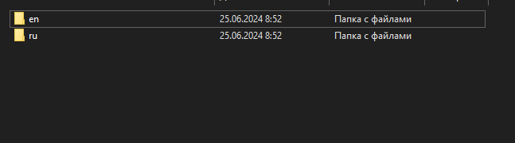{#fig:001 width=70%}

Затем скачиваю руссский и английский локализаторы из модулей hugo. (рис. [-@fig:002]).

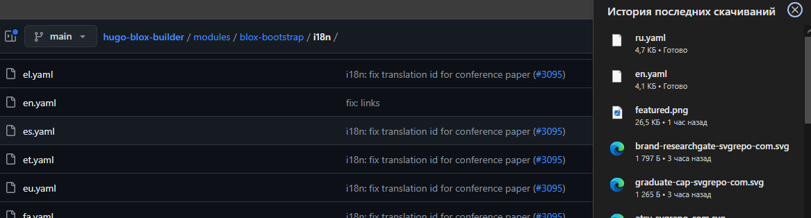{#fig:002 width=70%}

Перемещаю en.yaml в папку en (рис. [-@fig:003]).

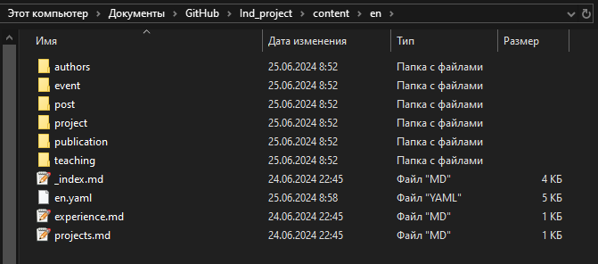{#fig:003 width=70%}

Перемещаю ru.yaml в папку ru (рис. [-@fig:004]).

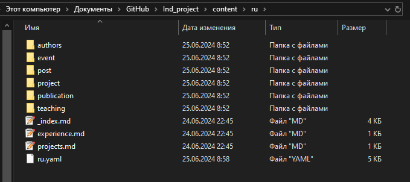{#fig:004 width=70%}

Затем открываю файл конфигурации languages.yaml и переписываю его текст следующим образом.  (рис. [-@fig:005]).

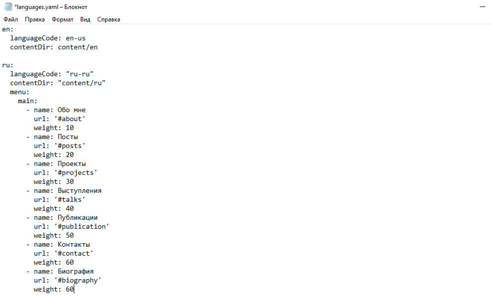{#fig:005 width=70%}

Запускаю локальный сервер с помощью hugo server и проверяю, что смена языка работает корректно  (рис. [-@fig:006]).

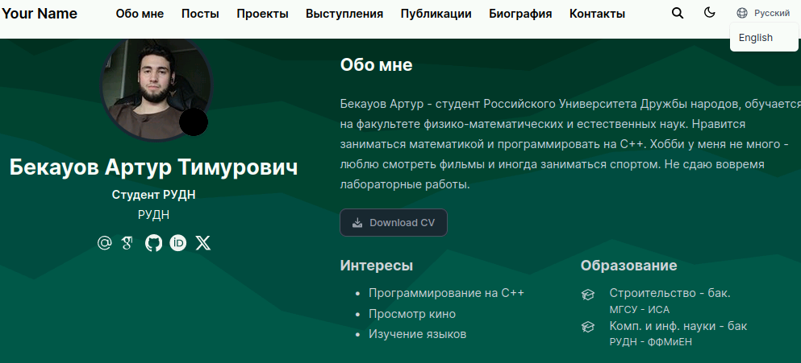{#fig:006 width=70%}

Далее захожу в posts и создаю папку post 9, открываю в ней index.md, и расписываю, как прошла моя неделя. Аналагичную папку на на английском размещаю в en/posts. (рис. [-@fig:007]).

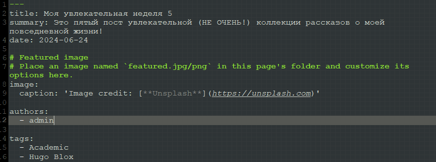{#fig:007 width=70%}

Затем создаю папку post 10, открываю index.md и пишу там пост о черепахах. В en/posts оставляю английский аналог  (рис. [-@fig:008]).

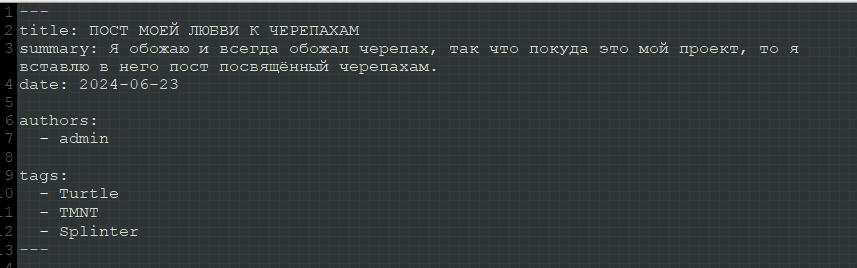{#fig:008 width=70%}

Запускаю hugo server и проверяю посты. (рис. [-@fig:009]).

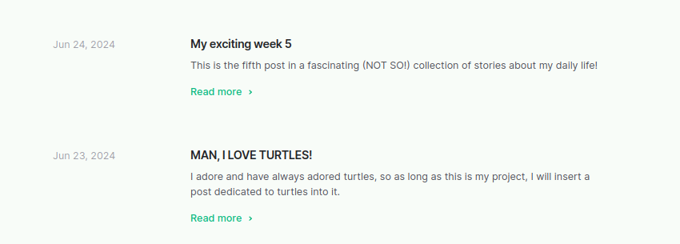{#fig:009 width=70%}

С постами всё отлично, ввожу в репозитории Ind_project ~/bin/hugo. Затем перехожу в каталог public  и отправляю все изменения на репозиторий atbekauov.github.io (рис. [-@fig:010]).

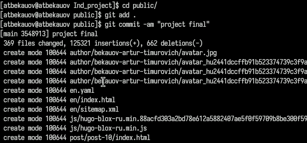{#fig:010 width=70%}

Проверяю работу сайта и локализаций. (рис. [-@fig:011]).

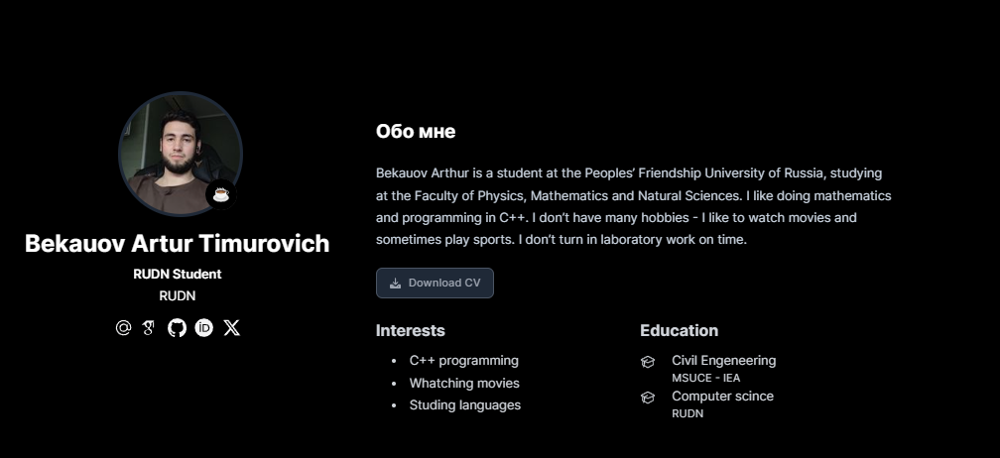{#fig:011 width=70%}

# Выводы

В ходе данной лаботраторной работы я закончил редактирование сайта и выполнил шестой этап индивидуального проекта.

